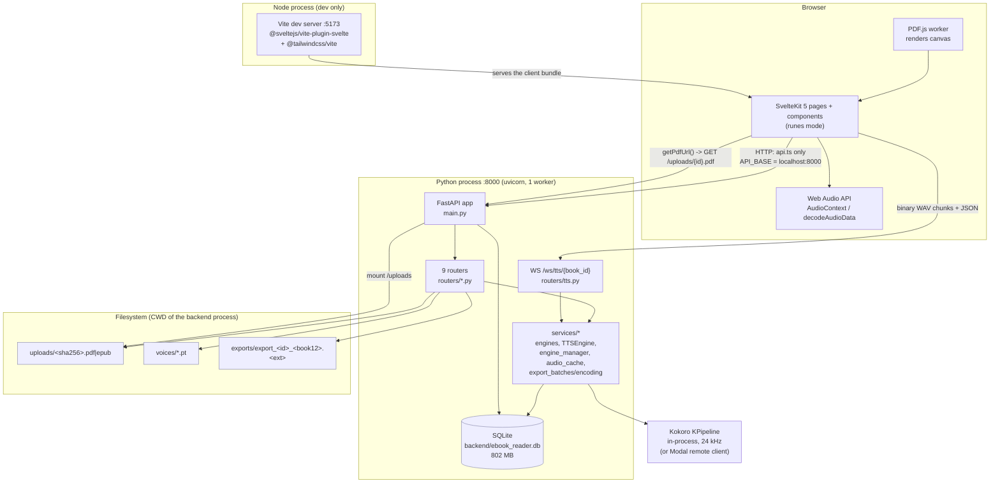

# System Architecture

How the Kokoro Ebook Reader is put together: the process shape, the backend layers, the data model,
schema evolution, the frontend, the end-to-end reading pipeline, the test gates, and the decisions
behind all of it.

**Scope boundary.** This document owns **the system**. Speech synthesis, playback speed, the
speed-strategy tradeoff, the synthesis/pre-synthesis policy, the audio cache's internals, the WebSocket
*protocol* semantics, the concurrency model and backend/hardware selection are owned by
[`docs/TTS_ARCHITECTURE.md`](TTS_ARCHITECTURE.md) — "how this app turns text into sound". Where the two
touch (the `Sentence` table, the `POST /ws/tts/{book_id}` router, `stores/audio.ts`, the
`AudioCache` table) this document gives the **contract** — what the table holds, who writes it, what
the client must send — and stops. It does not explain Kokoro internals, the speed mechanism, or the
scheduling decision. If you want the *why* behind anything audible, read that document; if you want the
*why* behind everything else, read this one.

### Companion documents

| Document | Owns | Use it for |
|---|---|---|
| [`docs/TTS_ARCHITECTURE.md`](TTS_ARCHITECTURE.md) | Speech, speed, audio cache, synthesis scheduling, WebSocket protocol, engine selection, hardware | Anything audible |
| [`implementation-handoff.md`](../implementation-handoff.md) | The requirements of record. §9 lists places where the spec contradicts the repo | What the app is *supposed* to be |
| [`frontend/DESIGN.md`](../frontend/DESIGN.md) | The design-system contract: tokens, themes, component inventory, test selectors | UI work — noting that §3 and §4 are a **plan**, not a description (§6.6) |
| [`CLAUDE.md`](../CLAUDE.md) | Hard rules for contributors, including the concurrent-agent git policy | Before your first commit |
| [`docs/research/`](research/) | Measurements: `01-speed-strategy.md`, `02-synthesis-strategy.md`, `kokoro-runtime-picks.md`, `kokoro-accelerated-backends-benchmarks.md`, `kokoro-82m-t600-4gb-research.md`, `cuda-display-gpu-low-vram-findings.md` | Evidence behind the TTS decisions. **Cited, not re-verified here** — I did not reproduce their benchmarks |
| [`frontend/tests/README.md`](../frontend/tests/README.md) | The `@critical` e2e policy and its reasoning | Before adding an e2e spec |

**Repo root.** Paths are relative to the repository root. `git rev-parse --show-toplevel` is the
authority — use it rather than any path quoted in a task description. The handoff's two spellings
(`christiapia50` and `christia50`) are both unreliable: the in-session shell reports the latter as the
session workspace, and `cd` to it fails. Relative paths always work.

---

## Evidence convention

Every significant claim carries one of these labels. The convention exists because this repo has a
documented history of specs describing features that do not exist — `implementation-handoff.md` §9 is
itself a list of such corrections, and `frontend/DESIGN.md` is in places a target rather than a
description. Being trustworthy is this document's main value, so nothing is described as implemented
unless it was read in the code or executed.

| Label | Meaning |
|---|---|
| **Measured** | I ran something and read its output. Numbers, gate results, reproductions. |
| **Verified** | I read it in the code at the cited location. Not inferred from behaviour. |
| **Cited** | It comes from another document in this repo (`implementation-handoff.md`, `DESIGN.md`, `CLAUDE.md`, `docs/TTS_ARCHITECTURE.md`, `docs/research/*`). I relay it and say whose claim it is. |
| **Inferred** | Not stated anywhere; reasoned from the code. The reasoning is given. |
| **Intended** | Stated in a spec or comment but *not* implemented. Says so explicitly. |

**How to read the citations.** A `file:line` reference is a **locator**, not a contract: it was
correct when I took the reading and the tree has moved under this document more than once. The
**symbol name next to it** (`_migrate`, `AudioCache`, `EngineManager`, `load_sentences`) is the
authoritative part. If a line number does not match, trust the name and re-grep it. Where a claim's
truth depends on a line number rather than a symbol — which is rare — I say so.

Claims that contradict another document in the repo are called out in place and in §10, with both
sides cited. Nothing is described as working because a spec says it works.

### Snapshot

This document describes the tree at:

| | |
|---|---|
| Commit | `012ef03` — `fix(tests): stop test_voices_path_traversal shadowing the fake_kokoro fixture` |
| Working tree | **dirty** — 33 modified files, 8 untracked at final measurement |
| Branch | `folders-and-pages` |
| Readings taken | 2026-09-26 19:05–19:30 UTC (12:05–12:30 local) |
| Repo root | `git rev-parse --show-toplevel` → `/home/christiapia50`-adjacent; the tool reports `/home/christia50/Repos/ebook-reader` in-session, and the handoff's two spellings are both unreliable. Relative paths always work. |

> **Concurrent change — read this before trusting any single paragraph.** Several agents were editing
> `backend/` and `frontend/src/` throughout. Four of the architectural risks the brief asked me to
> verify were repaired *during* the writing session, in commits that landed underneath me:
>
> | Commit | What it changed |
> |---|---|
> | `e3938d1` | Closed the voice path traversal; stopped the MP3 export blocking the event loop |
> | `354764d` | Moved Kokoro synthesis off the event loop |
> | `be59ba5` | Bounded `AudioCache` growth with FIFO eviction |
> | `881d918`, `36e2120`, `8c3c0c3`, `cb00ed8`, `43526fa`, `012ef03` | Prefetch budget, speed ceiling, word-highlight stall, export/engine unification, `speed_unavailable` notice, test isolation |
>
> **The tree also advanced past `012ef03` while I was writing, entirely in *uncommitted* work.** I
> re-read the affected files at the end rather than leaving stale text, so the sections below describe
> the **working tree**, not the commit. The uncommitted additions I incorporated are:
>
> * `backend/services/engine_manager.py` (**new, 553 lines**) — a runtime-swappable Kokoro engine
>   manager (`cpu` / `gpu` / `modal`), replacing the "decide once at startup" wiring. It added
>   `GET`/`POST /api/system/engine`, and **its own tests are currently red** (§8.4, §10 R10).
> * `backend/services/sentence_source.py` (**new, 49 lines**) — the shared sentence loader.
> * `backend/tests/conftest.py` grew from 12 to **610 lines** with an autouse isolation guard (§8.4).
> * New model columns: `UserSettings.tts_engine`; `MP3Export.phase`, `batches_done`, `batches_total`,
>   `format`, `bitrate_kbps`, `options`; plus 7 new `_migrate` steps (`db/database.py` 95 → 119 lines).
> * The **MP3 export path was reworked**: `services/export_batches.py` and
>   `services/export_encoding.py` are new, `routers/mp3.py` grew from 253 to **681** lines, and it
>   gained `GET /mp3/formats`.
> * Frontend: `Toaster.svelte` and folder UI (`FolderTile`, `FolderNameDialog`, `MoveToFolderDialog`),
>   `frontend/tests/folders.spec.ts`, `frontend/tests/README.md`, plus `folders.test.ts` and
>   `library-folders.test.ts` under `frontend/src/tests/`.
> * `stores/settings.ts` gained `bionicMinWordLength` and `bionicSkipCommonWords`; **the unit gate went
>   red because of it** (§8.3).
> * `scripts/test.sh` and `backend/pytest.ini` (both untracked). `docs/TTS_ARCHITECTURE.md` also landed
>   during the session, committed as `6f809b1`.
>
> **The route count went from 32 to 34** during the session. §3.2 reflects the latest read. Where a
> later commit changed a fact I had already written down, I corrected the text rather than leaving two
> versions.

---

## 1 · Overview

Kokoro Ebook Reader is a **local, single-user reading application**. You give it a PDF or EPUB, or
paste text; it extracts that document into a numbered sequence of sentences; and it reads those
sentences aloud with a locally-run Kokoro text-to-speech model while highlighting the sentence — and
inside it, the word — that is currently being spoken. It also remembers where you were, lets you
bookmark and search, and exports a whole book to a single MP3 file. There is no account, no
multi-tenancy, no authentication and no network dependency beyond the first model download.

**In one sentence:** a browser-driven SvelteKit 5 client talks to a single-process FastAPI backend
that owns all state in one SQLite file and all speech in one in-process Kokoro pipeline, streaming
per-sentence audio back over a session-tagged WebSocket.

---

## 2 · System shape

### 2.1 Component and data flow



### 2.2 What actually talks to what — **Verified**

| Edge | Evidence |
|---|---|
| Browser → FastAPI over HTTP and WebSocket, both at `http://localhost:8000` | `frontend/src/lib/api.ts:45` `export const API_BASE = 'http://localhost:8000'`; the WS URL is `${API_BASE.replace(/^http/, 'ws')}/ws/tts/${bookId}` at `api.ts:316` |
| The frontend never talks to SQLite, to the filesystem, or to Kokoro | the backend is the only process with those handles; `frontend/package.json` has no DB or TTS dependency |
| FastAPI → SQLite | `backend/db/database.py:12-27` builds one engine; every router gets sessions through `Depends(get_session)` (`database.py:93`) or opens `Session(_db.engine)` directly |
| FastAPI → Kokoro, **in-process** | `backend/main.py:48-60` decides the device and delegates the build to `engine_manager.build_local`; `main.py:75-87` (`_apply_kokoro`) hands the resulting object to three routers |
| Uploaded books → `uploads/` on the backend's CWD | `backend/routers/documents.py:18` `UPLOAD_DIR = Path("uploads")`, written at `:39-40` |
| Uploaded voices → `voices/` | `backend/routers/voices.py:8` `VOICES_DIR = Path("voices")`, written at `:111-112` |
| Exported MP3s → `exports/` | `backend/routers/mp3.py:22` `EXPORTS_DIR = Path("exports")`, written at `:86-89` |
| `uploads/` is also served statically to the browser | `backend/main.py:134` `app.mount("/uploads", StaticFiles(directory="uploads"))`; the client builds that URL in `api.ts:92-93` |
| The client renders PDFs itself with PDF.js, fetching the raw file from `/uploads/` | `frontend/src/lib/components/PDFViewer.svelte:133` `pdfjsLib.getDocument(getPdfUrl(bookId))` |
| Audio flows browser-ward as **binary WAV frames** on the same WebSocket as the JSON control messages | server sends bytes at `routers/tts.py:154`; client tags them via `activeSessionId` (`stores/audio.ts:302-308`) |

### 2.3 Development: a Vite dev server, driven by Playwright

**Verified.** In development the frontend is not a built artifact. `frontend/vite.config.ts` registers
`tailwindcss()` and `sveltekit()`; `npm run dev` starts Vite, which serves the client and proxies
nothing — the browser calls `localhost:8000` directly. `frontend/svelte.config.js:8-10` uses
`@sveltejs/adapter-static` with a `fallback: 'index.html'`, so `npm run build` produces a static SPA.

`frontend/playwright.config.ts` drives exactly that server: `webServer.command = 'npm run dev'` at
`baseURL http://localhost:5173`, with `reuseExistingServer: !process.env.CI` (`playwright.config.ts:19-23`).
The e2e suite therefore **starts its own Vite dev server** if one is not already listening on 5173.
The specs do not require a live backend: they intercept HTTP with `page.route(...)` and drive the
WebSocket with a fixture (`frontend/tests/fixtures/ws-driver.ts`, `audio-context-mock.ts`,
`mock-data.ts`).

### 2.4 Production shape — **Intended, and currently broken**

`docker-compose.yml` builds two images: the backend (`nvidia/cuda:12.6.3-cudnn-runtime-ubuntu24.04`,
uvicorn on 8000, `EXPOSE 8000`) and the frontend (nginx serving the static build on port 80).
`frontend/nginx.conf:25-44` proxies **only** `^/(documents|library|ws)/` and `/uploads/` to
`http://backend:8000`.

Two consequences, both **Verified**:

1. `docker-compose.yml:11` publishes the backend as `"3001:8000"` — host port 3001. But
   `frontend/src/lib/api.ts:45` hard-codes `http://localhost:8000`. In the browser, `localhost:8000`
   is the *user's own machine*, not the container. The stack as committed cannot work in a browser
   without editing `api.ts`.
2. Even if the port matched, `/voices`, `/mp3`, `/bookmarks`, `/user`, `/folders`, `/api/system` and
   the backend's `/health` are **not in the nginx proxy regex**, so those requests would hit the SPA
   fallback (`nginx.conf:50-52` `try_files ... /index.html`) and return HTML instead of JSON.

`docker-compose.dev.yml` has the same 3001 mapping for the backend and runs the frontend as
`node:18-alpine` on 5173, so the dev stack has the same mismatch. See §10 R6.

---

## 3 · Backend architecture

### 3.1 Entrypoint and app setup

`backend/main.py` is the whole composition root. **Verified** structure:

| Lines | What happens |
|---|---|
| `main.py:31-45` | `_load_env_file()` — loads `backend/.env` via `python-dotenv` if installed, `override=False` so real environment variables win. Missing file or missing package is not an error. |
| `main.py:48-60` | `_init_local_kokoro()` — decides the **device** for the startup path (`"cuda" if engine_manager._cuda_available() else "cpu"`) and delegates the build to `engine_manager.build_local(device)`. Returns `(pipeline, device, error)`; the error string is retained so the capability endpoint can explain a `null` pipeline. |
| `main.py:63-72` | `_init_kokoro()` — a thin wrapper returning `engine_manager.manager.startup(os.environ.get("KOKORO_BACKEND"))`. The precedence is: the engine persisted in `UserSettings.tts_engine`, then `KOKORO_BACKEND` (`local` → GPU if present else CPU; `remote` → Modal; `auto` → Modal only when a probe answers), then local. Every failure path falls back. |
| `main.py:75-87` | `_apply_kokoro(kokoro)` — pushes the live engine into all three routers, and is **registered** with the engine manager (`engine_manager.register_applier(_apply_kokoro)` at `:87`) so a runtime engine switch in Settings reaches the WebSocket, voice-preview and export paths through one function. |
| `main.py:96-111` | `lifespan` — `create_engine_and_tables()`, `mkdir uploads`, `_apply_kokoro(_init_kokoro())`, then `await audio_cache.sweep_once(engine)` and a periodic eviction sweep stopped on shutdown. |
| `main.py:114-122` | `app = FastAPI(lifespan=lifespan)` plus `CORSMiddleware` with `allow_origins=["*"]`, all methods and headers. |
| `main.py:124-132` | Nine routers included. `documents`, `library`, `user`, `tts`, `voices`, `mp3`, `bookmarks`, `folders`, `system`. |
| `main.py:134` | `app.mount("/uploads", StaticFiles(directory="uploads"))`. |
| `main.py:137-148` | `GET /health` returning `status`, `backend`, `device`, `synthesis_available`. |

**How the TTS engine is initialised and injected — Verified.** There is no dependency-injection
framework. The design is a **module-level mutable global per router plus a `set_kokoro()` function**,
with `services/engine_manager.py` as the single owner of *which* engine object is live:

```python
# main.py:75-87
def _apply_kokoro(kokoro: Any) -> None:
    tts_router.set_kokoro(kokoro)      # routers/tts.py:32
    voices_router.set_kokoro(kokoro)   # routers/voices.py:75
    mp3_router.set_kokoro(kokoro)      # routers/mp3.py:40 — also builds an MP3-only TTSEngine

engine_manager.register_applier(_apply_kokoro)
```

Each router holds its own private `_kokoro` and each is used at call time, never at import time.
`routers/mp3.py` additionally constructs a dedicated `TTSEngine` so the export path shares the
speed-capability probe and the on-disk `AudioCache` with playback rather than duplicating them.

Two consequences worth naming:

1. The pipeline is **not** discoverable through FastAPI's dependency graph. `main.py` is where the
   three wiring points live, and a new router that needs Kokoro must be added to `_apply_kokoro`
   there. That is the single easiest thing to forget when adding an endpoint.
2. `EngineManager` (`services/engine_manager.py`, uncommitted at the snapshot) makes the choice
   **runtime-swappable** for the first time: it builds the requested engine first and swaps it in only
   on success, so a failed switch leaves the previous engine running. Its docstring states the reason:
   before it, the only way to change engines was to edit `KOKORO_BACKEND` and restart. It owns no
   FastAPI or router state — it calls the applier registered above. This supersedes the
   `implementation-handoff.md` §3.4 observation that `device` was computed and discarded: the device
   is now recorded on `KokoroRuntime` and reported by `GET /api/system/capabilities`.

**Consequence of the failure mode — Verified.** The local build path catches `Exception` broadly (in
`services/engine_manager.py:151`, `build_local`, which `_init_local_kokoro` delegates to), logs the
traceback, and returns `None`. `lifespan` does not raise. The application
therefore starts and serves the whole HTTP surface with no TTS engine at all; only synthesis-dependent
routes fail, and they fail late (`/voices/preview/...` returns 503 at `routers/voices.py:137-138`;
the WebSocket yields no audio because `TTSEngine.stream_job` returns immediately when
`self.kokoro is None`, `services/tts_engine.py:393`). `GET /health` and
`GET /api/system/capabilities` are the way to find out, which is what they were added for.

**Python version — Verified.** `backend/pyproject.toml` declares `requires-python = ">=3.12,<3.13"`
and notes that `CLAUDE.md`'s older "Python 3.11" line was stale. The environment is uv-managed:
`backend/uv.lock` + `backend/.venv`; `CLAUDE.md` was updated during this session to say
`cd backend && uv sync && uv run uvicorn main:app --reload`. A legacy `backend/venv` still exists and
`start.sh` falls back to it. `backend/requirements.txt` is generated from the lock.

### 3.2 Routers and the real endpoint surface

Nine router modules, **34 routes total** (33 on routers, 1 on the app). This count grew from 32 during
the writing session as `/mp3/formats` and the two `/api/system/engine` routes landed.

| Method | Path | Purpose | Notable behaviour |
|---|---|---|---|
| POST | `/documents/upload` | Ingest a PDF or EPUB | `book_id` **is** `sha256(file bytes)` (`documents.py:27`); re-uploading the same bytes returns `already_existed: true` with the existing sentence count and writes nothing (`:29-32`). 400 for any extension other than `pdf`/`epub` (`:35-36`). Sentence extraction runs **synchronously inside the request**. |
| GET | `/documents/{book_id}/sentences` | All sentences for a book, ordered by `index` | 404 if the book is unknown (`:90-91`). JSON-decodes the stored `words` column into a list (`:98`). Returns `chapter` and `chapter_title`. |
| POST | `/documents/text` | Create a book from pasted text | `book_id` is `sha256(text)` (`:114`); idempotent per exact text. Creates the `Book` with **`ephemeral=True`** (`:148`) so it does not appear in the library until saved. 400 on empty text or zero extracted sentences. |
| PATCH | `/documents/text/{book_id}` | "Save to library" — clear the ephemeral flag | 400 if `file_type != "text"` (`:162-163`). The `title` field that `persistTextBook()` sends (`api.ts:287-289`) is **ignored**: the handler takes no body (`documents.py:156`). |
| DELETE | `/documents/text/cleanup` | Delete ephemeral books older than 24 h | `documents.py:172-195`. **Nothing calls it** — no scheduler, no cron, no client function. Ephemeral text books accumulate until someone hits it by hand. |
| GET | `/library` | List non-ephemeral books | Filters `Book.ephemeral == False` (`library.py:30-32`). Returns `author` and `folder_id`; never returns `file_path` or `cover_page`. |
| POST | `/library/{book_id}/progress` | Upsert reading position | 404 if the book is unknown (`:37-38`). Body is `{sentence_index: int}`; there is **no range validation**. |
| POST | `/library/{book_id}/folder` | File a book into a folder, or unfile it | `folder_id: null` clears it (`library.py:18-20`). 404 if the book or the folder does not exist (`:69-72`). |
| GET | `/library/{book_id}` | Book metadata | `library.py:79-85`, serialized by the shared `_serialize()` at `:23-27`. |
| GET | `/library/{book_id}/progress` | Reading position | Returns `0` for a book with no row **and for a book that does not exist** — it never 404s (`library.py:87-90`). |
| DELETE | `/library/{book_id}` | Delete a book and its data | Cascades manually over `Sentence`, `Progress`, `Bookmark`, `MP3Export` (`:93-117`) — there are no DB-level cascade rules. **It does not delete the uploaded file in `uploads/` nor an already-written MP3 in `exports/`.** |
| GET | `/user/settings` | The single settings row (`id=1`) | Returns hard-coded defaults when the row is missing (`user.py:33`). |
| POST | `/user/settings` | Upsert settings | Accepts **only** `last_book_id`, `last_sentence_index`, `highlight_enabled` (`user.py:15-19`). |
| WS | `/ws/tts/{book_id}` | The synthesis stream | Closes with code `4004` if the book is unknown (`tts.py:58`). See §3.5. |
| GET | `/voices` | Voice catalog + custom voices | The 28-entry `ENGLISH_VOICE_CATALOG` (`voices.py:37-68`) is a Python literal, plus a live `iterdir()` scan of `voices/` on every call (`:80-95`). |
| POST | `/voices/upload` | Store a `.pt` voice pack | Validates the filename through the same resolver used by delete/preview so the returned id round-trips (`voices.py:109-113`). |
| DELETE | `/voices/{voice_id:path}` | Delete a custom voice | 403 for anything not prefixed `custom:` (`:119-120`); 404 if absent. `:path` accepts slashes, which is why the resolver exists. |
| GET | `/voices/preview/{voice_id:path}` | Synthesize and return a WAV preview | 503 when no engine (`:137-138`); 400 on synthesis failure with the exception text interpolated into `detail` (`:150-153`). Fixed preview sentence at `:140`. |
| POST | `/mp3/export` | Start a whole-book export | Validates `speed` **before** the loop (`mp3.py:521`), then the format and bitrate (`:525-529`), each returning 400 on a bad value; 404 if the book is unknown; creates the row and returns without waiting. **Reworked beyond the snapshot:** it now also takes `format`/`bitrate_kbps` and can fan the work out over Modal containers. |
| GET | `/mp3/formats` | List the output formats the encoder can produce | `mp3.py:578-600`. Served from `services/export_encoding.FORMATS` rather than hard-coded in the UI, so a bitrate the backend would reject cannot be offered and the ffmpeg requirement is visible before the user picks M4B. |
| GET | `/mp3/exports` | List exports, newest first | Joins the book title; includes `effective_speed` (`mp3.py:616`). |
| GET | `/mp3/exports/{export_id}/status` | Poll one export | Returns `status`, `phase`, `progress`, `effective_speed` (`mp3.py:642`). |
| GET | `/mp3/downloads/{export_id}` | Download the finished file | 404 unless the export is done and the file still exists on disk; content type comes from the stored `format` (`mp3.py:651-667`). |
| DELETE | `/mp3/exports/{export_id}` | Delete the row and the file | `unlink(missing_ok=True)` (`mp3.py:670-677`). |
| POST | `/bookmarks` | Create a bookmark | Resolves `page` from the sentence (`bookmarks.py:26-32`); **truncates `label` to 100 characters silently** (`:38`). |
| GET | `/bookmarks/{book_id}` | List bookmarks | Ordered by `page`, then `sentence_index`. |
| DELETE | `/bookmarks/{bookmark_id}` | Delete one | 404 if absent. |
| GET | `/folders` | List folders with book counts | One grouped aggregate query, not N+1 (`folders.py:53-62`). |
| POST | `/folders` | Create a folder | `201`; 400 blank or over `FOLDER_NAME_MAX_LENGTH` (60); 409 case-insensitive duplicate (`folders.py:88-97`). |
| PATCH | `/folders/{folder_id}` | Rename | Same validation, excluding self (`folders.py:100-114`). |
| DELETE | `/folders/{folder_id}` | Delete a folder and unfile its books | Never deletes books; returns `unfiled_books` so the UI can offer an undo (`folders.py:117-128`). |
| GET | `/api/system/capabilities` | Live device/torch/remote probe | `routers/system.py:24-26` → `services/kokoro_runtime.capabilities()`. |
| GET | `/api/system/engine` | Which engine is live, which the user picked, what is available | `routers/system.py:34-37` → `engine_manager.manager.state()`. A second `GET` also reports switch progress, because switching is slow. |
| POST | `/api/system/engine` | Switch the live synthesis engine without a restart | `routers/system.py:40-60`. Runs `manager.switch` on a worker thread (`:54-56`) so one click cannot freeze playback. 400 unknown id, 409 when the probe says the machine cannot run it, 503 when the build failed — and in every failure case the previously live engine keeps running. |
| GET | `/health` | Liveness + active backend | `main.py:137-148`. |
| GET | `/uploads/{filename}` | Static file serving | `main.py:134`. Unauthenticated, and the filename in `documents.py:39` is a content hash, so it is not guessable in practice. |

**There are no `response_model` declarations anywhere in the backend** — **Verified**:
`grep -rn "response_model" backend/main.py backend/routers/*.py backend/db/*.py backend/services/*.py`
returns nothing. Request bodies are typed where a Pydantic model exists (`ProgressUpdate`,
`FolderCreate`, `ExportRequest`, `BookmarkCreate`, `UserSettingsUpdate`, `FolderAssignment`, …), but
every response is a bare `dict` or `list[dict]` built by hand.

Consequences, in order of how much they hurt:

1. **OpenAPI documents no response bodies.** `/docs` shows the routes and their request schemas and
   nothing else, so the generated schema cannot be used to generate a typed client.
2. **TypeScript's view of the API is hand-written twice.** `frontend/src/lib/api.ts` declares
   `Sentence`, `Book`, `Voice`, `ExportItem`, `Bookmark`, `UserSettings`, … independently of the
   server, and nothing checks that the two agree. A field renamed in a router silently becomes
   `undefined` in the browser.
3. **Response serialisation is not enforced.** FastAPI will happily serialize a value that does not
   match what the route annotates, so response-shape regressions are caught only by tests that assert
   on the JSON.

Related: several serializers are *ad hoc per handler*. `library.py` was refactored to a shared
`_serialize()` (`library.py:23-27`), but `bookmarks.py`, `mp3.py` and `folders.py` each build their
own dicts inline, and `Book` is shaped three different ways across the API surface.

### 3.3 Services layer

| Module | Lines | Responsibility |
|---|---|---|
| `services/base_engine.py` | 51 | `SentenceRecord` dataclass and `BaseEngine`, which loads spaCy `en_core_web_sm` (`base_engine.py:26`) and splits text with `doc.sents`. On `OSError` it shells out to `python -m spacy download en_core_web_sm` and retries (`:27-34`) — a network call from inside a constructor. |
| `services/pdf_engine.py` | 146 | PyMuPDF sentence extraction with per-word bounding boxes and TOC-derived chapters. |
| `services/epub_engine.py` | 56 | ebooklib + BeautifulSoup + spaCy; one "chapter" per document item, all coordinates zero. |
| `services/text_engine.py` | 20 | Pasted text; identical to EPUB but with `min_words=2`. |
| `services/ocr_engine.py` | 43 | Optional EasyOCR path (`gpu=False` hard-coded at `ocr_engine.py:11`). **Not wired into any router** — nothing calls `OCREngine`. **Intended, not implemented.** |
| `services/text_filter.py` | 110 | `TextFilter.should_filter()` with a `FilterReason` enum: copyright pages, TOC lines, chapter headings, page numbers, publisher blurbs, exercise markers, and short ALL-CAPS runs. |
| `services/text_cleaner.py` | 37 | `normalize_text()`: ellipsis → `.` before NFKC, smart quotes and guillemets → straight quotes, em/en dash → `", "`, zero-width stripping, whitespace collapse. The docstring states its contract: it preserves word count and sentence boundaries so it cannot desynchronise the audio. |
| `services/tts_engine.py` | 569 | `TTSEngine`, `SynthJob`, `AudioCache` read/write, the single-worker synthesis pool, prefetch. **Details belong to [`TTS_ARCHITECTURE.md`](TTS_ARCHITECTURE.md).** |
| `services/audio_cache.py` | 421 | Bounded FIFO eviction for `AudioCache`, plus a stats helper reporting retained audio against the cap and the database's own page counts. |
| `services/kokoro_runtime.py` | 156 | `KokoroRuntime` startup state plus `probe_local_torch()` and `capabilities()`. |
| `services/engine_manager.py` | 553 | **Uncommitted at the snapshot.** The single owner of *which* Kokoro object is live, and the only place that can change it at runtime. Exposes `EngineManager` with `startup()`, `switch()` and phase reporting; three engines (`cpu`/`gpu`/`modal`) all funnelling into the same `TTSEngine` contract via `build_local`/`build_remote`; `register_applier` for the router wiring; and a shared `PHASE_*` vocabulary (`idle`, `uploading`, `starting`, `warming_up`, `processing`, `encoding`, `ready`, `complete`, `error`) used by the export status endpoint and the reader WebSocket so the UI renders one indicator. |
| `services/modal_remote.py` | 879 | A locally-importable client that is call-compatible with `KPipeline`. |
| `services/export_batches.py` | 103 | **Uncommitted.** Plans the sentence batches a Modal export fans out over, grouped by chapter (the unit a reader recognises and the dialog can report progress in), splitting any chapter longer than `DEFAULT_MAX_SENTENCES = 150`. Its docstring records the constraint that forces batching: `KModel.forward_with_tokens` handles batch size 1 only, so the way to use more than one GPU is to send *more text per call* — one batch is one Modal container. |
| `services/export_encoding.py` | 437 | **Uncommitted.** Turns one assembled float32 track into a downloadable file in four formats (`mp3` via LAME at an explicit bitrate, `m4b` AAC with chapter markers, `opus`, `wav`), with `FORMATS` as the single source of truth that `/mp3/formats` serves. Its docstring records why ffmpeg is involved for three of the four: soundfile cannot write AAC/M4B or attach chapters. |
| `services/sentence_source.py` | 49 | Exposes `load_sentences(book_id)`, the one query both synthesis paths use. See §3.5. |

`services/__init__.py` is empty, so `import services` pulls in nothing.

**Layering — Verified.** The dependency direction is `routers → services → (db.models, db.database)`,
with one deliberate exception: `services/tts_engine.py` and `routers/mp3.py` import
`db.database as _db` and read `_db.engine` **at call time** rather than importing the engine object at
module scope (`tts_engine.py:12-13`, `mp3.py:13`). `CLAUDE.md` states this as a hard rule. `Inferred`
reason: it lets a test replace `db.database.engine` after the module has been imported. Several test
files do exactly that (`grep -l "_db.engine" backend/tests`), which corroborates it — but no comment
in the repo records the reasoning, so treat the *motive* as inferred and the *convention* as verified.

There is **no repository layer**: routers and `mp3.py` issue `sqlmodel` queries directly. No service
except `tts_engine` and `audio_cache` touches the database at all.

### 3.4 Data-access layer

Two things and nothing else:

* `db/database.py:12-27` `create_engine_and_tables(db_url=None) -> engine` — sets a module-global
  `engine`, runs `SQLModel.metadata.create_all(engine)`, then `_migrate(engine)`.
* `db/database.py:93-95` `get_session()` — a generator dependency yielding `Session(engine)`.

`engine` is `None` at import time (`database.py:9`) and is assigned inside `create_engine_and_tables`.
Anything that reads `_db.engine` before `create_engine_and_tables()` has run gets `None` and fails
with a confusing `AttributeError`/`TypeError` rather than a clear "database not initialised" error.
`Inferred`: the lifespan ordering at `main.py:95` is what makes this safe in the real app.

There is one engine and therefore one SQLite connection pool for the whole process. SQLite's default
journal mode is used (no WAL is enabled anywhere — **Verified**, no `pragma journal_mode` in the
source). Concurrent writers within the process are serialised by SQLite's own locking, and the
`max_workers=1` synthesis pool (`tts_engine.py:123`) is what keeps two synthesis paths from writing
audio blobs at the same time — that is the *concurrency* reason it is one worker, its docstring says so
at `tts_engine.py:115-122`, and the GPU/CUDA-context reason is owned by the TTS document.

### 3.5 The WebSocket streaming path

The `tts_websocket` handler in `routers/tts.py`, one WebSocket per open reader. **Verified** flow (the
handler's internals — the queue, the synthesis pool, the phase reporting — are
[`TTS_ARCHITECTURE.md`](TTS_ARCHITECTURE.md)'s subject; what follows is the contract this document
depends on):

```
client                         router (event loop)                  TTSEngine
  |                                   |
  |-- text {action:"play", ...} ----->|  parse, normalise speed (tts.py:278-284)
  |                                   |  _cancel_and_clear()      (tts.py:218-263)
  |                                   |  spawn _producer(from_index, voice, speed)  (tts.py:70)
  |                                   |  spawn _consumer_with_events(session_id)    (tts.py:82)
  |                                   |  spawn engine_tts.prefetch(...)             (tts.py:305)
  |                                   |
  |<-- text {type:"sentence_start"} --|  (tts.py:119)
  |<-- bytes: WAV chunk --------------|  engine_tts.stream_job(job) yields 100 ms frames
  |<-- bytes: WAV chunk --------------|
  |<-- text {type:"sentence_end"} ----|  (tts.py:190) with duration_ms + word_timestamps
  |                                   |  [optional] bytes: 500 ms of silence at a chapter
  |                                   |             boundary (tts.py:206-207)
  |<-- text {type:"complete"} --------|  when the queue is empty and the producer finished
```

**Client → server messages — Verified** at `routers/tts.py:266-322`:

| `action` | Fields | Effect |
|---|---|---|
| `play` | `from_index`, `voice`, `speed`, `session_id` | Cancel any active session, then start a producer from `from_index` and a consumer. |
| `seek` | `to_index`, `voice`, `speed`, `session_id` | Identical handling; the only difference is which field carries the start index (`tts.py:235-239`). |
| `prefetch_speed` | `from_index`, `voice`, `speed` | Warm the cache at a new rate without interrupting playback. No `session_id`: it produces no client-bound messages. |
| `pause` | — | `_cancel_and_clear()` only. |

**Server → client messages — Verified:**

| `type` | Payload | `file:line` |
|---|---|---|
| `sentence_start` | `index`, `session_id` | `tts.py:119` |
| `sentence_end` | `index`, `duration_ms`, `word_timestamps`, `session_id` | `tts.py:190` |
| `complete` | `session_id` | `tts.py:90` |
| `speed_unavailable` | `requested_speed`, `effective_speed`, `session_id` — sent **at most once per connection** | `tts.py:179` |
| `error` | `message`, `session_id` | `tts.py:214` (consumer), `tts.py:281` (bad speed on a control message) |
| *(binary, no type)* | raw WAV frames, and a 500 ms silent WAV at chapter boundaries | `tts.py:118`, `tts.py:206-207` |

**The `session_id` protocol is the load-bearing part.** Every control message carries a client-minted
`session_id` (`stores/audio.ts:53`), which the server echoes on every JSON message bound for that
client. The client drops any message whose `session_id` does not match its current one
(`stores/audio.ts:313, :319, :332`). Binary frames carry no tag, so they are gated instead by
`activeSessionId`, which is only armed by a matching `sentence_start` (`stores/audio.ts:302-316`).
The reason is recorded in the code: neither a client-side reset nor server-side cancellation can flush
chunks already in the WebSocket receive buffer, so tag-filtering is the last line of defence
(`stores/audio.ts:47-58`; the server side explains the same thing at `tts.py:82-88`).
`_cancel_and_clear()` `await`s the dying tasks before starting new ones precisely to narrow that
window (`tts.py:218-253`).

**Sentence loading is shared, via `services/sentence_source.load_sentences` — Verified.** The WebSocket
router no longer queries the database itself: it calls `load_sentences(book_id)` and gets back
`{index: sentence}` or `None`. The module's docstring records why it exists — the two synthesis paths
(the streaming WebSocket and the MP3 export) "had grown two copies of the same query, and the copies
had already drifted: one returned the full model dump, the other a hand-picked subset". Three
properties matter:

* The session is **short-lived** and every row is copied into a plain dict before it closes, because
  callers hold the result far longer than a session should live.
* Only the fields synthesis reads are copied (`text`, `filtered`, `chapter`, `chapter_title`), which
  makes the caller's dependency visible instead of incidental.
* `None` means "no such book" and is **deliberately distinct** from "a book with no sentences": the
  WebSocket closes with 4004 for the former, the export records an error, and the two cannot be
  collapsed.

**One blocking call remains on this path — Verified by reading**, magnitude unknown:
`load_sentences` performs a synchronous SQLite read when the WebSocket is accepted, on the event loop.
It is unavoidable without making the loader async, and it is small compared with synthesis.

It is short compared with the synthesis work that commit `354764d` moved off the loop, and it is not
annotated as a known issue in the code. Residual, not headline — see §10 R8.

---

## 4 · Data model

Seven tables, all in `backend/db/models.py`. There are **no database-level cascade rules and no
`relationship()` declarations anywhere** — SQLModel emits foreign keys, but SQLite does not enforce
them by default and nothing enables `PRAGMA foreign_keys=ON`. Integrity is maintained by hand-written
loops in the routers. **Verified.**

### 4.1 `Book` — `db/models.py:37-49`

| Field | Type | Key / null | Writable through the API? |
|---|---|---|---|
| `id` | `str` | PK | Yes, implicitly — set to `sha256(content)` at upload (`documents.py:27`) or `sha256(text)` for pasted text (`:114`). Never client-supplied. |
| `title` | `str` | not null | Yes — the uploaded filename (`documents.py:76`) or `"Untitled Text"` / a supplied title (`:108`, `:142`). **No endpoint can change it afterwards.** |
| `author` | `Optional[str]` | nullable | **No.** See below. |
| `file_path` | `str` | not null | Yes, set at creation; `""` for text books (`documents.py:143`). Never updated. |
| `file_type` | `str` | not null | Yes — `pdf`, `epub` or `text`. The client routes on it (`routes/reader/[id]/+page.svelte:234`). |
| `page_count` | `int` | not null | Yes — PyMuPDF page count, `max(1, len(raw)//10)` for EPUB (`documents.py:60`), `max(1, len(raw))` for text. |
| `cover_page` | `int` | default `0` | **No.** A page *index*, not artwork. **Intended but unreachable.** |
| `created_at` | `datetime` | not null | Server-set. |
| `last_opened` | `Optional[datetime]` | nullable | Set at creation only (`documents.py:81`, `:147`). **Nothing ever updates it**, so it stays equal to `created_at`. |
| `ephemeral` | `bool` | default `False` | Yes, once: `PATCH /documents/text/{id}` sets it to `False` (`documents.py:165`). |
| `folder_id` | `Optional[int]` | FK → `folder.id`, nullable, indexed | Yes — `POST /library/{book_id}/folder` (`library.py:61-76`). |

#### `Book.author` is always NULL — **Verified, and it confirms the brief**

Grepping the entire backend source:

```
$ grep -rn "author" backend/routers/ backend/services/ backend/db/ --include=*.py
backend/routers/library.py:24:    return {"id": book.id, "title": book.title, "author": book.author,
backend/db/models.py:40:    author: Optional[str] = None
```

`author` appears exactly twice: the column definition, and the serializer that *reads* it. No router
reads a body field named `author`, no `Book(...)` constructor passes one, and there is no
`PATCH /library/{book_id}` for metadata at all. `documents.py:74-82` and `documents.py:140-149` build
every `Book` without it, so it is always the `None` default.

Confirmed against the live database, read-only
(`sqlite3.connect("file:ebook_reader.db?mode=ro", uri=True)`):

```
book                    7        author IS NOT NULL: 0
```

7 books, 0 with an author. Meanwhile `frontend/src/lib/api.ts:25` types `author: string | null` and
`api.ts:24` sends it to the library, and `frontend/tests/library.spec.ts` has a mock book with
`author: null` alongside ones with names. `implementation-handoff.md` §3.5 anticipated exactly this
("'Author not detected' maps to `author === null` … let the user set it via `PATCH` (add the endpoint
if absent)"). **The endpoint was not added. `Book.author` is a column the UI renders and the API
cannot write.** This is the single clearest example of the repo's documented failure mode, and it is
still open.

### 4.2 `Sentence` — `db/models.py:52-65`

| Field | Type | Key / null | Notes |
|---|---|---|---|
| `id` | `Optional[int]` | PK, autoincrement | Surrogate; the API never exposes it. |
| `book_id` | `str` | FK → `book.id`, indexed, not null | |
| `index` | `int` | indexed, not null | 0-based, contiguous per book, assigned at extraction. This is the app's **only** reading position unit. |
| `text` | `str` | not null | Post-`normalize_text()` (`documents.py:50`). |
| `page` | `int` | not null | PDF: 0-based page. EPUB and text: always `0`. |
| `x0,y0,x1,y1` | `float` | not null | PyMuPDF word-bbox union, in **PDF points at 72 dpi** (`pdf_engine.py:94-106`). Zero for EPUB/text. |
| `filtered` | `bool` | default `False` | Set at extraction by `TextFilter.should_filter` (`documents.py:52`). Consumed by the player (skip) and the renderer (don't draw). **No endpoint can change it.** |
| `words` | `Optional[str]` | nullable | A **JSON string** of `[{x0,y0,x1,y1}, …]`, one entry per word in reading order (`pdf_engine.py:106`, serialized at `documents.py:53`). Only populated for PDFs. The API decodes it back to a list (`documents.py:98`). |
| `chapter` | `int` | default `0` | PDF: 1-based TOC index, `0` when there is no usable TOC (`pdf_engine.py:125-133`). EPUB: 1-based document-item index. Text: `0`. |
| `chapter_title` | `Optional[str]` | nullable | PDF: TOC level-1 title. EPUB: the document filename without extension. |

The `words` column is added by `_migrate`, not by `create_all` — see §5. Nothing indexes
`(book_id, index)` as a composite; `book_id` and `index` are indexed separately.

### 4.3 `AudioCache` — `db/models.py:67-73`

| Field | Type | Key / null |
|---|---|---|
| `text_hash` | `str` | **PK** — `sha256(f"{text}:{voice}:{normalised_speed}")` (`tts_engine.py:226-236`) |
| `audio_data` | `bytes` | not null — raw **int16 PCM**, not a WAV container (`tts_engine.py:329-331`) |
| `duration_ms` | `int` | not null |
| `voice` | `str` | not null |
| `word_timestamps` | `Optional[str]` | nullable — JSON `[{word,start,end}, …]`; added by `_migrate` |
| `created_at` | `datetime` | not null |

No row is ever updated and none is ever addressed by anything but its primary key, so the cache is
effectively append-only with a uniqueness guard (`tts_engine.py:335-338`). **Writable only by the
server.** Measured content of the live database:

```
audiocache              4553 rows
  am_adam       2686 rows   443,438,400 bytes of audio_data
  af_heart      1834 rows   352,938,000
  am_michael      33 rows    12,145,200
book/ebook_reader.db    802 MB, page_count 205,055 × 4 KiB, freelist 0
```

Speed is part of the key, which is why one voice change multiplies the row count; the size and
lifetime policy is the subject of [`TTS_ARCHITECTURE.md`](TTS_ARCHITECTURE.md) §cache and of §10 R1.

### 4.4 `Progress` — `db/models.py:75-78`

| Field | Type | Key |
|---|---|---|
| `book_id` | `str` | **PK**, FK → `book.id` |
| `sentence_index` | `int` | not null |
| `updated_at` | `datetime` | not null |

**One row per book** — `book_id` is the primary key, so this is a position, not a history. Written by
`POST /library/{book_id}/progress` (`library.py:39-50`), read by `GET …/progress`. The client writes it
through `reader.seek()` → `saveProgress()` (`stores/reader.ts:47`) and also mirrors the position into
`UserSettings` (`reader.ts:49`), so there are two server-side records of where you are; §6.2 explains
why that is a deliberate duplication rather than a bug.

### 4.5 `Bookmark` — `db/models.py:81-87`

`id` (PK, autoincrement), `book_id` (FK, indexed), `sentence_index` (int), `page` (int), `label`
(`str`, truncated to 100 chars server-side at `bookmarks.py:38`), `created_at`. Fully writable through
the API. No unique constraint, so duplicate bookmarks at the same sentence are allowed.

### 4.6 `MP3Export` — `db/models.py:90-105`

| Field | Type | Notes |
|---|---|---|
| `id` | `Optional[int]` | PK |
| `book_id` | `str` | FK, indexed |
| `voice` | `str` | |
| `speed` | `float` | The rate **requested** |
| `effective_speed` | `Optional[float]` | The rate **actually rendered**; `None` for rows predating it and for in-flight exports. Added by `_migrate` (`database.py:68-71`). |
| `status` | `str` | One of `pending` → `processing` → `done` \| `error`. A bare string, not an enum or a CHECK constraint. |
| `progress` | `int` | 0–100, written repeatedly during the export (`mp3.py:75-81`) |
| `file_path` | `Optional[str]` | Server-set |
| `file_size` | `Optional[int]` | |
| `error_message` | `Optional[str]` | The `str()` of whatever exception killed it |
| `created_at` | `datetime` | |
| `phase` | `Optional[str]` | **Uncommitted.** A finer-grained stage from the `PHASE_*` vocabulary in `services/engine_manager.py` (`starting`, `warming_up`, `processing`, `encoding`, `complete`). The comment records why it exists: Modal's slow part — container boot plus model load — used to be completely invisible. `status` keeps its original values so existing clients still work. |
| `batches_done`, `batches_total` | `int`, default `0` | **Uncommitted.** Batch progress for exports fanned out over Modal containers. |
| `format` | `str`, default `'mp3'` | **Uncommitted.** Defaulted to `'mp3'` because every row written before the column existed is an MP3. |
| `bitrate_kbps` | `Optional[int]` | **Uncommitted.** |
| `options` | `Optional[str]` | **Uncommitted.** JSON of the options the file was rendered with, so a finished export can be described and re-downloaded with the right extension and content type without re-deriving them. |

Rows are created only by `POST /mp3/export` and mutated only by the background task. There is no
unique constraint on `(book_id, voice, speed)`, so identical exports can be queued repeatedly and each
writes its own file.

### 4.7 `UserSettings` — `db/models.py:107-111`

| Field | Type | Notes |
|---|---|---|
| `id` | `int` | PK, `default=1` — a hard-coded single-row table |
| `last_book_id` | `Optional[str]` | FK → `book.id`, nullable |
| `last_sentence_index` | `int` | default `0` |
| `highlight_enabled` | `bool` | default `True` |
| `tts_engine` | `Optional[str]` | **Uncommitted.** The synthesis engine last chosen in Settings (`"cpu"` \| `"gpu"` \| `"modal"`). `NULL` means "never chosen", which is what lets `KOKORO_BACKEND` keep deciding for existing installs. |
| (missing) | | no bionic fields, no theme, no voice, no highlight colour — all of those live only in `localStorage` |

`implementation-handoff.md` §9.2 already records that the earlier claim "bionic settings already
persist to the server" is **false**; that is still true. `stores/settings.ts:97` persists the whole
settings blob to `localStorage['kokoro-settings']` and only `highlightEnabled` is ever sent to the
server (`settings.ts:171`). **Verified.**

### 4.8 `Folder` — `db/models.py:14-34`

| Field | Type | Notes |
|---|---|---|
| `id` | `Optional[int]` | PK |
| `name` | `str` | `Column(String(60), collation="NOCASE", unique=True, nullable=False)` — case-insensitive uniqueness enforced by the column, with an explicit `func.lower()` pre-check in the router so the API can answer 409 instead of leaking an `IntegrityError` (`folders.py:43-49`) |
| `created_at` | `datetime` | |

`Folder` is new (`146087d feat(folders): backend for folder organization`). It is the only model using
`sa_column=`, because `Field(unique=True)` cannot express a collation. **It is also the case that made
the migration hazard visible** — see §5.

### 4.9 Which columns can never be written

Consolidated, all **Verified**:

| Column | Why it is unreachable |
|---|---|
| `Book.author` | No endpoint accepts it; no `PATCH` for book metadata exists at all. |
| `Book.title` | Settable only at creation (filename / pasted title). No rename endpoint. |
| `Book.cover_page` | No writer. |
| `Book.last_opened` | Written once at insert; never updated afterwards. |
| `Book.file_path`, `Book.file_type`, `Book.page_count` | Creation-time only. |
| `Sentence.*` | Fully server-owned after ingestion; no endpoint mutates a sentence, including `filtered`. |
| `AudioCache.*` | Server-owned. |

`author` is the one that matters, because it is the only one the UI actively renders as a user-facing
state.

---

## 5 · Schema creation and migration

There is no migration tool. No Alembic, no `alembic.ini`, no version table, no down-migrations.
**Verified.** Schema evolution is two mechanisms in ~95 lines of `backend/db/database.py`.

### 5.1 `create_all` — `database.py:12-27`

```python
def create_engine_and_tables(db_url: str | None = None) -> object:
    global engine
    import db.models  # noqa: F401  (registers tables on SQLModel.metadata)   # :21
    url = db_url or f"sqlite:///{_DEFAULT_DB}"                                 # :23
    engine = create_engine(url)                                                # :24
    SQLModel.metadata.create_all(engine)                                       # :25
    _migrate(engine)                                                           # :26
    return engine
```

`SQLModel.metadata` is populated **as a side effect of importing the model module**. `create_all` only
creates tables that are registered on that metadata, and it only ever issues `CREATE TABLE IF NOT
EXISTS` — it will never add a column to a table that already exists. That second property is the whole
reason `_migrate` exists.

`_DEFAULT_DB` (`database.py:7`) is `os.environ["DB_PATH"]` if set, else
`backend/ebook_reader.db`. Docker sets `DB_PATH=/data/ebook_reader.db` on a named volume
(`docker-compose.yml:13`, `backend/Dockerfile`).

### 5.2 The `create_all` ordering hazard — reproduced, then **fixed during this session**

The hazard is real and I reproduced its exact failure. `db/database.py` originally called
`create_all()` **without importing `db.models`**. In a fresh interpreter, with nothing else having
imported the models, `SQLModel.metadata` is empty, `create_all` creates nothing, and `_migrate` then
runs:

```python
ac_cols = {row[1] for row in conn.execute(text("PRAGMA table_info(audiocache)"))}  # -> empty set
if 'word_timestamps' not in ac_cols:                                               # -> True
    conn.execute(text("ALTER TABLE audiocache ADD COLUMN word_timestamps TEXT"))    # -> boom
```

Measured, against a version of the file without the import, `sqlite:///:memory:` so nothing on disk
was touched:

```
$ backend/.venv/bin/python -c "import sys; sys.path.insert(0,'.'); import db.database as d; \
    assert 'db.models' not in sys.modules; d.create_engine_and_tables(db_url='sqlite:///:memory:')"
RAISED OperationalError (sqlite3.OperationalError) no such table: audiocache
[SQL: ALTER TABLE audiocache ADD COLUMN word_timestamps TEXT]
```

**Is it a live bug or latent? Both, at different times.** The honest answer:

| Path | Outcome |
|---|---|
| Through `main.py` (the real app) | **Never reproduced.** `main.py:11-19` imports `routers.documents` before `lifespan` runs, and `documents.py:10` imports `db.models`, so metadata is already populated. Verified by importing `main` in a fresh interpreter and printing `SQLModel.metadata.tables` → all 8 tables present. |
| Any other caller | **A hard startup crash.** A script, a management command, or a test that imports `db.database` first hits it. `backend/tests/test_db_schema_startup.py` (added during this session) is an explicit subprocess regression test for exactly this, and its module docstring calls the defect "a startup crash". |

The fix is `import db.models` inside the function (`database.py:21`, committed). **As of the snapshot
the hazard is fixed, guarded by a test, and latent-by-construction**: it was only ever invisible
because of an import ordering accident in `main.py`, and the guard that removes the accident is now
explicit. Verified after the fix:

```
$ ... d.create_engine_and_tables(db_url='sqlite:///:memory:')
OK tables: ['audiocache','book','bookmark','folder','mp3export','progress','sentence','usersettings']
```

### 5.3 `_migrate` — `database.py:30-90`

A hand-written, forward-only, idempotent column adder. It uses `PRAGMA table_info(<table>)` to read
the current column set and `ALTER TABLE … ADD COLUMN` to add what is missing. At the snapshot it is 12
guarded steps in 85 lines:

| Guard | Adds |
|---|---|
| `database.py:33-36` | `audiocache.word_timestamps TEXT` |
| `database.py:46-50` *(unconditional `IF NOT EXISTS`)* | index `ix_audiocache_created_at` on `audiocache(created_at)` — so the eviction sweep's `ORDER BY created_at` is not a full scan of 800 MB of PCM |
| `database.py:52-58` | `sentence.words TEXT`, `sentence.chapter INTEGER DEFAULT 0`, `sentence.chapter_title TEXT DEFAULT NULL` |
| `database.py:60-63` | `usersettings.highlight_enabled INTEGER DEFAULT 1` |
| `database.py:67-69` | `usersettings.tts_engine TEXT DEFAULT NULL` — the engine chosen in Settings, so the choice survives a restart without editing `KOKORO_BACKEND` |
| `database.py:74-76` | `mp3export.effective_speed REAL` |
| `database.py:81-86` | `mp3export.phase TEXT DEFAULT NULL`, `batches_done INTEGER DEFAULT 0`, `batches_total INTEGER DEFAULT 0` |
| `database.py:89-94` | `mp3export.format TEXT DEFAULT 'mp3'`, `bitrate_kbps INTEGER DEFAULT NULL`, `options TEXT DEFAULT NULL` |
| `database.py:106-114` | `book.folder_id INTEGER REFERENCES folder(id)`, plus an unconditional index `ix_book_folder_id` |

Properties, all **Verified** by reading and by the live database:

* **Idempotent.** Each column is guarded. The two indexes are written as `IF NOT EXISTS`
  unconditionally, which the comments at `:42-45` and `:78-81` explain: the conditional form would
  need a query, the `IF NOT EXISTS` form is a no-op once the index exists, and either way the database
  file must not be rewritten on every boot.
* **Forward-only, and it never drops or retypes anything.** There is no way to remove a column or
  change a type.
* **It is applied to the user's live database at startup**, before the app serves a request.
* The live database already carries the results: `PRAGMA table_info(book)` includes `folder_id`, and
  `sqlite_master` lists a `folder` table. (Note: the file's mtime and size changed at 11:50 during this
  session — another agent's test run migrated it. It is now 840,077,312 bytes. I did not write to it;
  every read in this document went through `sqlite3.connect("file:ebook_reader.db?mode=ro", uri=True)`.)

**`_migrate` has no tests in the committed tree — Verified, and this is the weakest point in the
design.** At the snapshot there is an *uncommitted* `backend/tests/test_db_schema_startup.py` covering
it (7 tests, passing) and an untracked `backend/pytest.ini`, both added by another agent during this
session. So the statement to carry forward is: **as committed at `012ef03`, nothing tests `_migrate`;
the tests exist but are untracked.** A migration bug that corrupts or fails on the user's 802 MB
database is exactly the class of failure that has no other safety net — there is no backup step, no
dry run, and no way to reverse a step that has already run.

### 5.4 What is missing

* No schema version marker of any kind, so there is no way to ask a database what migration level it is
  at.
* No handling of the opposite direction: a **removed** model, or a column whose meaning changed.
  `effective_speed` is the near miss — if it had been declared `NOT NULL` the `ALTER TABLE ADD COLUMN`
  would have failed on a populated table.
* SQLite's `ALTER TABLE` cannot alter a column type or add a constraint, so any such change needs the
  twelve-step table-rebuild dance. Nothing in the repo does that.
* No `VACUUM`. Deleting hundreds of MB of `audiocache` rows (which eviction now does) leaves free pages
  in the file: SQLite reuses them, so the file stops growing but does not shrink. That is a deliberate
  and reasonable trade, but it means "the database is 802 MB" is not the same statement as "the
  database holds 802 MB of live data", and nothing in the API surfaces the difference — the numbers
  exist internally (`services/audio_cache.py:195-220` computes `db_bytes` from `PRAGMA page_count ×
  page_size` and `freelist_bytes` from `PRAGMA freelist_count`), but only for the eviction sweep's own
  logging and stats payload, never for the user.
* No size report on the API. There is no endpoint that answers "how much is this app using".

---

## 6 · Frontend architecture

### 6.1 Routing

SvelteKit file-based routing, `@sveltejs/adapter-static`, SSR disabled for the reader.
**Verified.**

| Route | File | Role |
|---|---|---|
| `/` | `routes/+page.svelte` (290 lines) | Paste-text reader. Two modes in one component: `idle` (textarea + upload CTA) and `reading` (TextViewer + MediaBar + AudioProgressBar). |
| `/library` | `routes/library/+page.svelte` (395) | Book grid, folder tiles, breadcrumb, LastRead resume card, create/rename/move/delete folder dialogs, drag-and-drop filing. |
| `/reader/[id]` | `routes/reader/[id]/+page.svelte` (296) + `+page.ts` | The main reader. `+page.ts` is one line: `export const ssr = false`. |
| `/upload` | `routes/upload/+page.svelte` (24) | Thin wrapper that renders `UploadDialog`. |
| `/voice` | `routes/voice/+page.svelte` (164) | Voice catalog grid, upload, delete, preview. |
| `/mp3` | `routes/mp3/+page.svelte` (222) | Export list, new-export dialog, polling. |
| *(layout)* | `routes/+layout.svelte` (55) | Shell: mobile hamburger, drawer overlay, `Sidebar`, `<main class="md:ml-[180px]">`. |

`routes/reader/[id]/+page.svelte:21` reads the id with `const bookId = $page.params.id as string`, and
the actual data load is an `onMount(async () => …)` block (`:44-77`) rather than a SvelteKit `load`
function. **Inferred** reason: with `ssr = false` there is no server render to populate, and the page
needs the browser-only `AudioContext` — but note the practical consequence: **the reader page has no
loading/error route state.** `loadBook()` throws inside `onMount` and the failure path is the
`{#if reader.sentences.length > 0}` … `{:else}` block at `:233-279`, which renders an infinite
"Loading…" spinner for both "still loading" and "the fetch failed". `implementation-handoff.md` F4
asks for a 404 + Back to Library state; it is **Intended, not implemented**.

### 6.2 The store layer — `frontend/src/lib/stores/*`

Six stores. All six are classic Svelte `writable` stores accessed with `get()`/`subscribe`, **not**
runes — runes mode (enforced by `svelte.config.js:6`) does not forbid Svelte stores, and the
`$state(get(store))` + `store.subscribe(v => x = v)` pattern bridges the two. **Verified.**

| Store | Lines | Owns | Notes |
|---|---|---|---|
| `stores/reader.ts` | 79 | `bookId`, `sentences[]`, `currentIndex`, `isPlaying`, `speed` | The authoritative reading position. `loadBook()` fetches sentences then restores `currentIndex` from `getProgress()` (`:23-37`); `seek()` clamps to `[0, sentences.length-1]` (`:43`), then writes both `saveProgress()` and `userStore.updateLastRead()` (`:47-49`). `setSpeed()` clamps to `[0.5, 3.0]` (`:54`). |
| `stores/audio.ts` | 433 | `isPlaying`, `speed`, `currentIndex`, `currentWordIndex`, `voice`, `buffering`, `elapsedSeconds`, `sentenceDurations` | The playback engine, and the only owner of `TTSSocket` state. Owns the `AudioContext`, the serialized `decodeChain`, the `generation` counter, the `sessionId` counter, `sentenceTimings`, `wordTimings`, and the rAF loop that advances `currentIndex` in **audio time**. |
| `stores/settings.ts` | 189 | `voice`, `highlightColor`, `autoscroll`, `hotkeysEnabled`, `bionicMode`, `bionicFixation`, `bionicBoldRatio`, `bionicMinWordLength`, `bionicSkipCommonWords`, `highlightEnabled`, `theme` — **11 fields** | Persisted whole to `localStorage['kokoro-settings']` on every change (`setItem` in `saveToStorage`). Only `highlightEnabled` reaches the server (`toggleHighlight`). Applies `document.documentElement.dataset.theme`. The last two fields are recent and are the cause of the current unit-gate failure (§8.3). |
| `stores/user.ts` | 95 | `settings` (`last_book_id`, `last_sentence_index`), `loading`, `error` | Mirrors server settings; rolls back on failure (`:63-69`). |
| `stores/ui.ts` | 54 | `sidebarCollapsed`, `immersive`, `activePanel` (`'search' \| 'bookmarks' \| 'settings' \| 'chapters' \| null`) | Written during this session's revamp effort. Only `activePanel` types are defined; the reader route still uses its own three booleans (`settingsOpen`, `searchOpen`, `bookmarksOpen`, `routes/reader/[id]/+page.svelte:29-31`), so `uiStore.activePanel` is **Intended, not wired up**. |
| `stores/toast.ts` | 78 | `Toast[]` | `push({tone, title, message?, action?, duration?})`, auto-dismiss, max 3, per-toast `setTimeout` with cleanup. Consumed by `components/Toaster.svelte`. |

**Why "position" exists in two places is deliberate — Verified.** `reader.ts:36` and `:49` write to
`UserSettings` as well as `Progress`. `Progress` is per-book and is what `loadBook` restores from;
`UserSettings.last_book_id`/`last_sentence_index` is what the library's "Resume Reading" card uses
without knowing which book to open (`routes/library/+page.svelte:50-56`). So it is one source of truth
per *question*, not two copies of the same state. `implementation-handoff.md` §3.1 and §8 both warn
against introducing a fourth place to hold position; there isn't one.

**There is no derived state duplicated across stores.** `reader.speed` and `audio.speed` are separate
fields holding the same number, synchronised by the route (`routes/reader/[id]/+page.svelte:138-140`
calls `setSpeed()` then `audioStore.setSpeed()`). That is the one genuine duplication, and it is
**Inferred** to be an artefact of splitting the store during a refactor rather than a decision — no
comment explains it.

### 6.3 The API client — `frontend/src/lib/api.ts` as the single HTTP boundary

384 lines, and **every** HTTP call in the app goes through it. **Verified:**

```
$ grep -rn "fetch(" frontend/src --include=*.svelte --include=*.ts | grep -v "lib/api.ts"
frontend/src/lib/utils/errors.ts:4:  * `fetch()` rejects with a bare TypeError on network failure ...
```

The only match outside `api.ts` is the word `fetch()` inside a doc comment. There is likewise **no
`new WebSocket` and no `EventSource` outside `api.ts`**. The rule holds completely — so completely that
the one violation worth reporting is a *near*-violation rather than a real one:

**`API_BASE` leaks out of `api.ts` as an exported constant — Verified.** `api.ts:45` exports it, and two
routes import it: `routes/mp3/+page.svelte:3` and `routes/voice/+page.svelte:4`. Neither actually uses
it (it is an unused import in both files). So the origin is *intended* to stay private and currently
does, by accident. `api.ts:92-93`'s `getPdfUrl()` is the correctly-designed version of the same
problem: it returns a URL string because PDF.js must fetch the file itself, and its doc comment states
that `api.ts` "remains the one place that knows the backend origin".

Surface of `api.ts`, **Verified**:

* `toApiError(response)` (`:53-62`) — converts a failed `Response` into an `ApiError`, lifting
  FastAPI's `detail` string into the message when the body has one. It imports `ApiError` from
  `$lib/utils/errors` (`api.ts:1`).
* `fetchApi<T>()` (`:64-71`) — the shared wrapper, which throws `await toApiError(response)` (`:69`).
  **But adoption is partial:** the four call sites that hand-roll `fetch` for multipart bodies and
  `text/plain` still throw a bare `new Error(\`HTTP ...\`)` — `uploadDocument` (`:79`), `uploadVoice`
  (`:154`), `previewVoice` (`:164`) and `createTextBook` (`:283`). So `toUserMessage()` produces the
  friendly status-mapped copy for JSON requests and falls through to `Request failed (HTTP n)` for
  those four. **Inferred:** this is mid-migration, not a design; the newer functions use `fetchApi`
  and the older multipart ones were not converted.
* 41 exported symbols: 28 functions (`getPdfUrl` at `:92` is the only synchronous one; the rest are
  `async`), 10 interfaces (`WordBbox`, `Sentence`, `Book`, `Folder`, `Voice`, `ExportStatus`,
  `ExportItem`, `Bookmark`, `UserSettings`, `WordTimestamp`), `class TTSSocket` (`:298`), and 2
  constants (`API_BASE` at `:45`, `FOLDER_NAME_MAX_LENGTH` at `:35`).
* The 10 interfaces are **hand-written and unverified against the server**, because the server declares
  no `response_model` (§3.2). Note `Book` here (`:24-32`) carries `folder_id`, which the reader route's
  local inline type (`routes/reader/[id]/+page.svelte:33`) omits.
* `class TTSSocket` (`:298-…`) — connection, reconnect with exponential backoff capped at 10 s and 5
  attempts (`:273-280`), `binaryType = 'arraybuffer'`, and a **one-deep pending-message queue** so a
  `play` issued before the socket opens is delivered on `onopen` (`:250-256`, `:298-304`).

### 6.4 Component inventory

18 components, all in one flat directory `frontend/src/lib/components/`. **Verified:** 17 of the 18
take props via `$props()` with callback props named `onEvent`; the exception is `Toaster.svelte`, which
takes no props at all and reads `toastStore` directly — which is the correct design for it, since the
store owns lifetime, ordering and the three-toast cap and the component only draws it.

| Component | Lines | One line |
|---|---|---|
| `Sidebar.svelte` | 80 | Persistent left nav (Library / Text / Voices / MP3), active-route highlighting, wordmark. |
| `BookGrid.svelte` | 48 | Grid of `LibraryCard`s with loading skeletons, error + Retry, and empty state. |
| `LibraryCard.svelte` | 107 | One book card: title, author-or-missing, type badge, progress, resume/delete. |
| `LastRead.svelte` | 84 | "Resume Reading" card driven by `userStore.settings`. |
| `FolderTile.svelte` | 152 | One folder tile with a `role="menu"` options button (rename/delete) and drop target. |
| `FolderNameDialog.svelte` | 85 | Create/rename folder dialog; `role="dialog"` + `role="alert"` for validation. |
| `MoveToFolderDialog.svelte` | 119 | Move a book into a folder or unfile it. |
| `Toaster.svelte` | 60 | Renders `toastStore` as `role="region"` + `role="status"` notifications with actions; the only component that takes no props. |
| `PDFViewer.svelte` | 585 | PDF.js canvas renderer plus three absolutely-positioned overlays: sentence bboxes, word bboxes, bionic text. Owns zoom, IntersectionObserver-based page tracking, autoscroll. |
| `TextViewer.svelte` | 111 | Reflowed text renderer for text books and EPUBs: one `<p role="listitem">` per sentence, word spans while playing. |
| `MediaBar.svelte` | 107 | Transport: play/pause, −5/+5 sentence, speed group (`role="group"` "Playback speed"), buffering spinner. |
| `AudioProgressBar.svelte` | 85 | Determinate `role="progressbar"` "Reading position", derived at render time from sentence index and real durations — never a stored percentage. |
| `PageNavigator.svelte` | 56 | Current/total page indicator and a jump input. |
| `TopToolbar.svelte` | 59 | Reader actions: CC, copy, bookmark, show bookmarks, search, settings. |
| `SearchOverlay.svelte` | 117 | `role="search"` in-book search with match count, prev/next, Esc to clear. |
| `BookmarkPanel.svelte` | 146 | Side panel: list, add-at-current, delete, go-to. |
| `SettingsOverlay.svelte` | 219 | Highlight swatches, highlight/autoscroll/hotkeys switches, bionic mode + fixation/bold sliders, hotkey reference. |
| `UploadDialog.svelte` | 89 | Modal file picker for PDF/EPUB, uploads through `uploadDocument()`. |

Two components carry **dead handlers** wired by the reader route: `TopToolbar`'s `onToggleCC` and
`onCopyText` are passed `() => {}` (`routes/reader/[id]/+page.svelte:214-215`), and its CC and copy
buttons are live UI with no behaviour. **Verified.** `DESIGN.md:174` records that CC and Copy are meant
to be removed; they are **Intended-to-be-removed, still present**.

### 6.5 Svelte 5 runes conventions — what is compiler-enforced and what is not

`frontend/svelte.config.js:6`:

```js
runes: ({ filename }) => (filename.split(/[/\\]/).includes('node_modules') ? undefined : true)
```

Every first-party `.svelte` file therefore compiles in runes mode. `CLAUDE.md` says "violations = build
errors" for five rules. I compiled each construct directly against the project's own Svelte compiler to
find out which of the five that is actually true for. **Verified by execution:**

| `CLAUDE.md` rule | `runes: true` | Actually compiler-enforced? |
|---|---|---|
| `$props()` not `export let` | `Error: Cannot use \`export let\` in runes mode — use \`$props()\` instead` | **Yes** |
| `$state()` not reactive `let` | (not separately testable; `$state` is how runes mode expresses reactivity) | Partly — there is no error for a plain `let`, it is simply not reactive |
| `$derived()` not `$:` | ``Error: `$:` is not allowed in runes mode, use `$derived` or `$effect` instead`` | **Yes** |
| `onclick` not `on:click` | **compiles, no error** | **No — convention only** |
| callback props not `createEventDispatcher` | **compiles, no error** | **No — convention only** |

So the honest statement is: **two of the five rules are compiler-enforced; two are enforced by review
alone; one is not a rule at all in the sense stated.** `CLAUDE.md`'s "violations = build errors" is an
overstatement, and a new contributor who writes `on:click` will get a working build.

The good news, **Verified**: the codebase currently satisfies all five anyway.

```
$ grep -rn "export let \|on:click\|createEventDispatcher" frontend/src   # -> no matches
$ grep -rn '^\s*\$:' frontend/src                                        # -> no matches
```

**No `@apply` anywhere** either: `grep -rn "@apply" frontend/src` returns nothing, which is the
`CLAUDE.md` Tailwind v4 rule.

### 6.6 Design system: `frontend/DESIGN.md` against reality

`DESIGN.md` is explicitly the "Source of truth for the UI revamp" and, in its own words, describes a
"target structure" with an "Existing → target mapping". It is therefore a **specification**, and large
parts of it are **Intended**. Measured state at the snapshot:

| `DESIGN.md` | State | Evidence |
|---|---|---|
| §1 Tokens: `@theme inline` layer mapping `--bg`, `--surface`, `--fg`, `--accent`, … to Tailwind colour utilities, swapped per `[data-theme]` | **Implemented exactly as described** | `frontend/src/app.css:9-110` defines the three theme blocks; `app.css:112-137` is the `@theme inline` block including `--color-*`, `--shadow-1..3`; `app.css:139-171` is the `@theme` block with fonts, radii, easings, durations, a named z-index scale and the `shimmer`/`breathe`/`skeleton-wave` animations |
| §1 no-flash theme boot | **Implemented** | `frontend/src/app.html:11-31`, an inline IIFE that reads `localStorage['kokoro-settings'].theme`, resolves `system` via `matchMedia`, and sets `document.documentElement.dataset.theme` before first paint |
| §0 "Components use semantic utilities only … never raw palette classes (`slate-*`, `blue-*`, `red-*`…)" | **Partially implemented, mostly violated** | Only **4** files use semantic utilities: `FolderTile`, `FolderNameDialog`, `MoveToFolderDialog`, `Toaster` (all added during this session). The other **20** files use raw palette classes — 37 occurrences in `routes/mp3/+page.svelte`, 36 in `SettingsOverlay.svelte`, 25 in `routes/voice/+page.svelte`, and so on. `routes/reader/[id]/+page.svelte:177-190` alone has `border-slate-200 bg-white`, `hover:bg-slate-100 text-slate-600`. |
| §1.2 Highlight swatches (Honey `#FCD34D`, Lavender, Mint, Rose, Sky, Coral, Peach, Aqua) | **Not implemented** | `stores/settings.ts:10-20` does define `HIGHLIGHT_SWATCHES` with those values, but `SettingsOverlay.svelte:9-18` still renders its own older list (`#fef08a` Yellow, `#86efac` Green, `#93c5fd` Blue, …) and never imports the store's list. |
| §1.3 Search highlight colours derived from `accent` via CSS variables | **Not implemented** | `PDFViewer.svelte:76-77` still defines `SEARCH_CURRENT_COLOR = 'rgba(59,130,246,0.35)'` and `SEARCH_MATCH_COLOR = 'rgba(134,239,172,0.4)'` as literals; the `--search-*` variables that `app.css:103-110` defines are unused. |
| §1.1/§1.4 Theme selector (Light/Sepia/Dark/System) in Settings | **Not implemented** | `grep -rn "setTheme" frontend/src/lib/components frontend/src/routes` → no matches. The store supports it, `app.html` honours it, nothing lets the user change it. |
| §3 Component inventory (`ui/` primitives, `components/{shell,reader,library,voices,exports}/`) | **Not implemented** | The tree is still the flat `frontend/src/lib/components/*.svelte` list in §6.4. There is no `src/lib/ui/`, and none of `Button`, `IconButton`, `Dialog`, `Sheet`, `AsyncView`, `EmptyState`, `ErrorState`, `Skeleton`, `Kbd`, `Card` exists. |
| §4 State matrix, §5 test contract, §6 brand | Mixed | The test contract selectors do exist in markup (`[data-sentence-index]`, `[data-highlighted]`, `role="group"` "Playback speed", `#bionic-fixation`, …) and the e2e suite asserts on them. The brand wordmark is "Kokoro Reader" in `Sidebar.svelte`. |

**Summary, and the honest framing:** the design system's *foundation* — tokens, themes, no-flash boot,
animation primitives, z-index scale — was built and works. Its *migration* — components adopting the
tokens — has reached 4 of 24 files. Anyone reading `DESIGN.md` as a description of the app will be
badly misled; it is a plan about one-fifth executed.

---

## 7 · The reader pipeline end to end

From "open a book" to "hear audio while the right words light up". Every step below is **Verified**.

### 7.1 Stage 1 — Ingestion (PDF)

`POST /documents/upload` (`routers/documents.py:21-85`):

1. `contents = await file.read()`; `book_id = sha256(contents).hexdigest()` (`:26-27`). If a `Book` with
   that id exists, return the existing sentence count with `already_existed: true` (`:29-32`) — this is
   the upload dedupe, and it means re-uploading is free.
2. Extension check, then write `uploads/{book_id}.{ext}` (`:34-40`).
3. `PDFEngine().extract_sentences(path)` (`:45-46`).
4. Each `SentenceRecord` becomes a `Sentence` row (`:48-56`): text normalised, bbox copied, `filtered`
   from `TextFilter`, `words` JSON-encoded.
5. A `Book` row is added and committed (`:74-83`). `page_count` comes from a **second** `fitz.open()` in
   `engine.page_count(path)` (`documents.py:47` → `pdf_engine.py:135-139`) — the document is opened,
   parsed and closed twice per upload. **Verified; Inferred** reason: the extraction method returns only
   sentences, so the page count has no other route out.

**Sentence extraction detail** (`services/pdf_engine.py:24-112`):

* `page.get_text("words")` returns `(x0, y0, x1, y1, word, block_no, line_no, word_no)` per word
  (`:36-42`).
* Words are grouped by `block_no`, blocks are sorted by average `(y, x)` — top-to-bottom then
  left-to-right (`:44-50`), reproducing the reading order that raw `get_text` does not guarantee.
* Each block's words are joined into one string, and a **character-offset table** records where each
  word sits in that joined string (`:61-66`).
* spaCy runs on the joined block text (`:74`), and each sentence's character span is used to select the
  words whose offsets fall inside it (`:83-88`). A sentence with zero matched words is dropped (`:91-92`).
* The sentence bbox is the **union of its words' boxes**, not the block box (`sentence_bbox`,
  `:9-17`; used at `:94`).
* `words` is stored as an ordered list of per-word boxes (`:106`), which is what makes word-level
  highlight possible on the PDF path.
* Chapters come from `doc.get_toc()` filtered to `level == 1` (`:114-123`) as
  `(title, page_1based - 1)`, and `_page_chapter` picks the last chapter starting at or before the page
  (`:125-133`).

### 7.2 Stage 2 — Ingestion (EPUB and pasted text)

* **EPUB** (`services/epub_engine.py`): `ebooklib` reads the book, `BeautifulSoup(features='xml')` finds
  `<p>` elements per document item. **All coordinates are `0.0`** and `page` is always `0`.
  `page_count` is fabricated as `max(1, len(raw) // 10)` (`documents.py:60`). `chapter` is the 1-based
  document-item index; `chapter_title` is that item's filename without extension.
* **Text** (`POST /documents/text` → `services/text_engine.py`): `sha256(text)` is the id, `page_count`
  is `max(1, len(raw))` — i.e. for a pasted book the "page count" equals the sentence count, which is a
  number with no relation to pages. Created with `ephemeral=True` so it stays out of `/library` until
  the user clicks Save.
* Both go through `normalize_text()` (`services/text_cleaner.py`), whose contract is that it preserves
  word count and sentence boundaries.

**Consequence for the UI:** `routes/reader/[id]/+page.svelte:34` is
`totalPages = bookMeta?.page_count ?? reader.sentences.length`, and for `file_type === 'text'` the PDF
viewer is not used at all (`:234-249`) — the `TextViewer` renders the whole book as a sentence list.
So the fictional `page_count` is only reachable through `PageNavigator`'s "page" display, where it is
misleading for text books.

### 7.3 Stage 3 — Persistence and the dedupe key

The book id is a content hash, which gives idempotent ingestion for free and makes the upload filename
unknowable without the bytes. Two consequences worth naming, both **Verified**:

* **Two different books can never collide**, and the same book uploaded twice costs one row.
* **Renaming or re-uploading a corrected file creates a second book.** There is no identity other than
  the bytes. The library lists the title from the *original* upload's filename (`documents.py:76`), so
  a re-upload under a new filename appears as a separate book.

### 7.4 Stage 4 — The frontend's load path

`routes/reader/[id]/+page.svelte:44-77`, in order:

1. Subscribe to the three stores (`:45-47`).
2. `bookMeta = await getBook(bookId)` — failures are `console.error`'d and swallowed (`:50-54`), which
   is what silently routes an EPUB to the PDF viewer if the metadata call fails.
3. `await loadBook(bookId)` (`:56`) → `GET /documents/{id}/sentences`, then `getProgress()`, then
   `readerStore.update(...)`, then a fire-and-forget `updateLastRead` (`stores/reader.ts:23-37`).
4. `settingsStore.loadFromServer()` (`:57`) — pulls `highlight_enabled`.
5. `audioStore.init(bookId)` (`:58`) — **creates the `TTSSocket` and connects it immediately**, before
   any play action. `audioStore.init` installs all four socket callbacks and calls `socket.connect()`
   (`stores/audio.ts:294-338`).
6. Speed, current index and voice are copied from the reader/settings stores into the audio store
   (`:59-61`).
7. `registerHotkeys({...})` (`:63-76`): Space, ←/→ (±1 sentence), ↑/↓ (±0.25 speed), B, F. Escape is
   deliberately **not** in the map — `:73-74` explains that the overlay stack owns Escape so that it
   closes only the topmost layer (`lib/utils/overlay-stack.ts`).

`onDestroy` (`:79-85`) unsubscribes, calls `audioStore.destroy()` (which stops all nodes, closes the
socket and closes the `AudioContext`) and unregisters hotkeys.

### 7.5 Stage 5 — The WebSocket synthesis protocol

The message types are enumerated in §3.5. The client half, all in `stores/audio.ts`:

* `play(fromIndex)` (`:340-346`): `resetForPlay()` (bump `generation`, cancel all scheduled nodes, bump
  `sessionId`, resume the `AudioContext`, start the rAF loop — `:281-289`), set local state, then
  `socket.play(fromIndex, voice, speed, sessionId)`.
* `seek(index)` (`:365-371`): same, sending `seek` instead of `play`.
* `pause()` (`:348-355`): sends `pause`, then `stopAll()`, and clears `buffering` explicitly so the
  spinner cannot stick.
* `setSpeed(newSpeed)` (`:373-401`): updates local speed, **discards all measured durations** because
  they described the previous rate (`:379-383`), fires a debounced (100 ms) `prefetchSpeed` to warm the
  cache at the new rate without interrupting playback (`:387-395`), and — only if playing — waits
  `SPEED_CHANGE_DEBOUNCE_MS = 200` (`:80`) before restarting playback at the new speed
  (`:396-400`).
* `init()` (`:294-338`) installs the four handlers, each of which begins with a `sessionId` comparison.

### 7.6 Stage 6 — The Web Audio scheduling and decoding chain

This is where the visible highlight comes from, and it is the most intricate part of the client.
**Verified.**

```
socket.onAudioChunk(bytes)                      audio.ts:302-308
  -> gated on activeSessionId === sessionId     (binary frames carry no tag)
  -> scheduleChunk(bytes, receivingSentenceIndex)

scheduleChunk(bytes, idx)                       audio.ts:198-248
  -> myGen = generation                         (captured at ARRIVAL, not at decode)
  -> decodeChain = decodeChain.then(async () => {
         if (cancelled || myGen !== generation) return
         buffer = await ac.decodeAudioData(bytes.slice(0))
         if (cancelled || myGen !== generation) return
         source.playbackRate.value = 1.0        :218  (speed is the backend's job)
         startAt = max(ac.currentTime, nextStartTime)
         if (!sentenceTimings.has(idx))
             sentenceTimings.set(idx, startAt + 0.016)   :225
         source.start(startAt)
         source.onended = ...  (generation-guarded fallback that advances currentIndex)
         nextStartTime = startAt + buffer.duration
         buffering = (nextStartTime - ac.currentTime) < 0.3        :244
     })
```

Four mechanisms here, each with a recorded reason in the code:

1. **The serialized `decodeChain`** (`:60-62`). Every chunk's decode is chained onto the previous one so
   scheduling happens in arrival order and `nextStartTime` advances monotonically. Without it, chunks
   that decode out of order would be scheduled out of order — the comment calls the symptom a "marble
   effect".
2. **The generation counter** (`:41-45`, `:204`, `:206`, `:214`, `:236`). Bumped on every `stopAll()`.
   Both the post-decode guard *and* `onended` check it. The stated reason: `onended` fires even for a
   source that was stopped early, so without the guard a seek backwards would let the previous
   session's callbacks re-advance `currentIndex` past the seek target.
3. **The rAF loop** (`:133-192`). Each frame it finds the **latest** sentence whose scheduled start time
   is `<= ac.currentTime` (deliberately the max, not the min, so several short sentences elapsing inside
   one frame still land on the newest — `:143-149`), advances `currentIndex` to it, computes
   `currentWordIndex` by scanning `wordTimings` backwards for the last word whose `start <= elapsed`
   (`:151-164`), and prunes `sentenceTimings`/`wordTimings` entries for sentences already past
   (`:165-171`). Advancing from the **audio clock** rather than from message arrival is what makes the
   highlight track what is audible.
4. **`elapsedSeconds`** (`:95-131`, published from the rAF tick at `:187`). The sum of backend-reported
   durations for earlier sentences plus the elapsed part of the current one, measured against
   `ac.currentTime`. The comment is explicit that unknown durations contribute 0 — "unknown, never
   estimated". This is what `AudioProgressBar` displays.

`buffering` (`:244`) is derived from the scheduled-ahead margin, not from a timer: it is true while less
than 300 ms of audio is queued. `PDFViewer` gates autoscroll on `!buffering` (`PDFViewer.svelte:397`)
so the page does not jump during the initial synthesis gap.

### 7.7 Stage 7 — Coordinate mapping between PyMuPDF and PDF.js

This is the part most likely to be got wrong, and the repo's one-line rule in `CLAUDE.md` is a
simplification of the truth. **Verified.**

**The stored coordinates** are PyMuPDF word/sentence boxes in **PDF user-space units (points, 72 dpi)**,
top-left origin, produced by `page.get_text("words")` (`pdf_engine.py:36-42`) and unioned per sentence
(`:94`).

**The rendered canvas** is produced by PDF.js at `viewport = page.getViewport({ scale: finalScale })`
(`PDFViewer.svelte:155`). PDF.js viewports use the same top-left origin, so **no y-flip is needed** —
which is what `CLAUDE.md` says and is correct.

**The scale** is `finalScale = effectiveScale * zoomLevel` (`PDFViewer.svelte:83`), where:

* `zoomLevel` starts at `1.0` and is changed by zoom in/out (`:497-507`, step 0.15, clamped `[0.5, 3.0]`)
  and by `Ctrl` + `=`/`-`/`0` (`:511-518`).
* `effectiveScale` starts at `BASE_SCALE = 1.5` (`:73`) and is **recomputed from the container width**
  (`:95-119`): if the container is narrower than the page's natural width at 1.5, it scales down
  proportionally; if wider than `MAX_WIDTH_PX = 900`, it scales down to 900 px. It re-renders only when
  the change exceeds `SCALE_CHANGE_THRESHOLD = 0.05` (5%), to avoid thrash.

**Every overlay coordinate is `stored_value * finalScale`** — sentence boxes with a 2 px pad
(`:236-240`), word boxes without (`:201-210`), bionic spans (`:288-289`, `:311-312`), and the autoscroll
target (`:404`, `sentence.y0 * finalScale`).

**So `CLAUDE.md`'s "x = fitz_x * 1.5, y = fitz_y * 1.5" is exact only in the default case** — a
container wide enough for the natural 1.5 scale, at `zoomLevel = 1.0`. Narrow windows and any zoom
change scale both coordinates by a different factor, and `finalScale` is the number that is actually
used everywhere. Anyone implementing new overlay maths from the `CLAUDE.md` line alone will be wrong on
a laptop screen. **This is a documentation defect, not a code defect** — the code is consistent
throughout.

One further subtlety, **Verified**: the sentence overlay is created **inside** `renderPage` and its
`z-index` is unset, while the bionic overlay gets `zIndex = '1'` (`:180`) and is `pointer-events-none`.
The word `<div>`s are appended to the sentence overlay, not a separate one (`:256-262`), so they are
siblings of the sentence boxes within the same stacking level and are only visible because they are
appended after them.

### 7.8 Stage 8 — Highlight updates, and why they are `$effect`s

Three `$effect`s in `PDFViewer.svelte` do the visible work, all deliberately O(1) in DOM operations:

* `:341-354` — sentence highlight. Clears the previous element's background and `data-highlighted`, sets
  the current one's, and tracks `prevHighlightIndex` in a plain variable. Rebuilding the overlay on every
  index change would destroy and recreate hundreds of `<div>`s per sentence.
* `:356-363` — word highlight, keyed by `${sentenceIndex}:${wordIndex}` in a `Map`.
* `:366-390` — search matches, using `diffSets()` (`:213-218`) to apply and clear only what changed.

`TextViewer` uses a different strategy, because there is no canvas: it renders every sentence and, for
the *current* sentence while playing, re-renders its text as per-word `<span>`s
(`TextViewer.svelte:86-101`). `wordTrackStyle()` (`:49-51`) marks every word up to `currentWordIndex`
with a translucent background and semibold weight — so text reading is a "trail" rather than a single
cursor, unlike the PDF path which highlights exactly one word box. **Verified; Inferred** reason for the
divergence: on the PDF path the word boxes come from the backend's `words` geometry and only one
element is style-toggled per frame, whereas the text path has no geometry and re-renders the sentence
anyway. Nothing records which behaviour was intended.

---

## 8 · Testing and quality gates

Four gates, invoked from `CLAUDE.md` and `implementation-handoff.md` §1.6. **Every number below was
measured by me at 2026-09-26 19:20–19:30 UTC on the working tree described in the header — commit
`012ef03` plus the uncommitted changes listed there. The tree was still moving; treat every number as
perishable.** Where a figure differs from the brief I was given, I record both.

### 8.1 Summary

| Gate | Command | **Measured now** | Brief's figure |
|---|---|---|---|
| Type/compile check | `cd frontend && npm run check` | **Green** — `0 errors and 19 warnings in 6 files` | Green — `0 errors, 29 warnings in 7 files` |
| Frontend unit | `cd frontend && npm run test:unit` | **RED** — `2 failed \| 137 passed (139)` in `8` files | Green — `139 tests in 8 files` |
| Backend | `cd backend && uv run pytest` | **RED** — `14 failed, 603 passed, 1 xfailed` in 96 s | Green — `559 passed, 1 xfailed` |
| Browser e2e | `cd frontend && npm run test:e2e` | **Not green. Not run to completion.** The default run is now 32 `@critical` tests, and the human has paused e2e execution. Last full attempt: 121 failed of 121, all `browserType.launch: Executable doesn't exist at ~/.cache/ms-playwright/chromium_headless_shell-1217/...` | "runs only the 32 `@critical` tests by default" |

**Two of the four gates are red where I was told they were green.** The brief I was given said pytest was
"effectively green: 559 passed, 1 xfailed" and `test:unit` was "139 tests in 8 files"; measured now,
pytest is `14 failed, 603 passed, 1 xfailed` and the unit gate is `2 failed | 137 passed`. Both
regressions are in work that landed *after* that brief was written. The other two gates match what I was
told: `npm run check` is green, and e2e is explicitly not green and not being run. §8.3 and §8.4 give
the causes rather than the counts alone.

The suite also grew: eight backend test modules and three frontend unit files appeared during the
session (`test_audio_cache_eviction.py`, `test_db_schema_startup.py`, `test_folders.py`,
`test_engine_manager.py`, `test_modal_remote.py`, `test_mp3_export_nonblocking.py`,
`test_speed_adversarial.py`, `test_system_capabilities.py`, `test_voices_path_traversal.py`), which is
why the pass count rose from 559 to 603.

### 8.2 `npm run check` — svelte-check

`package.json` → `svelte-kit sync && svelte-check --tsconfig ./tsconfig.json`. It type-checks
TypeScript inside `.svelte` files and runs Svelte's a11y/validity warnings.

Measured: **0 errors, 19 warnings in 6 files.** The warnings are all accessibility, in two families:

* *"Visible, non-interactive elements with a click event must be accompanied by a keyboard event
  handler"* / *"`<div>` with a click handler must have an ARIA role"* — `LibraryCard.svelte:25` and `:39`,
  `BookmarkPanel.svelte:122`, `TextViewer.svelte:76`, `mp3/+page.svelte:171` and `:172`.
* *"Buttons and links should either contain text or have an `aria-label`…"* — `PageNavigator.svelte:27`
  and `:47`, `SettingsOverlay.svelte:104`, `:121`, `:138`, `:155`, `mp3/+page.svelte:155`.
* Plus one real logic smell: *"This reference only captures the initial value of `currentPage`. Did you
  mean to reference it inside a derived instead?"* — `PageNavigator.svelte:12`.

The count moved from the brief's 29-in-7 to 19-in-6 because components were edited concurrently. Note
that `npm run check` is **not** a lint config: there is no ESLint, no Prettier and no `.prettierrc` in
the repo (`Verified` — `frontend/package.json` devDependencies contain none), so formatting and
import ordering are unenforced.

### 8.3 `npm run test:unit` — vitest

`vitest.config.ts`: `environment: 'jsdom'`, `include: ['src/**/*.test.ts']`, `setupFiles:
['src/tests/setup.ts']`. It is a **unit** suite: pure functions, stores with mocked `fetch`, and
components rendered with `@testing-library/svelte`. `Verified` coverage:

| File | Tests | Covers |
|---|---|---|
| `src/tests/utils/bionic-reading.test.ts` | 50 | The bionic algorithm: `bionifyWord`, `bionifyText`, `bionifyTextToSegments`, punctuation handling, common-word skipping, idempotence. |
| `src/tests/stores/settings.test.ts` | 23 | Defaults, `localStorage` round-trip, colour/theme validation, clamps for fixation and bold ratio, theme application. |
| `src/tests/components/library-folders.test.ts` | 20 | Folder tile behaviour, dialogs, validation errors. |
| `src/tests/stores/user.test.ts` | 12 | `load`, `updateLastRead` success and rollback-on-failure, `clearLastRead`. |
| `src/tests/api/user-settings.test.ts` | 8 | The `api.ts` user-settings functions against a mocked `fetch`. |
| `src/tests/components/TextViewer.test.ts` | 7 | Sentence rendering, `data-sentence-index`, highlight, word spans. |
| `src/tests/stores/audio-voice.test.ts` | 6 | Voice selection reaching the socket. |
| `src/tests/api/folders.test.ts` | 13 | The folder API functions. |

Measured: **2 failed | 137 passed (139)** in **2.2 s**. The gate is **red**, and the cause is a
one-line test-maintenance miss in the newest settings work:

```
FAIL  src/tests/stores/settings.test.ts > settingsStore > has correct default values
FAIL  src/tests/stores/settings.test.ts > settingsStore > reset returns all values to defaults
AssertionError: expected { voice: 'af_heart', …(10) } to deeply equal { voice: 'af_heart', …(8) }
```

`stores/settings.ts`'s `SettingsState` gained two fields — `bionicMinWordLength` and
`bionicSkipCommonWords` — and the test file keeps its **own copy** of the expected defaults, which was
not updated. Ten fields now, eight expected. The store is fine; the assertion is stale. Note that this
is the same class of failure the whole document is about: a checked-in expectation drifting behind the
code it describes.

Nothing in this suite exercises `stores/audio.ts`'s scheduling logic directly — that is covered only by
the Playwright suite, which is not being run (§8.5).

### 8.4 `pytest` — the backend suite

**How to run it.** `CLAUDE.md` says `cd backend && uv sync && uv run <cmd>` (uv-managed `.venv`, locked
by `uv.lock`). A legacy `backend/venv` still exists and also works. `backend/pytest.ini` (untracked at
the snapshot) now owns the pytest configuration, replacing the `[tool.pytest.ini_options]` block in
`pyproject.toml`, which carries a comment saying so.

**Measured on the working tree, in place:**

```
14 failed, 603 passed, 1 xfailed, 4 warnings in 96.17s (0:01:36)
```

The failure set is **not stable between runs**. Three consecutive full runs produced 4, 5 and 14
failures, and the identity of the failing tests changed each time. Everything I could pin down:

| Failing test | Reproducible alone? | Cause |
|---|---|---|
| `test_system_capabilities.py::TestBackendSelection` (4 tests) | **Yes** — deterministic | `AttributeError: module 'main' has no attribute '_init_remote_kokoro'`. The test monkeypatches a `main`-level symbol that the `EngineManager` refactor **deleted**; remote-backend choice now lives in `services/engine_manager.py`. The test was not updated with the code. |
| `test_engine_manager.py` (10 tests, incl. `TestBuildLocal`, `TestSwitch`, `TestStartup`) | **No** — `41 passed` when the file runs alone | Cross-test pollution / ordering. Passes in isolation, fails in the full run. |
| `test_mp3_export_nonblocking.py::TestExportSpeedValidation::test_out_of_band_speeds_are_clamped_not_rejected` | No — appeared in some runs only | Same pattern; flaky under full-suite ordering. |
| `test_ws_mimo.py` (4), `test_websocket_integration.py`, `test_word_timestamps.py` | No — appeared in one earlier run only | Same pattern. |

**So the honest statement is: the backend gate is red, and 4 of the 14 failures are a real,
deterministic API-drift bug in the newest subsystem while the other 10 are order-dependence that
disappears when their file runs alone.** The brief I was given said "pytest is effectively green:
559 passed, 1 xfailed, 0 failed". That was true of an earlier tree; it is not true of this one.

**Isolation is now genuinely fixed, though — Measured, and this reverses my earlier finding.**
`backend/tests/conftest.py` grew from 12 to **610 lines** and now installs an **autouse** guard
(`isolate_from_real_resources`) that, for *every* test:

* replaces `db.database.engine` with a throwaway in-memory engine and repoints
  `db.database._DEFAULT_DB` into `tmp_path`, so even a bare `create_engine_and_tables()` builds a
  scratch file and `get_session()` can never open `backend/ebook_reader.db`;
* redirects `uploads/`, `voices/` and `exports/` under `tmp_path`, so a test cannot write into the
  repository;
* replaces `main`'s lifespan hooks (`_init_kokoro`, `create_engine_and_tables`) once `main` is
  imported, so entering a `TestClient` cannot download the real Kokoro model;
* pre-seeds `services.tts_engine._g2p` with a fake, because the real misaki `G2P()` constructor pulls
  in spaCy and `transformers`.

It also `os.chdir`s into a scratch sandbox **at import time**, before any test module is imported,
because `main` mounts `StaticFiles(directory="uploads")` at import. The file's own docstring names the
three ways the suite used to reach real data. This is a real improvement and it removes the reason I
previously had to run the suite on a `/tmp` copy — I ran the measurements above in place, and the real
database's size and mtime did not change.

**What is still not hermetic — Verified.** Four fixtures still read real files from outside the
repository: `sample_pdf_path`, `sample_epub_path`, `logic_pdf_path` and `hardthing_pdf_path` point at
`~/Documents/EBooks/*.pdf|epub`. There is no skip guard, so on a machine without that directory those
tests fail rather than skip. The brief describes intermittent 27-failure runs caused by a test reaching
the real `_init_kokoro` and the model cache being read-only in this sandbox; I did **not** reproduce that
specific mode (the autouse guard replaces `_init_kokoro`), but I did reproduce non-determinism of the
same severity, so I treat "the suite is not yet fully hermetic or deterministic" as **open** (§10 R9)
rather than solved.

**Also worth recording, because it has bitten this suite before:** the earlier-traced failures
`HTTPException: 400: Synthesis failed: 'dict' object is not callable` at `routers/voices.py` were a
fixture-shadowing bug (`voices._kokoro` was a dict, not a callable), fixed by commit `012ef03`. Recent
history here is full of *test* problems masquerading as *product* problems, which is why each failure
above is labelled with whether it reproduces alone.

### 8.5 `npm run test:e2e` — playwright

`playwright.config.ts`: `testDir: './tests'`, `fullyParallel: true`, one project (`chromium`), 30 s
timeout, `webServer: npm run dev` on `http://localhost:5173` with `reuseExistingServer` outside CI.
10 spec files, **121 tests** (`Measured` — the runner's own count).

**The default run is now a deliberate subset: 32 of 121.** `playwright.config.ts` sets
`grep: /@critical/` unless `E2E_ALL=1`, and `frontend/tests/README.md` records the policy and the
reasoning: the suite had grown to 121 tests, and most guarded behaviour that unit tests already cover
faster and more precisely — bionic word rendering (26 tests, with a unit file alongside),
search-highlight styling (7), buffering indicators (5), and the individual bug regressions in
`text-reader-bugs.spec.ts` (11). The rule for tagging is stated as: **tag `@critical` only if its
failure means a user cannot read their book.** The 32 are library entry (3), the read flow (6),
playback controls (4), highlight/audio sync (6), word-level highlight (4), folders (8) and the PDF
error state (1). Scripts: `test:e2e` (default, critical only), `test:e2e:all` (`E2E_ALL=1`),
`test:e2e:list`.

**Status: not green, and not being run to completion.** The human has paused e2e execution, so this is
**not** a passing gate and I make no claim that it is. The last full attempt I ran produced `121 failed`
of 121, every one identical:

```
Error: browserType.launch: Executable doesn't exist at
  /home/christapia50/.cache/ms-playwright/chromium_headless_shell-1217/chrome-headless-shell-linux64/chrome-headless-shell
```

That is an **environmental** failure, not a code failure: the Playwright browser build the config pins
is not in `~/.cache/ms-playwright`, so every test dies before its body runs. `frontend/tests/README.md`
documents the workaround (other builds usually are present; point `launchOptions.executablePath` at
one). Nothing about the app's behaviour can be concluded from that run either way. Report artifacts from
an earlier attempt by another agent exist in `frontend/playwright-report/` and `frontend/test-results/`,
dated 12:02 local.

**What the suite covers when it runs.** The specs mock HTTP with `page.route` and drive the WebSocket
with a custom fixture (`tests/fixtures/ws-driver.ts`, `audio-context-mock.ts`, `mock-data.ts`), so they
need **no backend**. `tests/README.md` notes that Playwright starts the frontend itself, and that a spec
which talks to the real backend must start it by hand because nothing in the repo does.

| Spec | Critical? | Focus |
|---|---|---|
| `text-reader.spec.ts` | partly | Homepage paste flow: textarea, Play enablement, submit → reading mode, sentence list, highlight, pause, click-to-seek, speed change, save, reset, upload dialog, responsive overflow at 3 widths. |
| `text-reader-bugs.spec.ts` | no | No autoplay after "Read Aloud", no word highlight before Play, pause stops playback, rapid play/pause/play does not stick, click-while-paused sends `play` with the right `from_index`, spinner cancels, speed carried into the `play` action, `play` queued while the socket is still opening. |
| `highlight-sync.spec.ts` | partly | The largest spec: audio-clock highlight sync, `decodeAudioData` rejection, stream stall, viewport bounds, cross-page highlight, word-level highlight, and O(1) search-diff behaviour. |
| `buffering-states.spec.ts` | no | Buffering indicators across `MediaBar`, `TextViewer`, `AudioProgressBar`. |
| `mediabar.spec.ts` | yes | Transport controls and the speed group, including "speed change while paused sends no WS action". |
| `library.spec.ts` | yes | Loading spinner, empty state, error + Retry, grid, navigation, LastRead presence/absence. |
| `bionic-reading.spec.ts` | no | The bionic overlay on text. |
| `error-states.spec.ts` | yes (1) | Backend failure and edge states. |
| `folders.spec.ts` | yes (8) | Folder tiles, breadcrumbs, rename/delete, drag-and-drop filing — against a `page.route` fake that mirrors the real contract (case-insensitive duplicates, 60-char cap, `unfiled_books`). |
| `simple-test.spec.ts` | no | A canary asserting `1 + 1 === 2`; proves the harness itself runs. |

### 8.6 The full command surface, test-support files and other gates

The four gates plus their variants, as they exist now:

| Command | What it runs |
|---|---|
| `cd frontend && npm run check` | `svelte-kit sync && svelte-check` — types + Svelte a11y/validity warnings |
| `cd frontend && npm run test:unit` | `vitest run` (jsdom, `src/**/*.test.ts`) |
| `cd frontend && npm run test:e2e` | Playwright, **32 `@critical` tests only** |
| `cd frontend && npm run test:e2e:all` | Playwright, all 121 (`E2E_ALL=1`) |
| `cd frontend && npm run test:e2e:list` | Lists what would run, without running it |
| `cd frontend && npm run test:unit:changed` | `vitest run --changed` |
| `cd backend && uv run pytest` | The backend suite |

Support files and other gates, all **Verified**:

* `scripts/test.sh` is **untracked** at the snapshot, added during this session. It is intended to be
  the single command that runs the gates; until it is committed, use the table above.
* `backend/pytest.ini` is **untracked**, added during this session as the replacement for the
  `[tool.pytest.ini_options]` block in `backend/pyproject.toml` — that block now carries the comment
  "Test/coverage configuration is owned by another change in flight; do not edit this block here
  (`backend/pytest.ini` is its replacement)". The two would conflict if both were present.
* `backend/tests/conftest.py` (610 lines) is the shared fixture and isolation layer. Read its docstring
  before writing a test: it explains the three ways the suite used to reach real data, and it supplies
  the fakes (`fake_kokoro`, `FakeG2P`, `mock_engines`, `seed_book`, `client`, `ws_read`) that make a
  hermetic test cheap to write.
* `frontend/tests/README.md` is the e2e policy document, including the `@critical` tagging rule and the
  known pinned-browser-build gotcha.
* `verify-config.sh` and `start.sh` are repository-level convenience scripts. `start.sh` resolves the
  backend environment in three tiers (uv → `backend/.venv` → `backend/venv`) and fails with an
  actionable message if none is present.
* `scripts/agent-worktree.sh` and `scripts/agent-safety.sh` exist for the multi-agent workflow;
  `CLAUDE.md` documents them and forbids `git stash`, `git checkout -- <path>`, `git restore`,
  `git reset` and `git clean` in the shared tree. **Follow that rule** — an earlier agent's `git stash`
  destroyed two other agents' uncommitted work.
* `backend/requirements.txt` is generated from `uv.lock`; `CLAUDE.md` says never hand-edit it.
* **There is no lint gate.** No ESLint, no Prettier, no config for either (§10 R8l).

---

## 9 · Architectural decisions and why

Each record is **Context / Decision / Consequences / Alternatives rejected**, and each states honestly
whether the decision was *deliberate and documented* or merely *observed in the code*. This codebase
comments unusually heavily, so for several decisions a real rationale **is** recorded and can be cited;
where it is not, I say so rather than inventing one.

### ADR-1 · SQLite + SQLModel as the entire persistence layer

**Status:** Deliberate. Rationale partially recorded.

* **Context.** Single-user, single-process, local desktop-class application. One machine, one reader,
  no concurrent writers from other hosts.
* **Decision.** One SQLite file (`backend/ebook_reader.db`, overridable via `DB_PATH`), one engine,
  one `Session` per request via `Depends(get_session)`. Models declared as SQLModel classes with
  `table=True` (`db/models.py`).
* **Consequences.**
  * Zero operational surface: no server to run, no credentials, no connection string, no migrations
    service. The whole database is one file the user can copy.
  * SQLModel gives Pydantic validation on request models and SQLAlchemy types on rows from one
    declaration; `model_dump()` is used to detach rows for the WebSocket (`tts.py:49`).
  * It is also why **audio lives in the database as a BLOB** rather than on disk — the simplest thing
    that works, and the direct cause of the 802 MB file (§10 R1).
  * Schema evolution had to be hand-rolled, because SQLModel/SQLAlchemy provide no migration story
    (§5).
  * No `PRAGMA foreign_keys=ON` anywhere, so the declared foreign keys are documentation and not
    enforcement. Deletion integrity is hand-written loops (`library.py:93-108`).
* **Alternatives rejected.** PostgreSQL/MySQL (a server to run, for one user, on localhost —
  disproportionate); a document store (the data is genuinely relational: `Book` → `Sentence` →
  `Bookmark`/`Progress`); plain `sqlite3` + hand-written SQL (would discard the Pydantic/SQLAlchemy
  pairing that the rest of the app relies on).
* **Honesty note.** No document in the repo justifies the choice. `implementation-handoff.md` treats
  the stack as a given. The listed benefits are **Inferred** from the code; the strongest
  code-anchored evidence is the Docker volume + `DB_PATH` indirection (`docker-compose.yml:13`), which
  shows the choice was made *knowingly enough* to be deployable.

### ADR-2 · Per-sentence synthesis granularity

**Status:** Deliberate. Rationale recorded in code.

* **Context.** A book is 10,000–13,000 sentences (the live database holds **12,172**). Kokoro
  synthesizes a chunk in well under a second, but not instantly, and the model has no notion of a page
  or a chapter.
* **Decision.** The unit of synthesis, the unit of caching, the unit of transport, the unit of
  highlighting **and the unit of reading position** are all the same thing: one `Sentence` row. The
  WebSocket sends one `sentence_start`, one or more binary chunks, then one `sentence_end`
  (`routers/tts.py:119-190`). The cache is keyed per sentence (`tts_engine.py:226-236`). `Progress`
  stores a sentence index (`db/models.py:75-78`).
* **Consequences.**
  * Everything lines up: a seek is an integer, a cache hit is a primary-key lookup, and "where was I"
    needs one number. There is no character-offset arithmetic anywhere in the app.
  * Sentence boundaries are decided **once**, at ingestion, by spaCy (`base_engine.py:41-51`), and are
    immutable thereafter. Re-segmenting the text would invalidate every cache row and every stored
    position.
  * `normalize_text()` has an explicit contract to preserve word count and sentence boundaries
    (`services/text_cleaner.py:3-4`) — precisely so it cannot desynchronise sentence boundaries from
    audio.
  * Cache size scales with sentence count × distinct voices × distinct speeds, which is why speed is a
    key component and why one slider drag can mint a whole second copy of the book's audio (§10 R1).
  * A very short sentence still costs a full synthesis round-trip, and a very long one blocks its
    segment — the reason the *prefetch* policy is the interesting part (owned by
    [`TTS_ARCHITECTURE.md`](TTS_ARCHITECTURE.md)).
* **Alternatives rejected.** Page-level or chapter-level synthesis (too coarse to highlight inside; too
  coarse to cache usefully when the user seeks to the middle); word-level (absurd overhead — one
  inference per word, and Kokoro has no such API); a streaming model that re-segments on the fly
  (would make position persistence and cache invalidation intractable).
* **Honesty note.** The *decision* is documented; the *comparison* above is **Inferred**. The one piece
  of recorded rationale is the sentence-boundary-preservation contract in `text_cleaner.py` and the
  speed-in-the-cache-key comments in `tts_engine.py:30-37`.

### ADR-3 · The WebSocket streaming model with a client-minted `session_id`

**Status:** Deliberate and thoroughly documented — the best-documented decision in the repo.

* **Context.** Synthesis is slower than playback. The user can pause, seek, scrub speed, or close the
  tab at any moment, and the server may be mid-inference. Critically, **there is no way to flush bytes
  already written into a WebSocket's receive buffer** — neither client-side state resets nor
  server-side task cancellation removes them.
* **Decision.** One WebSocket per open reader. Control messages (`play`, `seek`, `pause`,
  `prefetch_speed`) are JSON text; audio is untagged binary frames on the same socket. Every
  client-bound JSON message carries back the `session_id` the client minted
  (`routers/tts.py:82-88`, `stores/audio.ts:47-58`). The client discards any message whose
  `session_id` is stale, and gates binary frames on `activeSessionId`, which is armed only by a
  matching `sentence_start`. The server cancels, **awaits**, and drains the previous session before
  starting a new one (`tts.py:218-263`).
* **Consequences.**
  * Stale audio cannot play, and a stale message cannot advance the highlight — the two user-visible
    symptoms this design exists to prevent.
  * The server must be careful: `_cancel_and_clear` **awaits** the dying tasks, because a consumer
    still mid-`send` would interleave with the new one (`tts.py:222-225`). The `cancelled` set is
    cleared only after the old consumer is confirmed gone, because leaving stale indices in it would
    make the *new* session silently skip re-enqueued sentences (`tts.py:259-263`).
  * Binary frames cannot be tagged, so they need the second mechanism (`activeSessionId`). This is a
    real cost of multiplexing JSON and binary on one socket.
  * Reconnection is the client's job: `TTSSocket` retries 5 times with exponential backoff, and holds
    one pending control message so a `play` issued before the socket opens is not lost
    (`api.ts:273-280`, `:250-256`).
* **Alternatives rejected.** **Separate sockets for control and audio** — would make the pairing
  problem worse, because ordering between two sockets is not guaranteed. **HTTP chunked streaming per
  sentence** — loses sub-sentence cancellation and keeps a request open per sentence. **Server-minted
  session ids** — the client would have to wait for the ack before it could send a follow-up action,
  which is exactly the latency the design avoids. **A monotonically increasing sequence number with no
  session concept** — cannot express "everything before `play #3` is dead".
* **Honesty note.** Rationale *is* recorded, in the two docstrings cited above and in
  `stores/audio.ts:47-58`. This ADR is a summary of recorded reasoning, not a reconstruction.

### ADR-4 · `AudioCache` keyed on a content hash

**Status:** Deliberate and documented in unusual detail. The key is a *contract with data already on
disk*.

* **Context.** Synthesis is the expensive operation. Re-reading a sentence the user has already heard,
  or switching voice and switching back, or flipping speed and flipping back, should be free. But the
  cache must not serve audio that does not match what was asked for.
* **Decision.** Primary key is `sha256(f"{text}:{voice}:{speed}")`, with speed normalised to two
  decimals and rendered with `repr()` of the rounded float (`services/tts_engine.py:226-236`).
* **Consequences.**
  * Content-addressed, so identical requests anywhere in the app hit the same row; there is no
    invalidation problem because nothing is ever updated.
  * Speed is part of the key, which is *required* for correctness here: Kokoro renders speed natively,
    so a 1.5× render is a physically different waveform, not a playback-rate flag.
  * The cache is only correct if it is keyed on the speed that was **actually used**. `_call_kokoro`
    returns `(results, effective_speed)` and every write re-derives the key from that
    (`tts_engine.py:247-273`, `:460-468`). The docstring records the bug this fixed: keying on the
    *request* stored a 1.0× render under the 1.5× key, permanently, so every later 1.5× request
    replayed the wrong rate out of the cache.
  * The `repr(round(speed, 2))` spelling is deliberately byte-identical to the legacy `f"{speed}"` for
    every speed the UI can produce, so existing rows stay reachable. Commit `980fc04` is titled "keep
    cache keys byte-compatible with rows already on disk", and the comment at `tts_engine.py:227-235`
    says a fixed-point format such as `"1.00"` would silently orphan the entire cache and force
    re-synthesis of every sentence in the library.
  * Cache growth is a function of (distinct sentences) × (distinct voices) × (distinct speeds). Every
    new speed is a new key space, so growth is multiplicative and the user's habits drive it. That is
    the trade the eviction policy in §10 R1 now bounds.
* **Alternatives rejected.** **Keying on `(book_id, sentence_index, voice, speed)`** — cheap to look
  up, but a sentence's *index* is not a property of its text: the same sentence at index 40 in one book
  and index 900 in another would be stored twice, and re-ingesting a book would orphan rows keyed on
  the old indices while content-addressing would have kept them. **Keying without speed and applying
  the rate at playback** — that is the browser-`playbackRate` alternative in ADR-5, rejected on quality
  grounds. **A separate `AudioCache` row per (text, voice) plus a speed column** — cannot express
  multiple rendered rates without a second table and a second lookup.
* **Honesty note.** Deliberate and documented. This is the one decision where the code reads like it
  has been burned before, and the comments say so.

### ADR-5 · The server applies speed; the browser's `playbackRate` stays at 1.0

**Status:** Deliberate. Rationale recorded, and the *limits* of it were measured and acted on during
this session.

* **Context.** Speech at 2× has to be intelligible, not chipmunked. Two ways to get there: resample the
  1.0× waveform faster (the browser's `AudioBufferSourceNode.playbackRate`), or ask the model to speak
  faster.
* **Decision.** Speed is a synthesis parameter. `source.playbackRate.value = 1.0` is set explicitly in
  `stores/audio.ts:218` with the comment "backend handles speed via Kokoro native param", and the
  backend passes it into Kokoro (`tts_engine.py:_call_kokoro`). Speed changes therefore require
  re-synthesis, and the client's response to a speed change is to discard measured durations
  (`stores/audio.ts:379-383`), warm the cache at the new rate (`:387-395`) and restart playback
  (`:396-400`).
* **Consequences.**
  * No pitch artefacts and no time-stretch smearing, and the model's own prosody is preserved at the
    requested rate.
  * A speed change is not instant the first time: it costs synthesis. Hence prefetch, and hence the
    200 ms debounce so a slider drag does not spawn a synthesis per pixel.
  * **Bounded capability, now surfaced.** Kokoro's duration predictor floors every phoneme at one
    25 ms frame, so very high rates saturate: `MediaBar.svelte:22-26` records that 3.0× was measured
    twice on this codebase and is not deliverable, and commit `36e2120` ("stop offering 3.0x, which the
    engine cannot deliver") removed it from the UI. Where the engine cannot honour a requested rate at
    all, the server now says so explicitly with one `speed_unavailable` message per connection
    (`routers/tts.py:179`), added by commit `43526fa`. `TTS_ARCHITECTURE.md` owns the measurements.
  * Because speed is in the cache key, flipping between two rates warms two key spaces rather than
    reusing one.
* **Alternatives rejected.** **Browser `playbackRate`** — rejected on quality: it is a resampler, so it
  shifts pitch and smears transients, and it cannot reuse the server's cache at all. **Both, with
  client-side for large deltas** — rejected as two code paths to keep in sync for no benefit.
  **Time-stretching in a Web Audio worklet** — significant complexity, and it would still not reuse the
  server's cache.
* **Honesty note.** The `playbackRate = 1.0` line and its comment make the decision explicit. The
  quality rationale ("pitch artefacts, time-stretch smearing") is **Inferred** — the code does not
  argue it, and `TTS_ARCHITECTURE.md` is where the measured comparison lives. I have deliberately not
  reproduced that comparison here.

### ADR-6 · Svelte 5 runes, enforced by the compiler where the compiler actually enforces them

**Status:** Deliberate for the parts the compiler enforces; convention-and-review for the rest.

* **Context.** Svelte 5 offers two authoring modes: legacy (`export let`, `$:`, `createEventDispatcher`)
  and runes (`$props`, `$state`, `$derived`, `$effect`, callback props). Mixing them in one codebase is
  the worst outcome.
* **Decision.** `svelte.config.js:6` sets `runes: true` for every first-party `.svelte` file, making
  runes the mode by construction, and `CLAUDE.md` lists the five conventions.
* **Consequences.**
  * `export let` and `$:` are **hard compile errors** — measured directly against the project's own
    compiler: `Cannot use \`export let\` in runes mode — use \`$props()\` instead` and
    `` `$:` is not allowed in runes mode, use `$derived` or `$effect` instead ``. A contributor cannot
    regress those two.
  * `onclick` over `on:click` and callback props over `createEventDispatcher` are **not** compiler-
    enforced — I compiled both and they build cleanly in runes mode. `CLAUDE.md`'s "violations = build
    errors" is therefore too strong for two of its five rules. The codebase satisfies all five anyway.
  * Runes mode is per-file and node_modules is excluded, so third-party components are unaffected.
  * The store layer stays on classic `writable` stores and bridges into runes with
    `$state(get(store))` plus `store.subscribe(...)` (`routes/reader/[id]/+page.svelte:23-24, 45-47`).
    That is a legitimate runes/legacy interop pattern, but it means the codebase is genuinely a hybrid:
    reactivity is runes in components and `writable` in `lib/stores`.
* **Alternatives rejected.** Legacy mode throughout (loses `$derived`/`$effect` and is where Svelte is
  going); a per-file opt-in (would produce exactly the mixed codebase the rule exists to prevent).
* **Honesty note.** The choice is documented in `svelte.config.js` and `CLAUDE.md`; the *reason* for
  choosing runes over legacy is not recorded anywhere and is **Inferred** (it is the framework's
  forward direction). The finding that two of the five rules are not compiler-enforced is **Verified by
  execution** and contradicts `CLAUDE.md`.

### ADR-7 · Tailwind v4 with no `@apply`

**Status:** Deliberate and documented; the reason for the no-`@apply` rule is not.

* **Context.** Tailwind 4 uses a CSS-first configuration: `@import "tailwindcss"`, `@theme` blocks, and
  utility names generated from CSS custom properties. `@apply` still exists.
* **Decision.** `frontend/src/app.css` holds all styling primitives — three theme blocks, a
  `@theme inline` layer mapping semantic colour names onto CSS variables, a `@theme` layer for fonts,
  radii, easings, durations, z-index and animations, and three `@keyframes`. `CLAUDE.md` forbids
  `@apply` in components; `DESIGN.md` §3 adds "no `<style>` blocks except `:global()`".
* **Consequences.**
  * **Theming actually works at runtime.** Because `@theme inline` (`app.css:112`) emits `var()`
    references rather than resolved values, utilities like `bg-surface` follow the active
    `[data-theme]` at runtime without a rebuild or a duplicated stylesheet.
  * Every design token exists in exactly one place; `DESIGN.md` §1 tables and `app.css` agree.
  * **But the utilities are barely used.** Only 4 of 24 component/route files consume semantic
    utilities; the other 20 use raw palette classes (`slate-*`, `blue-*`, `red-*`), which `DESIGN.md`
    forbids. So the token layer is correct and the migration that would exercise it is ~17% done
    (§6.6).
  * `@apply` being banned is consistent with the token approach — a component that needs `@apply` is
    usually a missing primitive — but with no `src/lib/ui/` primitives existing yet, contributors have
    nowhere to put the abstraction, which is a plausible reason adoption stalled. **Inferred.**
  * No `<style>` blocks and no `@apply` means no per-component CSS to dead-code-eliminate, so the
    utility CSS is one artifact.
* **Alternatives rejected.** Tailwind 3 with `tailwind.config.js` and a JS palette (would not follow
  `[data-theme]` at runtime without duplicating every class under a `dark:` variant — the exact problem
  `@theme inline` solves); plain CSS modules or a component library (a much larger change, and
  `DESIGN.md` §1 was written against Tailwind's scale); CSS-in-JS (Svelte has no idiomatic one).
* **Honesty note.** "No `@apply`" is stated as a hard rule in `CLAUDE.md` and honoured throughout
  (`grep -rn "@apply" frontend/src` → nothing). **No rationale for the rule is recorded anywhere I
  could find.** Plausible reasons: `@apply` in Tailwind 4 does not see `@theme inline` variables the way
  utilities do, and it defeats the "tokens in one place" property. Label that **Inferred**.

### ADR-8 · All HTTP lives in one module

**Status:** Deliberate and documented as a hard rule in three places. Honoured completely.

* **Context.** Seven backend routers, nine browser routes, one origin. Scattering `fetch` across
  components means the base URL, the error shape and the header policy are each duplicated N times.
* **Decision.** `frontend/src/lib/api.ts` is the only module that performs HTTP or opens a WebSocket.
  `CLAUDE.md` states it ("All API calls → `src/lib/api.ts` only, never `fetch()` in components"),
  `implementation-handoff.md` §1.2 repeats it, and `DESIGN.md` restates it for the `ui/` primitives
  ("no api").
* **Consequences.**
  * Exactly one place knows the origin: `API_BASE` (`api.ts:45`). Exactly one place knows the WS URL
    transform (`api.ts:316`). Exactly one place knows the JSON header policy (`api.ts:65-68`).
  * The rule covers the awkward case explicitly: PDF.js must fetch the file itself, so `api.ts` exposes
    `getPdfUrl()` — a **URL builder**, not a fetch — with a comment saying that keeps `api.ts` "the one
    place that knows the backend origin" (`api.ts:55-62`).
  * It is enforced by **review, not by tooling**: there is no ESLint rule banning `fetch` outside
    `api.ts`, no lint config at all. **Verified** by measurement: the rule happens to hold exactly
    (`grep -rn "fetch(" frontend/src | grep -v lib/api.ts` → one doc comment; no `new WebSocket` or
    `EventSource` outside `api.ts`).
  * The near-miss is `API_BASE` being **exported** (`api.ts:45`) and imported by two routes
    (`routes/mp3/+page.svelte:3`, `routes/voice/+page.svelte:4`) where it is unused. So origin
    knowledge has already leaked to two components that do not need it — one edit away from a real
    violation.
  * The client's error handling is now typed, but only on the shared path: `fetchApi` throws an
    `ApiError` carrying FastAPI's `detail` (`api.ts:53-71`), while the four hand-rolled multipart
    `fetch` call sites still throw a bare `Error` (`api.ts:79`, `:154`, `:164`, `:283`).
* **Alternatives rejected.** A generated client from OpenAPI (impossible — the server declares no
  `response_model`, §3.2); a shared `$lib/http` used freely by components (the rule is one module, and
  the point is that components have *no* HTTP knowledge at all); per-route clients (duplicated origin
  and error handling).
* **Honesty note.** Deliberate and documented three times over. The *origin* of the rule is not
  recorded; the handoff presents it as an existing convention to be reused. The strongest evidence that
  it is load-bearing rather than stylistic is `ADR-9` below plus the `getPdfUrl` accommodation, which
  only makes sense if the rule is taken seriously.

### ADR-9 · No parallel frontend state

**Status:** Deliberate and documented as a hard rule. Honoured, with one exception.

* **Context.** A reader has a lot of state that looks like it wants its own home: position, playback,
  settings, last-read, panel visibility. The comparable prototype this repo was specified against held
  reading progress in `localStorage` under `kokoro:progress:<title>` as a **0–100 percentage** — a
  second source of truth for a fact the server already owned.
* **Decision.** Each fact has exactly one owner, stated as a rule in `implementation-handoff.md` §1.3
  ("do not add a second store for any of these") and §8 ("Do not introduce a fourth place to hold
  position"). Specifically: `reader.ts` owns the position, `audio.ts` owns playback, `user.ts` mirrors
  last-read, `settings.ts` owns preferences.
* **Consequences.**
  * **Terminal decisions have exactly one representation.** Progress is a **sentence index**
    (`Progress.sentence_index`), never a percentage. `AudioProgressBar.svelte:26-28` derives the
    displayed fraction at render time from the index and the real durations, with a comment saying so
    explicitly. The handoff's §3.1 records why: with a sentence index, "finished" is
    `currentIndex === sentences.length - 1` and the prototype's `+1` fudge to make 100% reachable
    disappears.
  * **Derived values are derived.** `totalPages` is `bookMeta?.page_count ?? reader.sentences.length`
    (`routes/reader/[id]/+page.svelte:34`); elapsed audio is computed from real durations and the
    `AudioContext` clock and never estimated (`stores/audio.ts:101-131`).
  * The one duplicated number is `speed`, held in both `reader.speed` and `audio.speed` and
    synchronised by hand at `routes/reader/[id]/+page.svelte:138-140`. **Inferred** to be a refactor
    artefact: the two stores were split, and the setter was not collapsed. It is benign today because
    both are updated in one function, and it is the kind of thing the rule exists to prevent.
  * `stores/ui.ts` adds new state (`sidebarCollapsed`, `immersive`, `activePanel`) that the reader route
    does not yet use — it still holds three local booleans for the same panels
    (`routes/reader/[id]/+page.svelte:29-31`). So there are currently **two** representations of "which
    panel is open": verified, and **Intended to be consolidated** (the store is newer than the route).
  * Local storage is used for exactly one thing — the settings object the server cannot store
    (`stores/settings.ts:97`) — and never for anything the server owns.
* **Alternatives rejected.** The prototype's `localStorage` progress (rejected in the handoff, §3.1:
  "**Do not copy any of it**"); a single monolithic store (would make every consumer re-render on every
  audio-frame update); deriving position from audio events alone (the server must be able to answer
  "where was I" without the audio engine running).
* **Honesty note.** Deliberate and documented, unusually explicitly — the handoff names the exact
  anti-patterns to avoid because the prototype contained them. The two exceptions above are verified
  drift, not design.

---

## 10 · Known architectural risks and gaps

Verified structural weaknesses, with severity. **Read the concurrent-change note in the header first**:
four of the seven items below were repaired *during this session*, and I record both the pre-fix
evidence and the current state for each.

### R1 · `AudioCache` growth — **Severity: was High, now Medium (fixed during this session)**

* **Was.** `AudioCache` was append-only with no eviction, no cap and no delete path. Records were never
  updated, never expired, and no endpoint could remove one. The user's database measured **802 MB**
  (839,905,280 bytes at the start of this session; 840,077,312 at the end), of which
  **~771 MiB was `audio_data`** across 4,553 rows. Because speed is part of the cache key
  (`tts_engine.py:226-236`), every new speed the user tries mints a **complete second copy** of the
  audio for every sentence they reach — the brief's "~50 rows per speed change" is the observable
  consequence of one key space per rate.
* **Is now.** Commit `be59ba5` (`feat(cache): bound AudioCache growth with FIFO eviction`) added
  `services/audio_cache.py`: `DEFAULT_MAX_MB = 4096` (`audio_cache.py:92`, overridable by
  `AUDIO_CACHE_MAX_MB`), `DEFAULT_SWEEP_INTERVAL_SECONDS = 900.0` (`:97`,
  `AUDIO_CACHE_SWEEP_INTERVAL_SECONDS`), `evict_to_cap(engine, max_bytes)` (`:221`) deleting
  `ORDER BY created_at ASC, text_hash ASC` (`:115`), and `sweep_once` / `start_periodic_sweep` /
  `stop_periodic_sweep` (`:326`, `:394`, `:413`). `main.py:104-105` runs one sweep at startup and a
  periodic task for the life of the process — deliberately in the lifespan rather than the write path,
  so *every* writer is covered instead of only the flows someone remembered, which the comment at
  `main.py:97-103` states. `database.py:46-50` adds an index on `audiocache(created_at)` so the sweep's
  `ORDER BY` is not a full scan of 800 MB.
* **Residual.** The default 4 GB cap is **above** the user's current 802 MB, so on this machine
  nothing will be evicted yet. `4 GB` is also a large default for a local app on a laptop. The
  mechanism is now correct; the *policy number* is a judgement call, and the eviction is FIFO by
  creation time rather than LRU (the comment at `audio_cache.py:30` acknowledges it is the only
  recency signal the table has). And no `VACUUM` runs, so deleted pages are reused but the file does
  not shrink (§5.4). Tests: `backend/tests/test_audio_cache_eviction.py`, 41 tests, passing.
* **Concurrent fix:** yes — `be59ba5`, this session.

### R2 · `_run_export` blocking the event loop — **Severity: was High, now Resolved (fixed during this session)**

* **Was.** `_run_export` in `backend/routers/mp3.py` was declared `async def` and contained **no
  `await` at all**. Everything it called — `Session`, Kokoro inference, `sf.write` — is blocking, so the
  export owned uvicorn's single event loop for the entire duration: minutes for a real book, during
  which every other request and the TTS WebSocket were frozen. The measured symptom is recorded in the
  regression test's docstring: **0 heartbeat ticks over a 0.45 s export that should have allowed ~45**,
  and the `POST /mp3/export` that started it did not return until it was over.
* **Is now.** Commit `354764d` (`perf(tts): run Kokoro synthesis off the event loop`) split it:
  `_run_export_blocking` (`mp3.py:38`) holds the unchanged synchronous body, and
  `async def _run_export` (`mp3.py:112-125`) is a thin wrapper around
  `await run_in_threadpool(_run_export_blocking, …)` with a `finally` that pops the task registry on
  the loop thread. Verified by reading; verified by tests —
  `backend/tests/test_mp3_export_nonblocking.py` asserts the loop thread is not the synthesis thread
  (deterministic, no timing threshold), that a heartbeat keeps ticking during an export, that a
  concurrent coroutine makes progress, and that output is byte-identical to before (`15 passed`).
* **Residual.** The export still reads all sentences into memory and concatenates the whole book's
  audio into one `np.ndarray` before writing (`mp3.py:86-89`). For a long book at 24 kHz float32 that
  is a substantial allocation. The HTTP POST returns immediately now, which is what mattered.
* **Concurrent fix:** yes — `354764d` and `e3938d1`, this session.

### R3 · Kokoro inference blocking the event loop on the WebSocket path — **Severity: was Medium-High, now mostly Resolved (fixed during this session)**

* **Was.** `TTSEngine.stream_job` called `self._call_kokoro(...)` and then iterated the resulting
  generator directly inside the coroutine. In CPython the `next()` that performs a segment's inference
  executes *before* the `await asyncio.sleep(0)` that sat at the top of the loop body, so each segment's
  blocking forward pass ran on the event loop thread with no yield point inside it.
* **Is now.** `stream_job` offloads both halves to the shared pool: the initial call via
  `await loop.run_in_executor(_synthesis_pool, self._call_kokoro, …)` (`tts_engine.py:430-432`) and each
  generator step via `await loop.run_in_executor(_synthesis_pool, _next_chunk, iterator)`
  (`tts_engine.py:440-442`). `_synthesis_pool` is a `ThreadPoolExecutor(max_workers=1)` (`:123`) —
  deliberately one worker, and its docstring (`:115-122`) says the reason is to prevent two synthesis
  paths rendering concurrently against the same CUDA context. `prefetch` was converted the same way
  (`:541`, `:549`).
* **Residual, verified by reading.** Two blocking operations remain on the loop inside `stream_job`:
  the synchronous `Session(_db.engine)` + `session.get(AudioCache, cache_key)` at `:399-400`, and the
  synchronous `_write_cache_entry(...)` at `:466-468` whose `commit()` writes a multi-hundred-kilobyte
  PCM blob. Both are short compared with inference and neither is flagged in the code. Listed for
  completeness rather than alarm.
* **Concurrent fix:** yes — `354764d`, this session. **I did not re-measure the improvement**, so I
  make no claim about the magnitude beyond "the blocking call is no longer on the loop thread", which
  is verified by reading the code.

### R4 · Path traversal in `backend/routers/voices.py` — **Severity: was High (arbitrary file delete + `torch.load`), now Resolved (fixed during this session)**

* **Was.** `/voices/{voice_id:path}` accepts slashes, and both the delete and the preview handler
  interpolated the id straight into a filesystem path:

  ```python
  name = voice_id.replace("custom:", "", 1)
  dest = VOICES_DIR / f"{name}.pt"     # custom:../victim  ->  <voices>/../victim.pt
  ```

  `DELETE /voices/custom:../victim` deleted any `*.pt` the process could reach, and
  `custom:/abs/path` did the same with an absolute path. Worse, the preview handler handed the escaped
  path to `torch.load` through the Kokoro pipeline — `torch.load` deserialises pickles, so an attacker
  who could plant a `.pt` file outside `voices/` got code execution in the backend process.
* **Is now.** Commit `e3938d1` added `_resolve_custom_voice_path(name)` (`voices.py:12-34`), which
  rejects empty, `.`, `..` and null bytes (`:21-22`), requires a bare single-component relative
  filename with no backslash (`:25-26`), restricts the extension to `.pt` or none (`:27-28`), and then
  checks containment on the **resolved** path so `..` and symlinks cannot escape
  (`:30-33`). It is used by delete (`:121`), preview (`:145`) and upload (`:110`) — upload using the
  same validator is what guarantees the id it returns round-trips.
* **Verified.** The symlink case and the resolved-path containment are both covered:
  `backend/tests/test_voices_path_traversal.py` parametrizes nine traversal ids across delete and
  preview, covers absolute paths, `a/../victim`, backslashes, null bytes, unexpected extensions,
  symlink escape, percent-encoded traversal through the real ASGI stack, and asserts the victim file
  survives in every case. **34 tests, and it is the file commit `012ef03` had to fix for fixture
  shadowing** — the two failures I observed at 19:0x were that bug (`'dict' object is not callable`),
  not the traversal protection, which passed throughout.
* **Concurrent fix:** yes — `e3938d1`, this session (the pre-existing test file was added during it too).

### R5 · No cache or database size management — **Severity: Medium (partially addressed)**

This was a cluster of related gaps rather than one bug. Current state of each:

| Gap | State |
|---|---|
| No `AudioCache` cap or eviction | **Fixed** — `services/audio_cache.py`, wired at `main.py:104-105` (R1) |
| No index for the eviction `ORDER BY` | **Fixed** — `ix_audiocache_created_at`, `database.py:46-50` |
| No `VACUUM` after deleting hundreds of MB | **Partly.** The numbers now exist internally — `services/audio_cache.py:195-220` computes `db_bytes` and `freelist_bytes` from SQLite's own page counters for its stats payload and log line. But nothing vacuums, and no endpoint exposes the numbers to a user. Deleted pages are reused, so the file stops growing but never shrinks; "802 MB" therefore overstates the live data and nothing tells the user by how much. |
| Uploaded source files never deleted | **Open.** `DELETE /library/{book_id}` (`library.py:93-108`) removes the row and its children but leaves `uploads/{book_id}.{ext}` on disk. Uploads currently total 4.3 MB, so impact is low today; at scale it grows with every book ever uploaded and deleted. |
| Exported MP3s never deleted in bulk | **Partly.** `DELETE /mp3/exports/{id}` does unlink the file (`mp3.py:242-253`), but nothing expires old exports and nothing reconciles orphaned files in `exports/` with rows. |
| `uploads/` has no size or count limit | **Open.** `documents.py:21-85` reads the whole upload into memory (`await file.read()`, `:26`) with no size cap, so a large PDF is fully buffered in RAM before the extension check even runs. FastAPI/Starlette will spool to disk above a threshold, but the app applies no limit of its own. |
| Ephemeral text books are never cleaned up | **Open.** `DELETE /documents/text/cleanup` exists (`documents.py:172-195`) and **nothing calls it** — no scheduler, no cron, no client function, no test. Pasted text accumulates as `ephemeral=True` rows and sentences forever, invisible in the library and unreachable from the UI. |
| The database file has no backup | **Open.** `_migrate` runs against the live 802 MB database at startup with no snapshot first (§5.3). |

### R6 · `API_BASE` is hard-coded, and the Docker deployment cannot work — **Severity: Medium (open)**

* **Verified.** `frontend/src/lib/api.ts:45`:
  ```ts
  export const API_BASE = 'http://localhost:8000'
  ```
  It is not read from any environment variable. `implementation-handoff.md` §8 flags exactly this ("fine
  for dev, must be env-driven before any deploy") and it has not been done.
* **Verified.** The deployment mismatch, three ways:
  1. `docker-compose.yml:11` publishes the backend as `"3001:8000"`. The browser's
     `localhost:8000` is the host, where nothing is listening on 8000. `docker-compose.dev.yml:8` has
     the same mapping.
  2. `frontend/nginx.conf:21` proxies `location ~ ^/(documents|library|ws)/`. **`/voices`, `/mp3`,
     `/bookmarks`, `/user`, `/folders`, `/api/system` and `/health` are absent**, so those requests hit
     `location /` → `try_files … /index.html` (`nginx.conf:50-52`) and the client would receive HTML
     where it expects JSON.
  3. Consequently the *relative-URL* fix (pointing `API_BASE` at `''` so nginx can proxy) would not work
     either, without also extending the proxy regex.
* **Secondary, verified.** `frontend/nginx.conf:36-43` also proxies `/uploads/`, which is what makes
  PDF.js work behind nginx. So the intent to front everything with nginx is there; the route list is
  just incomplete.
* **Also verified.** `frontend/Dockerfile` + `adapter-static` produce a static SPA with
  `fallback: 'index.html'`, so client-side routing works under nginx — the deployment shape itself is
  sound; only the API addressing is broken.
* **Concurrent fix:** no.

### R7 · `Book.author` is a rendered field no endpoint can write — **Severity: Medium (open)**

Fully evidenced in §4.1. `author` appears in the backend exactly twice — the column
(`db/models.py:40`) and a serializer that reads it (`library.py:24`). No handler accepts it, no
`Book(...)` sets it, and there is no book-metadata `PATCH`. The live database has 0 non-null authors
across 7 books. The UI renders it (`api.ts:25`, `tests/library.spec.ts` mocks it as both a string and
`null`) and `implementation-handoff.md` §3.5 asks for a "Not detected" state with an endpoint to set
it. **The endpoint was never added,** so the field is permanently `NULL` and the UI's author slot is
permanently empty. This is the sharpest live instance of the failure mode the handoff's §9 exists to
catalogue.

* **Concurrent fix:** no.

### R8 · Residual and smaller issues — **Severity: Low–Medium (open unless noted)**

| # | Issue | Evidence |
|---|---|---|
| R8a | **No response models; the API contract exists twice.** No `response_model` anywhere in the backend, so OpenAPI documents no response bodies and `api.ts`'s interfaces are unverified against the server. | §3.2 |
| R8b | **No database-level integrity.** No `PRAGMA foreign_keys=ON`; no `relationship()` or cascade rules. Deleting a book relies on four hand-written loops (`library.py:93-108`); anything that bypasses them (a script, a migration, a bug) leaves orphans. | `db/models.py`, `library.py:93-108` |
| R8c | **The suite reads real files outside the repo.** `~/Documents/EBooks/*.pdf|epub` backs 4 fixtures (`sample_pdf_path`, `sample_epub_path`, `logic_pdf_path`, `hardthing_pdf_path`) with no `pytest.skip` guard, so the gate's result depends on the machine. See R9. | `backend/tests/conftest.py` |
| R8d | **`main.py` has almost no direct tests.** The composition root — engine selection, the fallbacks, and the wiring of the engine into three routers via `_apply_kokoro` — is exercised only indirectly through `from main import app` in a few test files. `services/engine_manager.py` is now well tested (41 tests); `main.py` itself is not. | `backend/tests/` |
| R8e | **`OCREngine` is dead code.** 43 lines, no caller, `gpu=False` hard-coded. A scanned PDF with no text layer yields zero sentences and the upload succeeds with `sentence_count: 0`. | `services/ocr_engine.py`; no reference in `routers/` |
| R8f | **The sentence loader blocks the loop.** A synchronous SQLite read inside `load_sentences` (`services/sentence_source.py`), called from the WebSocket accept path on the event loop. | `services/sentence_source.py`, called from `routers/tts.py` |
| R8g | **A book is identified only by its bytes.** Re-uploading a corrected file creates a second book; `title` comes from the first upload's filename and can never be changed. | `documents.py:27`, `:76` |
| R8h | **`POST /library/{id}/progress` does not validate `sentence_index`.** Any integer is stored and returned. The client clamps on read (`reader.ts:43`), so the effect is bounded — but the server's contract is "whatever you send". | `library.py:39-50` |
| R8i | **`GET /library/{book_id}/progress` never 404s**, returning `0` for unknown books. It hides a caller bug rather than surfacing it. | `library.py:87-90` |
| R8j | **Dead UI: `TopToolbar`'s CC and copy buttons** are rendered and wired to `() => {}`. `DESIGN.md:174` says they should be removed. | `routes/reader/[id]/+page.svelte:214-215` |
| R8k | **`stores/ui.ts` is not consumed by the reader route**, which keeps three local booleans for the same panels. Two representations of "which panel is open". | `stores/ui.ts`; `routes/reader/[id]/+page.svelte:29-31` |
| R8l | **No linting or formatting gate.** No ESLint, no Prettier, no config for either. `npm run check` is types + Svelte warnings only. Import ordering, unused imports (`API_BASE` in two routes) and naming are unenforced. | `frontend/package.json` |
| R8m | **`persistTextBook` sends a `title` the server ignores.** `api.ts:287-289` JSON-encodes `{title}`; the handler takes no body (`documents.py:156`). Harmless today, misleading forever. | `api.ts:287`, `documents.py:155-169` |
| R8n | **`text_filter`'s filters can never be reviewed or reversed.** `filtered` is set at ingestion and no endpoint can change it, so a false positive permanently removes a sentence from both playback and rendering with no user recourse. | `documents.py:52`, `db/models.py:62` |

### R9 · The test suites are not hermetic and not deterministic — **Severity: High (open; being worked on)**

This is the risk that most undermines everything else in this document, because it is the reason a
reader cannot simply trust a green gate.

**Measured.** Three consecutive full pytest runs on the same tree produced **4, then 5, then 14
failures**, with the failing test identities changing each time. Ten of the fourteen
(`test_engine_manager.py`) **pass when their file runs alone** (`41 passed`) and fail in the full run.
The frontend unit gate is separately red for a stale assertion (§8.3).

**Verified — what is already fixed.** `backend/tests/conftest.py` now carries an `autouse` guard
(`isolate_from_real_resources`) that redirects the engine, `_DEFAULT_DB`, `uploads/`, `voices/`,
`exports/`, `main`'s lifespan hooks and `services.tts_engine._g2p` for every test, and `os.chdir`s into
a scratch sandbox at import time. This is a substantial and correct fix, and it is why I could run the
suite in place without touching `backend/ebook_reader.db`.

**Verified — what remains.**

* **Four fixtures still read real files outside the repository** (`~/Documents/EBooks/*.pdf|epub`) with
  no skip guard, so the suite's result depends on the machine.
* **Order-dependence is still present** despite the guard, at a severity that changes the gate's colour.
  The specific mechanism is not something I pinned down; I can only report that the same file passes
  alone and fails in company.
* **The brief describes a further failure mode I could not reproduce:** runs going red with 27 failures
  because a test reaches the real `_init_kokoro`, which fails when the HuggingFace cache is read-only
  in this sandbox. **Not reproduced** — the autouse guard replaces `_init_kokoro` — so I record it as
  **Cited and unverified**, and note that the same class of breakage did occur in a different form.
* **`GPU`-dependent tests are unverifiable here.** The sandbox hides `/dev/nvidia*`, so
  `torch.cuda.is_available()` is `False` and any test asserting GPU selection can only be verified on
  the host. The ten `test_engine_manager.py` failures include `TestBuildLocal` and `TestStartup` cases
  about GPU preference; I could not distinguish "these fail because of environment" from "these fail
  because of ordering".

**Consequence:** the honest statement about the gates is the per-gate one in §8, not a single verdict.
**Concurrent fix:** partly — another agent owns the hermeticity work, and it landed the autouse guard
during this session.

### R10 · Refactors are outrunning their tests — **Severity: Medium (open)**

**Measured.** The `EngineManager` refactor moved remote-backend selection out of `main.py`. Four tests
in `test_system_capabilities.py` still monkeypatch `main._init_remote_kokoro`, a symbol the refactor
**deleted**, and therefore fail deterministically with
`AttributeError: module 'main' has no attribute '_init_remote_kokoro'`. The engine-selection tests
(`test_engine_manager.py`, `test_system_capabilities.py`) are the newest files in the suite and are
where 14 of 14 current failures live.

The frontend shows the same pattern in a different form: `stores/settings.ts` gained
`bionicMinWordLength` and `bionicSkipCommonWords`, and `settings.test.ts` — which keeps its own copy of
the expected defaults instead of importing `DEFAULTS` — was not updated, so `npm run test:unit` is red
(§8.3).

**Why this is architectural rather than incidental.** Both cases are the same root cause: **an
expectation is duplicated rather than derived.** The test restates a shape the code owns. In a repo
with this much concurrent refactoring, a duplicated expectation is a guaranteed future failure, and it
converts a code change into an apparently unrelated red gate. The fix is to import the source of truth
(the store's `DEFAULTS`, the module's real symbol) rather than to restate it.

**Verified — the counter-example worth copying.** `backend/tests/conftest.py` builds its fakes from the
real contract (`fake_kokoro_callable` mirrors `KPipeline.__call__` including the `1/speed` sample
scaling, and `FakeG2P` mirrors the misaki token shape), which is why most of the suite survived the TTS
refactors. Deriving from the source is markedly more robust than restating it.

* **Concurrent fix:** partly — the failures are in files another agent owns.

### 10.1 Risks explicitly checked and **not** reproduced

Stated as required, so that a reader knows these were tested rather than assumed:

* **The three "blocking the event loop" and traversal risks (R2, R3, R4)** are no longer reproducible as
  described, because they were fixed in commits `354764d` and `e3938d1` during this session. I verified
  the fixes by reading the code and, for R2, by the regression tests. **For R3 I did not re-measure**, so
  I claim only that the blocking call has moved off the loop thread.
* **`AudioCache` unbounded growth (R1)** is no longer true as stated — the cap and sweep exist and are
  wired into the lifespan. I verified that by reading `main.py:104-105` and `services/audio_cache.py`,
  not by observing an eviction on a live process.
* **The earlier 620 s hang** the brief mentions is real but intermittent, not deterministic: I
  reproduced it twice on one snapshot (killed at 620 s and 520 s, the first stalling after 201 tests)
  and then saw the same suite finish in ~120 s. It is reported as intermittent, with both observations,
  in §8.4.
* **The `create_all` ordering hazard** does not reproduce through the application entrypoint
  (`main.py`) — only for a direct caller of `create_engine_and_tables`. Both measurements are in §5.2. It
  is fixed as of the snapshot.
* **The "27 failures because a test reaches the real `_init_kokoro`" mode — Cited, not reproduced.**
  The brief describes the suite going red when a test reaches the real `_init_kokoro` and the
  HuggingFace cache is read-only in this sandbox. I could not reproduce that specific mechanism: the new
  autouse guard in `backend/tests/conftest.py` replaces `_init_kokoro` for every test, so no test I ran
  could reach it. What I *did* reproduce is non-determinism of comparable severity — 4, 5 and 14
  failures across three runs of the same tree (§8.4, §10 R9). So: the *symptom class* is confirmed, the
  *stated cause* is not, and I report it as an open risk rather than a solved one.
* **The ten `test_engine_manager.py` failures are also GPU-adjacent and therefore partly unverifiable.**
  `TestBuildLocal` and `TestStartup` include cases asserting GPU preference, and this sandbox reports
  `torch.cuda.is_available() == False` because `/dev/nvidia*` is absent. I could not separate "fails
  because the environment has no GPU" from "fails because of cross-test ordering" for those cases
  specifically; the file as a whole passes in isolation, which points at ordering, but that is
  **Inferred** for the GPU cases rather than measured.
* **GPU/CUDA conclusions are sandbox-limited.** This sandbox exposes no `/dev/nvidia*` and no `/dev/dri`,
  `torch.cuda.is_available()` reads `False` here, and `nvidia-smi` cannot reach the driver. The host has
  an **NVIDIA T600 Laptop GPU (4 GB, Turing, cc 7.5)** with driver 580.178.04 and the `nvidia`,
  `nvidia_uvm` and `nvidia_drm` modules loaded. **Nothing in this document claims the backend chose CPU
  on the host** — `device = "cuda" if engine_manager._cuda_available() else "cpu"` (`main.py:56`)
  resolves to `"cpu"` *inside this sandbox only*, and `GET /api/system/capabilities` is the endpoint
  that reports what actually happened (`services/kokoro_runtime.py:probe_local_torch`). Any GPU-path
  statement elsewhere is labelled as sandbox-limited. `implementation-handoff.md` §9.3 records the same
  restriction, and `docs/research/kokoro-82m-t600-4gb-research.md` plus
  `docs/research/cuda-display-gpu-low-vram-findings.md` hold the host-side GPU measurements — **cited
  here, not re-verified by me.**

---

## 11 · Extension guide

Five changes account for most of what is likely to come next. Each names the exact file to copy from.

### 11.1 Add an endpoint

**Copy from:** `backend/routers/library.py` — it is the smallest router that demonstrates real
patterns (a shared serializer, a Pydantic request body, a `session.get` existence check, a 404, an
upsert).

1. **If an existing router owns the resource**, add the handler there and register nothing: routers are
   included once in `main.py:124-132` and FastAPI picks up new `@router.<method>` declarations
   automatically.
2. **If it is a new resource**, create `backend/routers/<name>.py` modelled on `routers/folders.py`
   (newest, cleanest, and the only one with a full create/rename/delete set), then add to `main.py`:
   ```python
   from routers import <name> as <name>_router    # main.py:11-19 area
   app.include_router(<name>_router.router)       # main.py:124-132
   ```
3. **Declare a request model** with Pydantic, as `library.py:13-20` (`ProgressUpdate`,
   `FolderAssignment`) and `folders.py:24-29` do. Do not take a bare `dict` — `documents.py:105` does,
   and it is why `POST /documents/text` has no documented body.
4. **Take a session** with `session: Session = Depends(get_session)`. Do **not** import `engine` at
   module scope; if you need it directly (a background task, a service), use
   `import db.database as _db` and read `_db.engine` **at call time**. `routers/mp3.py:13` and
   `services/tts_engine.py:12-13` are the pattern.
5. **Return a `dict`** (that is the house style — there are no `response_model`s anywhere, §3.2), and
   add the matching TypeScript function to `frontend/src/lib/api.ts`.
6. **If it needs Kokoro**, you must extend `set_kokoro()` in `main.py:75-87` for your router. That
   wiring is not automatic and is the single easiest thing to forget.
7. **Always add a test.** `backend/tests/test_folders.py` is the best model: it redirects
   `db.database.engine` to a `StaticPool` in-memory SQLite via monkeypatch, builds a `FastAPI()` with
   only the router under test, and asserts on status codes and JSON. Do **not** rely on `from main
   import app` — that runs the lifespan against the developer's real 802 MB database (§8.4).

### 11.2 Add a table and a migration

**Copy from:** the `Folder` addition, which touched exactly four places. This is the most
error-prone task in the repo because `create_all` will not help you.

1. **Declare the model** in `backend/db/models.py`. Follow the file's existing conventions: `Optional[X]
   = Field(default=None)` for nullable, `Field(foreign_key='book.id', index=True)` for a foreign key,
   and `sa_column=Column(...)` only when you need something `Field` cannot express (a collation, as
   `Folder.name` does at `models.py:27-33`).
2. **Test on a fresh database.** `create_all` creates your new table automatically — nothing else to do.
3. **Add the `_migrate` step for every column you add to an *existing* table.** This is the step that
   is easy to skip and impossible to recover from. `create_all` only issues `CREATE TABLE IF NOT
   EXISTS`, so an existing `book` table will never gain a column from it. Copy the `book.folder_id`
   block at `database.py:82-89`:
   ```python
   book_cols = {row[1] for row in conn.execute(text("PRAGMA table_info(book)"))}
   if 'folder_id' not in book_cols:
       conn.execute(text("ALTER TABLE book ADD COLUMN folder_id INTEGER REFERENCES folder(id)"))
   conn.execute(text("CREATE INDEX IF NOT EXISTS ix_book_folder_id ON book(folder_id)"))
   conn.commit()
   ```
   Three rules that block encodes:
   * **Always guard with `PRAGMA table_info`.** The migration runs on every boot.
   * **Always give a default or allow NULL.** `ALTER TABLE ADD COLUMN` on a populated table fails for
     `NOT NULL` without one.
   * **Write indexes as unconditional `CREATE INDEX IF NOT EXISTS`.** It is a no-op when the index
     exists and keeps `_migrate` from rewriting the database file on every startup — there is a test
     asserting the file's size and mtime do not change on a second boot.
4. **Do not import `db.models` lazily inside `_migrate`.** If it needs the models, they are already
   imported by `create_engine_and_tables` (`database.py:21`), whose import is what makes the whole
   thing work (§5.2).
5. **Add tests to the untracked `backend/tests/test_db_schema_startup.py`** (or commit it first — as of
   the snapshot `_migrate` has no committed test coverage, §5.3). The patterns to copy from that file:
   create a legacy database by hand with the old schema, run `create_engine_and_tables` against it, and
   assert the new columns exist — plus a test that running twice does not change the schema.
6. **Expect the migration to run against the user's real 802 MB database** the next time the backend
   starts. There is no dry run and no rollback. Take a copy first.

### 11.3 Add a frontend store

**Copy from:** `frontend/src/lib/stores/user.ts` (server-mirroring state with a loading flag, an
optimistic update and rollback on failure) or `stores/toast.ts` (purely local, with a timer map and
cleanup).

1. Read `implementation-handoff.md` §1.3 **first**. The rule is that a new store is justified only if
   the fact it holds has no owner. Do not create a second home for `currentIndex`, `speed`, `voice`,
   `highlightColor`, `bionicMode`, `bionicFixation`, `bionicBoldRatio`, `bionicMinWordLength`,
   `bionicSkipCommonWords`, `highlightEnabled`, `autoscroll`, `hotkeysEnabled` or `theme` — all
   thirteen already live in `stores/settings.ts` or `stores/reader.ts`.
2. Use `writable` from `svelte/store` and return a `{ subscribe, ...verbs }` object, matching all six
   existing stores. Name the verbs as imperatives (`setSpeed`, `toggleAutoscroll`, `updateLastRead`).
3. **Put every HTTP call in `api.ts`**, import it, and never call `fetch` in the store (ADR-8).
4. **Validate and clamp on write**, in the store and not in the component — `setBionicFixation` clamps
   to `[1,5]` and `setBionicBoldRatio` to `[0.2,0.8]` in steps of 0.05; `reader.setSpeed` clamps to
   `[0.5,3.0]`. This is what keeps a bad value out of the audio cache key.
   **And if you add a field, update `frontend/src/tests/stores/settings.test.ts`** — it keeps its own
   copy of the expected defaults and is *currently red* because it was not updated for the last two
   fields added. Deriving that expectation from the store's exported `DEFAULTS` instead of restating it
   would have prevented the failure (§10 R10).
5. If it needs to survive a reload and the server cannot store it, persist to `localStorage` under a
   namespaced key (`'kokoro-settings'` is the existing one) — and read defensively, as
   `readFromStorage()` does (`settings.ts:81-104`: every field type-checked, falling back to the
   default). If the server *can* store it, extend `UserSettings` and `POST /user/settings` instead,
   which needs a migration (§11.2).
6. Add a unit test under `frontend/src/tests/stores/`. `settings.test.ts` (23 tests) and
   `user.test.ts` (12) are the models, including the rollback-on-failure case.

### 11.4 Add a component that follows the design system

**Copy from:** `frontend/src/lib/components/FolderTile.svelte` or `Toaster.svelte` — the two newest
components and the only ones that use semantic tokens. **Do not copy `SettingsOverlay.svelte` or
`routes/mp3/+page.svelte`**, which are the most token-violating files in the repo.

1. Read `frontend/DESIGN.md` §1 for tokens and §5 for the selector contract the e2e suite asserts on.
2. `$props()` with a typed destructure and callback props named `onEventName`:
   ```svelte
   let { label, onSelect }: { label: string; onSelect: () => void } = $props()
   ```
   `Sidebar.svelte:2-3` and `TopToolbar.svelte:2-8` are minimal examples.
3. **Use semantic utilities only** — `bg-surface`, `text-fg-muted`, `border-border`, `bg-accent`,
   `bg-danger-soft`. These come from the `@theme inline` block at `app.css:112-137`. Raw palette
   classes (`slate-*`, `blue-*`, `red-*`) are forbidden by `DESIGN.md` §0 and are exactly the debt the
   other 20 files carry.
4. **No `@apply`** and no `<style>` block (except `:global()`). If you need a new value, add it to
   `app.css` as a token and register it in `@theme inline` — that is the pattern the file establishes.
5. **Physical properties only:** `left`/`right`, `ml-*`/`mr-*`, `text-left`/`text-right`. Do not use
   logical properties or a `dir` attribute.
6. **Overlays:** use the `use:overlayLayer` action (`lib/actions/overlay-layer.ts`) on the outermost
   element. It handles focus-move-in, Tab trapping for modal layers, registration with the overlay stack
   so Escape closes only the topmost layer, and focus restoration to the trigger. Pass
   `modal: true` for a dialog, `closeOnBackdrop: true` if the backdrop should dismiss. Keep ARIA
   (`role="dialog"`, `aria-modal`, `aria-labelledby`) in the markup where it is greppable — the action
   deliberately does not manage it.
7. **Accessibility, because `npm run check` reports it:** every icon-only button needs an `aria-label`;
   do not put a click handler on a non-interactive element without a role and a keyboard handler (five
   of the 19 current warnings are this); associate every `<label>` with a control.
8. **Touch targets ≥ 44 px** (`implementation-handoff.md` §4), and one primary action per view.
9. Component tests go in `frontend/src/tests/components/` (`TextViewer.test.ts`,
   `library-folders.test.ts` are the models); a full user flow goes in `frontend/tests/*.spec.ts` as a
   Playwright spec using the `page.route` + `WsDriver` fixtures — **but note the gate cannot currently
   run until `npx playwright install chromium` is done** (§8.5).

### 11.5 Add a test

**Backend.** `backend/tests/test_folders.py` is the best template for a router test: a `StaticPool`
in-memory engine, `monkeypatch.setattr(_db, "engine", engine)`, `SQLModel.metadata.create_all(engine)`,
a `FastAPI()` with only the router included, and a `TestClient`. `test_mp3_export_nonblocking.py` is the
model for anything involving the event loop (assert on *which thread* ran the work, not on a timing
threshold). `test_db_schema_startup.py` is the model for schema tests. Guard every test against the real
database.

**Frontend unit.** `frontend/src/tests/`, `vitest` with `environment: 'jsdom'`. Mock `fetch` at the
`globalThis` level (`src/tests/setup.ts`), test stores by calling their verbs and reading the
subscriber, and test components with `@testing-library/svelte` (`TextViewer.test.ts`).

**E2E.** `frontend/tests/`, Playwright, one spec per flow. Copy the fixture trio
(`fixtures/mock-data.ts`, `fixtures/audio-context-mock.ts`, `fixtures/ws-driver.ts`) and mock the
backend with `page.route`; the suite is designed to need no live backend. Keep asserting on the
`DESIGN.md` §5 selector contract so the tests survive restyling.

**A full local run.** `scripts/test.sh` (untracked at the snapshot) is meant to be the one command; until
it is committed, the sequence is `cd frontend && npm run check && npm run test:unit`, then
`cd backend && uv run pytest`, then `npx playwright install chromium && cd frontend && npm run test:e2e`.

---

## 12 · Glossary

| Term | Meaning |
|---|---|
| **AudioCache** | The SQLite table holding one row of raw int16 PCM per `sha256(text:voice:speed)`. The app's only audio store; there are no WAV or MP3 files behind playback. |
| **Bionic reading** | A reading aid that bolds the first few letters of each word so the eye fixates faster. `lib/utils/bionic-reading.ts`; settings `bionicMode`, `bionicFixation` (how many leading letters), `bionicBoldRatio` (what fraction to bold). On the PDF path it is drawn as a text overlay above a dimmed canvas. |
| **Book** | One ingested document. `id` is `sha256` of the file bytes (PDF/EPUB) or of the pasted text. `file_type` is `pdf`, `epub` or `text`. |
| **`book_id`** | That content hash. Used as the primary key, the upload filename, the WebSocket path segment and the PDF URL segment. |
| **`chapter` / `chapter_title`** | PDF: the 1-based index of a level-1 TOC entry and its title (`0`/`NULL` when there is no usable TOC). EPUB: the 1-based document-item index and its filename. A chapter change triggers 500 ms of inserted silence (`routers/tts.py:206-207`). |
| **`decodeChain`** | The promise chain in `stores/audio.ts:60-62` that serialises `decodeAudioData` so chunks are scheduled in arrival order. |
| **`effective_speed`** | The rate audio was **actually** produced at, as opposed to the rate requested. Distinct from `speed` because some Kokoro builds reject the `speed=` kwarg (`tts_engine.py:247-273`). Stored on `MP3Export` and reported to the client in `speed_unavailable`. |
| **Ephemeral book** | A text book created from the paste flow with `ephemeral=True`, hidden from `/library` until `PATCH /documents/text/{id}` clears the flag. |
| **`filtered`** | A per-sentence boolean set at ingestion by `TextFilter`: copyright pages, TOC lines, headings, page numbers and short ALL-CAPS runs are marked and then skipped by playback and not drawn by the renderer. |
| **`finalScale`** | `effectiveScale * zoomLevel` in `PDFViewer.svelte:83`. The single multiplier that converts a stored PDF point into a rendered pixel: `px = point * finalScale`. `effectiveScale` defaults to `BASE_SCALE = 1.5` and shrinks to fit the container. |
| **Generation counter** | The integer in `stores/audio.ts:41-45`, bumped on every `stopAll()`. Captured by each `scheduleChunk` closure so stale decodes and `onended` callbacks from a stopped session become no-ops. |
| **`getPdfUrl()`** | `api.ts:92-93`. The one API function that returns a URL rather than performing a request, because PDF.js must fetch the file itself. |
| **Kokoro** | The local neural TTS model (`hexgrad/Kokoro-82M`), run in-process via `KPipeline`. Yields 3-tuples `(graphemes, phonemes, audio_ndarray)`; the app always takes `result[-1]`. 24 kHz mono. |
| **KokoroRuntime** | `services/kokoro_runtime.py`. Records *what the process actually did* at startup (local/remote/none, device, errors), read back by `GET /api/system/capabilities`. |
| **`_migrate`** | `db/database.py:30-90`. The hand-written, forward-only, idempotent schema upgrader: `PRAGMA table_info` + `ALTER TABLE ADD COLUMN`. |
| **`normalize_text()`** | `services/text_cleaner.py:9-37`. Unicode and punctuation cleanup applied once at ingestion. Contractually word-count- and sentence-boundary-preserving. |
| **PDF user space / point** | The unit PyMuPDF reports word boxes in (72 per inch), top-left origin. Same origin as PDF.js viewports, hence no y-flip — only a scale. |
| **Pre-synthesis / prefetch** | Warming `AudioCache` ahead of the current position so a speed change or a forward seek does not stall. Bounded by an audio-time budget, **not** a sentence count (`tts_engine.py:481+`; the router passes 50 only as a safety cap). Policy is owned by [`TTS_ARCHITECTURE.md`](TTS_ARCHITECTURE.md). |
| **Separator** | Not a term. If you see the word "separator" near a rendering task, it means the highlight overlay drawn between the canvas and the reader's DOM. |
| **`session_id`** | A client-minted integer (`stores/audio.ts:53`) echoed on every server JSON message so the client can discard output from a session it has already abandoned. |
| **`Sentence`** | One row of the extracted text — the unit of synthesis, caching, transport, highlighting and reading position. See ADR-2. |
| **`sentenceTimings`** | Map from sentence index to the `AudioContext` time at which it starts playing. Written when a chunk is scheduled; read by the rAF loop to advance `currentIndex` in **audio time** rather than on message arrival. |
| **TTS_ARCHITECTURE.md** | `docs/TTS_ARCHITECTURE.md`. The companion document, which owns speech generation, playback speed, the speed-strategy tradeoff, the synthesis/pre-synthesis strategy and the audio cache internals. |
| **`word_timestamps`** | Per-word `{word, start, end}` JSON, either from Kokoro's own token timings or estimated proportionally by phoneme count (`tts_engine.py:205-224`). Drives word-level highlighting. |
| **`words`** (Sentence column) | A JSON array of per-word bounding boxes, populated for PDFs only. Distinct from `word_timestamps`, which is timing rather than geometry — a distinction worth keeping straight, because the PDF path needs both. |
| **`zoomLevel`** | User zoom, `1.0` default, `[0.5, 3.0]`, changed via the on-canvas control or `Ctrl` + `=`/`-`/`0`. Multiplied by `effectiveScale` to give `finalScale`. |
