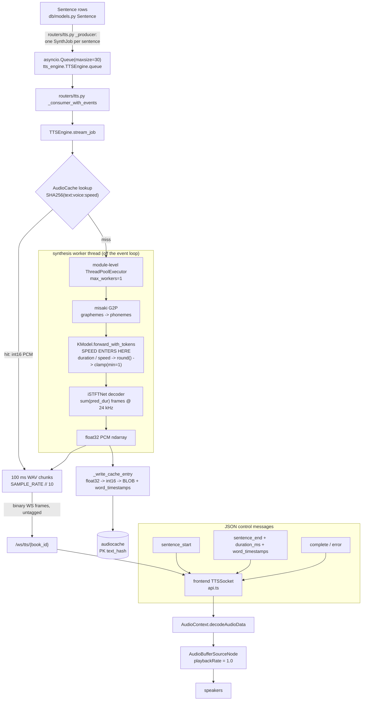

# TTS & Audio Architecture

How this app turns text into sound: speech generation, playback speed, the audio cache, the
synthesis scheduler, and the event-loop/threading model.

**Scope boundary.** This document owns **speech and audio only**. The system as a whole — backend
layering, data model, the reader/ingestion pipeline, frontend stores and components, testing gates —
is covered by [`docs/ARCHITECTURE.md`](ARCHITECTURE.md). Where the two touch (the `Sentence` table,
the WebSocket router, the reader store) this document says so and stops.

**Repo root.** Paths here are relative to the repository root, which is authoritative:
`git rev-parse --show-toplevel` → `/home/christapia50/Repos/ebook-reader`. Some older docs quote
`/home/christia50/...` (one `p` less); that spelling does not resolve.

---

## Evidence labels

Every significant claim below carries one of these. The convention exists because this repo has a
documented history of specs describing things the code does not do
(`implementation-handoff.md` §9, "Claims that are FALSE or incomplete").

| Label | Meaning |
|---|---|
| **Verified** | Read directly out of this repo's source or its SQLite database during the writing of this document. |
| **Measured** | A real number from a real run. The run is named: either mine, on this host and date, or the committed research artifact it came from. |
| **Cited** | An external source, with a URL. Not reproduced or measured here. |
| **Inferred** | Derived by reasoning from the above, with the reasoning shown. Not measured. |
| **Intent** | Stated as a rationale in a commit message or a research report, but not itself verified. |

**Hardware honesty up front.** This host has an NVIDIA T600 Laptop GPU, but `/dev/nvidia*` is absent
inside the agent sandbox, so `torch.cuda.is_available()` is `False` and `nvidia-smi` cannot reach the
driver (**Verified**: `services/kokoro_runtime.probe_local_torch()` exists precisely because a cached
answer can disagree with reality; it is a live probe). **Every measurement in this document is CPU,
or a count — frames, samples, bytes, rows — that is hardware-independent.** All GPU figures are
**Cited** or **Inferred**, never Measured, and §10 states their error bars.

**Concurrent edits — read this before trusting a line number.** The working tree was being edited by
other agents throughout the writing of this document, and `services/tts_engine.py` moved under me
**twice** in one session (`PREFETCH_TARGET_AUDIO_SECONDS`, then `synthesize_cached` /
`synthesize_serialized` plus the MP3-export consolidation). Line numbers below were re-checked
against the tree immediately before this file was finalised, and each is anchored to a named symbol
or a quoted line of code so it can be re-found after the next edit — but **where a line number and a
function name could disagree, trust the function name**, and prefer `grep -n <symbol>` over trusting
any number here. The claims themselves are against committed behaviour; the line numbers are against
a moving working tree.

---

## 1 · Overview

A reading session is a pull-through pipeline with a content-addressed cache in the middle. The
frontend sends `play` over `/ws/tts/{book_id}`; the router builds one `SynthJob` per non-filtered
sentence from a short-lived database read and enqueues them on a bounded `asyncio.Queue`; the
consumer calls `TTSEngine.stream_job` for each job in order. `stream_job` looks the sentence up in
`AudioCache` under `SHA256(text:voice:speed)`. On a **hit** it decodes the stored int16 PCM and
streams it out in 100 ms WAV chunks immediately. On a **miss** it hands the sentence to a
module-level single-worker `ThreadPoolExecutor`, where misaki's G2P produces phonemes and Kokoro's
`KModel.forward_with_tokens` produces 24 kHz float32 audio; that audio is chunked to the client as it
is produced and written back into the cache once complete. `playbackRate` on the browser side is
pinned at `1.0` — the rate is a **synthesis** parameter, resolved inside Kokoro before any audio
frame exists. The only WebSocket message that changes the rate is the next `play`/`seek` (or a
`prefetch_speed` cache warm), and because speed is part of the cache key, changing it means
re-synthesising the live window rather than re-labelling existing audio.



Three places consume the speed value, and they must agree:

| Where | Symbol | Role |
|---|---|---|
| Transport boundary | `routers/tts.py:_requested_speed` | validates, clamps to `[0.5, 3.0]`, quantises to 2 dp |
| Cache identity | `tts_engine.TTSEngine._cache_key` | `SHA256(f"{text}:{voice}:{repr(round(speed,2))}")` |
| Synthesis | `tts_engine.TTSEngine._call_kokoro` → `kokoro(text, voice=voice, speed=speed)` | the rate the model is asked to render |
| Frontend | `stores/audio.ts` → `TTSSocket.play/seek/prefetchSpeed` | carries the user's choice; `playbackRate` stays `1.0` |

---

## 2 · How speech is generated

### 2.1 The model and the front end

| Component | Version / value | Evidence |
|---|---|---|
| Kokoro-82M (`hexgrad/Kokoro-82M`) | `kokoro` **0.9.4** | **Verified** — `backend/venv/bin/python -c "import kokoro"` reports 0.9.4; the version is pinned in `backend/modal_kokoro.py:_runtime_image` (`pip_install("kokoro==0.9.4", ...)`) |
| G2P | `misaki` **0.9.4**, English (`lang_code="a"`) | **Verified** — `services/tts_engine._get_g2p` imports `misaki.en.G2P` |
| torch | **2.14.0+cu130** | **Verified** |
| numpy | **2.5.3** | **Verified** |
| Sample rate | **24 000 Hz**, mono, float32 in flight, int16 on disk | **Verified** — `SAMPLE_RATE = 24000` (`tts_engine.py:22`) |
| Frame rate | 40 frames/s → **600 samples = 25 ms** per frame | **Verified** — `24000 / 40 = 600`, and every measured take satisfies `samples == frames × 600` exactly (§2.4) |

Note on the local pipeline: **Kokoro's `speed` argument has no validation and no clamping in 0.9.4**
(**Verified** — `grep -n speed kokoro/model.py` returns only the signatures at lines 91/125/133/148/150
and the division at 108; nothing in `istftnet.py` or `custom_stft.py` references it). The only
effective bound is the per-token frame floor inside the model itself (§3).

### 2.2 The 3-tuple contract

Kokoro's `KPipeline.__call__` is a **generator** yielding `Result` objects that index as
`[graphemes, phonemes, audio]` and support `len() == 3` (**Verified** —
`kokoro/pipeline.py:345-349`, the `#### MARK: BEGIN/END BACKWARD COMPAT` block). This repo relies on
`result[-1]`:

```python
# services/tts_engine.py, TTSEngine._collect_result
audio = result[-1]
audio_data = audio if isinstance(audio, np.ndarray) else np.array(audio)
```

`CLAUDE.md` states this as a hard rule ("Kokoro yields 3-tuples `(graphemes, phonemes, audio_ndarray)`
— use `result[-1]`, sample_rate=24000"). The remote client preserves the same contract with a
purpose-built class rather than a tuple, so the engine needs **zero** changes to consume either:

```python
# services/modal_remote.py:74  class KokoroChunk
__slots__ = ("graphemes", "phonemes", "audio", "tokens")
def __getitem__(self, index: int) -> Any: return self._fields()[index]
def __iter__(self) -> Iterator[Any]:     return iter(self._fields())
def __len__(self) -> int:                return 3
```

**Verified.** Both paths also expose `.tokens` (misaki `MToken`s locally, rehydrated `KokoroToken`
dataclasses remotely), which is what the word-timestamp path consumes (§4).

### 2.3 Per-sentence granularity, and why

Each synthesis call is **exactly one sentence**. `routers/tts.py:_producer` walks
`sorted(sentence_data.keys())` and enqueues a `SynthJob` per non-filtered sentence; the consumer
pulls one job at a time and streams it to completion before taking the next.

```python
# routers/tts.py:_producer
for idx in sorted(sentence_data.keys()):
    s = sentence_data[idx]
    if idx < from_index or s["filtered"]:
        continue
    await engine_tts.enqueue(SynthJob(sentence_index=idx, text=s["text"], voice=voice, speed=speed))
```

Two consequences are structural, not incidental:

1. **A single `next()` on the Kokoro generator performs the entire inference.** `KPipeline.__call__`
   takes `split_pattern=r'\n+'` and only splits on newlines; a one-sentence input never contains one,
   so the generator yields exactly one `Result` (**Verified** — `kokoro/pipeline.py:351-355`; this is
   also why the old synchronous code froze the loop for whole sentences, §7).
2. **The sentence is the unit of everything else**: the seek target (`Progress.sentence_index`), the
   resume point, the `_producer`/consumer handoff, the metadata handoff
   (`TTSEngine._sentence_meta[idx]` → `sentence_end.duration_ms` + `word_timestamps`), and the
   cancellation checkpoints inside `stream_job` and `prefetch`.

**Inferred** — the rationale. No document in this repo states why per-sentence was chosen; I could not
find one, and I am not going to invent one. The mechanical reason visible in the code is
responsiveness: because the consumer can only be interrupted at a granularity boundary, a smaller
unit means pause/seek takes effect sooner, and the frontend's positional state
(`sentenceTimings`, `wordTimings`, `sentenceDurations`) is keyed by sentence index exactly as the
backend reports it. There is a real cost, and the research says so: `docs/research/02-synthesis-strategy.md`
§5.5 records that Kororo-FastAPI's tuned chunk band is **175–250 phoneme tokens** and this app's
average sentence is ~90–110 phonemes, so a run of consecutive sentences per call would amortise
per-call overhead *and* land inside the tuned band. That recommendation is **not implemented**.

### 2.4 Local pipeline vs the Modal remote backend

`TTSEngine` never knows which it has. It receives whatever callable `main._init_kokoro()` built and
probes its signature instead of guessing:

```python
# services/tts_engine.py:_accepts_speed
return "speed" in inspect.signature(kokoro).parameters
```

The docstring explains why signature probing replaced `except TypeError` (**Verified**, and the
reasoning is worth keeping): a `TypeError` can come from anywhere inside a callable — an unrelated
bug, one bad input, a remote transport — and treating any of them as "this build has no speed
support" silently downgrades a healthy engine to 1.0× for the rest of the session. `_accepts_speed`
returns `True` when the callable is not introspectable, giving it the benefit of the doubt.

| | Local (`KPipeline`) | Remote (`ModalKokoroClient`) |
|---|---|---|
| Built by | `engine_manager.build_local(device)` (`services/engine_manager.py:139`), called from `EngineManager._build` | `services/modal_remote.ModalKokoroClient` |
| Device | chosen by `EngineManager` from its **injected** torch probe (`kokoro_runtime.probe_local_torch` by default) and passed explicitly to `KPipeline(..., device=...)` | GPU chosen by Modal (`MODAL_KOKORO_GPU`, default `T4`) |
| Call | `pipeline(text, voice=..., speed=...)` returns a **generator** | `client(text, voice=..., speed=...)` returns a **`list[KokoroChunk]`** |
| Streaming granularity | one `Result` per call; `next()` *is* the inference | the whole sentence arrives in one HTTP/gRPC round trip, then decodes |
| Weight loading | 327 MB at process start | baked into a Modal volume at deploy time (`modal_kokoro._bake_model_into_volume`), `HF_HUB_OFFLINE=1` at runtime |
| Failure | raises | always raises `RemoteSynthesisError`; returning an empty iterable is explicitly rejected because "the reader would treat it as a successful synthesis of silence" (`modal_remote.py` module docstring) |

**Verified.** The remote wire contract is documented in `backend/modal_kokoro.py` (module docstring):
request `{"text", "voice", "speed", "lang_code"}`, response
`{"sample_rate": 24000, "chunks": [{"graphemes", "phonemes", "audio_b64", "tokens"}], ...}` with
`audio_b64` = base64 little-endian float32 mono PCM. `modal_remote.decode_response` rejects a
non-24000 sample rate, an empty chunk list, a chunk without `audio_b64`, and a chunk that decodes to
zero samples — each with its own message (**Verified**).

**Inferred, and important for latency:** because `ModalKokoroClient.__call__` blocks until the full
response arrives (`_invoke_with_timeout` → `future.result(timeout=self.config.timeout_s)`, default
**300 s**), the remote path has **no partial-sentence streaming**. Time-to-first-audio on a remote
miss is the whole round trip including a possible GPU cold start. The local path streams the first
100 ms chunk as soon as the frames exist.

### 2.5 Device selection

There is no device literal left in `main.py`. `main._init_kokoro()` is a thin wrapper over
`engine_manager.manager.startup()`, and the device is chosen inside `EngineManager`:

```python
# services/engine_manager.py — EngineManager._env_candidates
cuda = bool(self._torch_probe().get("cuda_available"))
preferred = MODAL if remote["reachable"] else (GPU if cuda else CPU)
```

The probe is **injected** (`torch_probe=kokoro_runtime.probe_local_torch` by default), and
`_local_availability` (`:309`) reads the same callable, so the startup device and the Settings
selector cannot disagree about whether this machine has a GPU (**Verified** — a test drives
`availability("cpu")` with a remote probe that raises if touched, and `switch()`/`options()` agree
over 30 probe combinations).

`build_local(device)` never guesses, so `cpu` and `gpu` are genuinely different requests rather
than "cuda if it happens to be there". The chosen device is recorded on `kokoro_runtime.runtime`
via `record_local(device=..., model_repo=...)` and reported by `GET /api/system/capabilities` (§9).
There is no runtime device switch: changing it means restarting the process.

An earlier version computed the device in `main._init_local_kokoro()`. That function had **no
callers**, and it read the device from a different source than the Settings selector — which is
precisely how a machine with no GPU could still be offered the GPU card. It has been removed.

---

## 3 · How speech speed-up works

This is the central section of the document. The short version: **Kokoro re-synthesises at the
target rate; nothing is resampled anywhere.**

### 3.1 The mechanism, verified from installed source

`kokoro/model.py`, `KModel.forward_with_tokens`, lines **108-109** (and the surrounding frame
expansion):

```python
duration = self.predictor.duration_proj(x)                  # :107
duration = torch.sigmoid(duration).sum(axis=-1) / speed     # :108  <-- speed enters
pred_dur = torch.round(duration).clamp(min=1).long().squeeze()  # :109
indices = torch.repeat_interleave(torch.arange(input_ids.shape[1], device=self.device), pred_dur)
pred_aln_trg = torch.zeros((input_ids.shape[1], indices.shape[0]), device=self.device)
pred_aln_trg[indices, torch.arange(indices.shape[0])] = 1
...
en = d.transpose(-1, -2) @ pred_aln_trg
F0_pred, N_pred = self.predictor.F0Ntrain(en, s)
...
audio = self.decoder(asr, F0_pred, N_pred, ref_s[:, :128]).squeeze()
```

**Verified** by reading `backend/venv/lib/python3.12/site-packages/kokoro/model.py`. Read it in order:

1. The duration/prosody predictor produces a per-token duration in frames.
2. **`/ speed` divides it before any frame exists.**
3. `torch.round` quantises to whole frames — i.e. **to 25 ms**.
4. `.clamp(min=1)` floors every *finite* token at **one frame (25 ms)** — *finite* is the operative
   word: §3.2 shows `inf`/`NaN` escaping this floor into a crash rather than degrading to one frame.
5. `repeat_interleave` expands each phoneme into `pred_dur[i]` columns of the alignment matrix, so
   `pred_aln_trg` has `sum(pred_dur)` columns — **the column count *is* the number of acoustic
   frames**.
6. The vocoder (`self.decoder`, iSTFTNet) is fed those frames. Fewer frames at higher `speed` means
   genuinely fewer samples, not a re-labelled sample count.

**There is no resampling in the package.** `grep -rniE "resample|interp1d|torchaudio|scipy|librosa|
wsola|stretch"` over `kokoro/*.py` returns **nothing** (**Verified**). `speed` appears only in
`model.py`, `pipeline.py` (pass-through and timestamp conversion) and `__main__.py` (CLI), and
`pipeline.py:228-232` forwards it verbatim into `model(ps, pack[len(ps)-1], speed, return_output=True)`.

The hardware-independent confirmation is arithmetic: **24000 Hz ÷ 40 frames/s = 600 samples per
frame**, and every take measured satisfies `samples == frames × 600` exactly — e.g. 176 frames →
105 600 samples → 4.400 s (**Measured**, my re-run of `docs/research/01-speed-strategy-range.py` on
2026-09-26; the full table is in §3.4). Had `speed` been implemented as a resample, samples would
have been produced at 1.0× density and then decimated, and this identity would fail.

### 3.2 A mechanism detail the docs get subtly wrong

The order is `round(...).clamp(min=1).long()`. The clamp is applied to the **float**, *before* the
`.long()` cast. So for finite non-positive durations `speed ≤ 0` is floored at 1 frame — but `inf`
and `NaN` pass through `clamp(min=1)` unchanged, and the cast then maps them to `INT64_MIN`:

```
speed=0.0: duration=[inf, inf, inf]  round=[inf,...]  long=[-9223372036854775808, ...]
speed=nan: duration=[nan, nan, nan]  round=[nan,...]  long=[-9223372036854775808, ...]
→ torch.repeat_interleave(...) raises  RuntimeError: repeats can not be negative
```

**Measured** by reproducing that exact expression on this host (torch 2.14.0, 70 tokens), and
confirmed end-to-end by re-running the repo's own probe: `speed=0.0` and `speed=nan` both raise
`RuntimeError: repeats can not be negative`, while `speed=-1.0` and `speed=inf` render the 70-frame
floor take (1.750 s) without error (**Measured**, `docs/research/01-speed-strategy-range.py`, re-run
by me 2026-09-26).

So the correct statement is **not** "`clamp(min=1)` floors every phoneme". It floors every *finite*
phoneme. `inf`/`NaN` are the only inputs that escape the floor, and they escape it into a crash — which
is exactly why validation at the transport boundary matters (§3.5) and why the router comment's
phrasing ("a `torch.round(inf)` failure") describes the symptom's neighbourhood rather than the
mechanism. `routers/tts.py:16-26` says the failure happens "during iteration, outside
`_call_kokoro`" — that part is exactly right, and it is why the old code could not catch it.

### 3.3 The decision: native `speed=` over "synthesise at 1× then time-stretch"

**Decision.** Ask the model for the rate. Do not synthesise at 1.0× and stretch.

The rationale is recorded in four places (**Intent**, all verified to exist): `CLAUDE.md`'s Audio hard
rule ("Speed handled by Kokoro native `speed` param — browser `playbackRate` stays at `1.0`"),
`frontend/src/lib/stores/audio.ts:218` with its inline comment, `docs/research/01-speed-strategy.md`'s
TL;DR recommendation, and commit `36e2120`'s message. Three arguments carry it.

**(a) Pitch. Native speed preserves it; naive resampling does not.** Measured by me on this host
(2026-09-26), re-running `docs/research/01-speed-strategy-pitch.py`, median F0 by autocorrelation on
one sentence:

| Variant | samples | duration | median F0 | vs 1.0× | semitones |
|---|---|---|---|---|---|
| native `speed=1.0` | 105 600 | 4.400 s | 196.72 Hz | 1.000 | 0.00 |
| native `speed=1.5` | 70 800 | 2.950 s | 192.00 Hz | 0.976 | **−0.42** |
| native `speed=1.0` then polyphase-resample ×1.5 | 70 400 | 2.933 s | 292.68 Hz | 1.488 | **+6.90** |

**Measured.** The residual −0.42 semitones is the model re-predicting F0 for the compressed frame
grid (`F0Ntrain` runs on the already-compressed alignment, `model.py:115`) rather than bending an
existing contour — **Inferred** from the code order. A naive resample raises the pitch by nearly a
fifth: the chipmunk effect. Resampling is disqualified on this measurement alone.

**(b) Timestamps come for free, and the stretch approach would break them.**
`kokoro/pipeline.py:join_timestamps` walks `pred_dur` — the **post-division** vector — and converts
half-frames to seconds with `MAGIC_DIVISOR = 80` (**Verified**, `pipeline.py:286-320`). So
`t.start_ts` / `t.end_ts` are *already* in delivered-audio time at the requested speed. Measured word
timings shrink with speed and stay inside the audio:

| requested | last word `riverbank` ends at | audio ends at | ratio vs 1.0× |
|---|---|---|---|
| 1.0 | 4.150 s | 4.400 s | 1.000 |
| 1.5 | 2.750 s | 2.950 s | 1.509 |
| 2.0 | 2.300 s | 2.475 s | 1.804 |
| 3.0 | 1.900 s | 2.050 s | 2.184 |

**Measured** (`docs/research/01-speed-strategy.md` Evidence 4, from
`docs/research/01-speed-strategy-timestamps.py`; I did not re-run this one — see "What I could not
verify" at the end). Under either stretch design the frontend comparison breaks: the rAF loop
computes `elapsed = now - sentenceStart` on the `AudioContext` clock and compares it to
`words[i].start` (`stores/audio.ts:155-163`), while the chunk scheduler computes
`nextStartTime = startAt + buffer.duration` (`audio.ts:242`). A stretch would require dividing every
timestamp by the stretch factor, accumulating `audio_offset` on stretched lengths, and rescaling
`sentenceTimings`. All three exist; none of them would have been free.

**(c) Cost runs the same direction.** The forward pass splits into terms that depend only on the
phoneme sequence (ALBERT at `model.py:102`, `bert_encoder`, `TextEncoder` at `:116`) — identical at
every speed — and terms proportional to the frame count (`repeat_interleave`, the
`[phonemes × frames]` alignment matrix, both matmuls, `F0Ntrain`, the whole decoder/iSTFTNet). Every
frame-proportional term shrinks as `1/speed`. So `cost(native@1.5) ≤ cost(native@1.0) ≤
cost(stretch) = cost(native@1.0) + stretch`. **Inferred from the code**, and the magnitude of the
saving was not measurable on this box (see §10 and `01-speed-strategy.md` Evidence 21, where the
host's load average of ~41 made wall-clock and CPU-second figures unusable).

**Alternatives rejected, and why.**

| Alternative | Rejected because | Evidence |
|---|---|---|
| Naive resample (change the sample rate) | +6.90 semitones measured on the same take; the chipmunk effect | **Measured** (table above); [Wikipedia, *Audio time stretching and pitch scaling*](https://en.wikipedia.org/wiki/Audio_time_stretching_and_pitch_scaling) — "the frequencies in the recording are always scaled at the same ratio as the speed" (**Cited**) |
| WSOLA / SOLA / TDHS | Past its comfortable range: Parviainen (author of SoundTouch) documents "reverberating artefacts that get more obvious with larger time modification, i.e. when scaled time differs from the original sound roughly by 15% or more". A 1.5× request is a 33% modification and 2.0× is 50%. Also needs ~100 ms of future samples per sentence (lookahead), which fights chunk-by-chunk streaming | **Cited** — [surina.net, *Time and pitch scaling in audio processing*](https://www.surina.net/article/time-and-pitch-scaling.html) |
| Phase vocoder | "Dull sound", transient smearing, and "running time or pitch scaling with Phase Vocoder for longer than a couple of second results into practically randomized signal phases" — which pushes toward whole-sentence batch processing. `librosa`'s only built-in time-stretch *is* a phase vocoder (`librosa/effects.py` → `core.phase_vocoder`), and `librosa` is not installed in either venv | **Cited** — same source; `librosa` absence **Verified** |
| Browser `playbackRate` | `AudioBufferSourceNode.playbackRate` **resamples**; MDN: "When set to another value, the `AudioBufferSourceNode` resamples the audio before sending it to the output", and its own example treats `2.0` as an octave up. `preservesPitch` is an **HTMLMediaElement** API, not an `AudioBufferSourceNode` one | **Cited** — [MDN](https://developer.mozilla.org/en-US/docs/Web/API/AudioBufferSourceNode/playbackRate), [caniuse](https://caniuse.com/mdn-api_htmlmediaelement_preservespitch); the repo's pin is **Verified** at `audio.ts:218` |
| Hybrid (native up to ~1.5×, stretch the residual) | Not needed while no requirement exceeds ~2.1×, and it doubles the failure surface. `01-speed-strategy.md` Recommendation 4 specifies how to build it if a true 3× is ever required: server-side, per sentence, inside `_write_cache_entry`, with `start_ts`/`end_ts` divided by the same residual | **Intent** — recorded, not built |

One honest note against the code: the upstream maintainer's advice in
[hexgrad/kokoro#174](https://github.com/hexgrad/kokoro/issues/174) is the opposite of this decision —
*"I think this is mitigated if you generate at 1x and then increase audio playback speed to 1.5x
using other means."* That advice is aimed at a Chinese-specific last-word truncation report in an
older release (issue state **closed**), and in this app "increase playback speed using other means"
lands on the `AudioBufferSourceNode` path where it means resampling and therefore a +6.9-semitone
shift. **Cited.** It is recorded here rather than dismissed because it is the one mainstream upstream
voice on the question.

### 3.4 What speed actually delivers

`clamp(min=1)` is the whole story. The achieved rate is `sum(d_i) / sum(max(1, round(d_i / speed)))`
where `d_i` is the 1.0× per-token duration. I recomputed that model from the committed per-token
vector in `docs/research/01-speed-strategy-durationmodel.json` (`token_dur_at_1x`, 70 tokens, sum 176
frames):

| requested | frames (model) | measured frames | **effective rate** | tokens at the 25 ms floor |
|---|---|---|---|---|
| 0.5 | 352 | 356 | 0.494× | 0 / 70 (0%) |
| 0.75 | 234 | 240 | 0.733× | 24 / 70 (34%) |
| 1.0 | 176 | 176 | 1.000× | 24 / 70 (**34%**) |
| 1.25 | 150 | 148 | 1.189× | 24 / 70 (34%) |
| 1.5 | 118 | 118 | **1.492×** | 50 / 70 (**71%**) |
| 2.0 | 103 | 99 | **1.778×** | 50 / 70 (71%) |
| 3.0 | 82 | 82 | **2.146×** | 64 / 70 (**91%**) |
| `inf` | 70 | 70 | **2.514×** (hard ceiling) | 70 / 70 (100%) |

The model column and the floor occupancy are **Verified** — recomputed by me from the committed
raw per-token durations, matching the report's published 34% / 71% / 91% exactly. The measured-frames
column is **Measured** (`01-speed-strategy-durationmodel.py`; I also re-ran the range probe and got
the same 356 / 82 / 70 frames for 0.5 / 3.0 / `inf`). The `predicted` vs `measured` agreement is
within 0–4 frames (0–4%) at every speed.

A second sentence (511 frames at 1.0×) gives 1.180× / 1.553× / 1.799× / 2.147× at 1.25 / 1.5 / 2.0 /
3.0 (**Measured**, same report). `docs/research/02-synthesis-strategy.md` §2.2 measures a third and
fourth sample (210-char and 47-char) and gets **1.596× / 1.876× / 2.275×** and
**1.492× / 1.778× / 2.146×** — the same direction, with the longer sentence closer to the request.
These are **different sentences and cannot be compared to each other directly**; together they show
that the delivered rate is **token-density dependent**, which is the point of the next paragraph.

**The consequence: delivered pace is text-dependent and wobbles sentence to sentence at a fixed
setting.** A long sentence with many long vowels lands near its label; a short one made of
consonant-heavy words saturates. The ceiling for a sentence with `T` tokens is `frames(1.0) / T`
(2.514× here), so no setting above roughly 2.1× means anything reliable, and the top of the old
0.5–3.0 range was a real argument value but **not a real playback rate**. The structural cause is
that 91% of tokens are pinned to a single 25 ms frame at 3.0× — the model is being asked to render a
phoneme in less time than one frame step, so consonant and final-phoneme clipping is a plausible
perceptual consequence. That perceptual claim is **Inferred**; **it was not listening-tested**
(`01-speed-strategy.md` Open Question 5 says so explicitly, and Open Question 1 names a blind A/B at
1.5× and 2.0× on 20 real sentences as the single experiment that would settle it).

**The product decision that follows: the UI no longer offers 3.0×.** Measured twice on this codebase,
3.0× renders at roughly 2.15–2.2× — about 27% short of its own label — and on some sentences is
indistinguishable from 2.75×. Offering it is a control that lies about what it does. Commit
`36e2120` removed it:

```svelte
// frontend/src/lib/components/MediaBar.svelte:32
const speeds = [0.5, 0.75, 1.0, 1.25, 1.5, 2.0]
```

**Verified** (the list is six values, and the accompanying comment states the saturation argument).
2.0× stays despite undershooting at ~1.78–1.9×, because the shortfall is an order of magnitude less
misleading and 2.0 is the top of the range Kokoro's own author exposes. **Intent** — the rationale is
recorded in the commit message and the component comment.

Two loose ends, both **Verified**:

- `backend/routers/tts.py` still accepts up to `MAX_SPEED = 3.0`, and
  `frontend/src/lib/stores/reader.ts:53-55` still clamps to `Math.max(0.5, Math.min(speed, 3.0))`.
  So 3.0 remains reachable by any WebSocket client and by any future caller of `setSpeed`; only the
  button list changed. The router is right to keep the wider bound — it serves the API, not the UI —
  but the two numbers now disagree about what the product supports.
- `backend/tests/test_speed_engine.py:196` and `backend/tests/test_speed_adversarial.py:55` still
  define `UI_SPEEDS = [0.5, 0.75, 1.0, 1.25, 1.5, 2.0, 3.0]` with a comment citing
  "`MediaBar.svelte:24`" — a line that has since moved to 32. Harmless to the assertions (they test
  key uniqueness and legacy-key spelling, and 3.0 is a legitimate key), but the comment is now wrong
  in both content and line number.

### 3.5 Edge cases: `speed = 0`, `NaN`, and what validation exists

| Input | Before | Now |
|---|---|---|
| `0`, `NaN` | reached `forward_with_tokens`, raised `RuntimeError: repeats can not be negative` during iteration, surfaced as an `{"type":"error"}` frame — a dead reading session | rejected at the transport boundary with a client-safe `error` frame; the session continues |
| `-1.0` | silently "maximum speed": the 70-frame floor take (1.750 s), a nonsense-but-valid render | rejected (`speed must be greater than zero`) |
| `inf` | accepted, behaves identically to the floor | rejected (`speed must be finite`) |
| `1.149` | hashed as a distinct key from `1.15` | quantised to `1.15` once, so key, Kokoro argument and reported rate cannot disagree |

**Verified** — `routers/tts.py:_requested_speed`:

```python
def _requested_speed(msg: dict) -> float:
    try:
        speed = float(msg.get("speed", 1.0))
    except (TypeError, ValueError):
        raise ValueError("speed must be a number")
    if not math.isfinite(speed):
        raise ValueError("speed must be finite")
    if speed <= 0:
        raise ValueError("speed must be greater than zero")
    return round(min(max(speed, MIN_SPEED), MAX_SPEED), 2)
```

Both `play`/`seek` and `prefetch_speed` go through it; on `play`/`seek` a rejection sends an `error`
frame and `continue`s, on `prefetch_speed` it is ignored silently because "a malformed speed is not
worth interrupting playback over; the next well-formed message will re-warm the cache" (**Verified**,
`routers/tts.py:233-239` and `:254-259`). `docs/research/01-speed-strategy.md` Evidence 24 documents
the pre-fix inconsistency (prefetch validated, `play`/`seek` did not); **that finding is now stale** —
the code moved on. `backend/tests/test_speed_engine.py` parametrises the rejections and the clamping.

**Still unvalidated:** `POST /mp3/export` takes `speed: float = 1.0` as an unconstrained pydantic
field and hands it to a synthesis path that never sees `_requested_speed` (§12).

---

## 4 · Word-level timestamps

### 4.1 Production

There are two paths, and only one of them is the primary one.

**Primary — the model's own timings.** For each result, `_collect_result` walks `result.tokens`,
filters through `_is_spoken_token`, and offsets by `audio_offset` (the sum of the delivered lengths
of previous chunks of the same sentence):

```python
# services/tts_engine.py:_collect_result
for t in (getattr(result, 'tokens', None) or []):
    if _is_spoken_token(t):
        word_timestamps.append({
            "word": t.text,
            "start": round((t.start_ts or 0) + audio_offset, 4),
            "end":   round((t.end_ts   or 0) + audio_offset, 4),
        })
audio_flat = audio_data.flatten() if audio_data.ndim > 1 else audio_data
return audio_data, audio_offset + len(audio_flat) / SAMPLE_RATE
```

**Verified.** `start_ts`/`end_ts` come from misaki tokens and are **already speed-adjusted**, because
`join_timestamps` counts the post-division `pred_dur` frames (§3.3b). `audio_offset` is accumulated
from `len(audio_flat) / SAMPLE_RATE` — i.e. from **delivered samples**, so it is correct at any
speed by construction.

**Fallback — proportional estimation, only for cache rows that have none.**
`_proportional_timestamps` distributes words across the row's stored `duration_ms` in proportion to
phoneme count. It is called only inside the cache-hit branch and only `if word_ts is None`
(**Verified**, `stream_job`). This matters more than it sounds: of 4 553 cached rows, **1 777 have
`word_timestamps IS NULL`** (**Measured**, read-only query against `backend/ebook_reader.db`), so on
an existing library the fallback is not rare.

### 4.2 Why both paths share one predicate

```python
# services/tts_engine.py:_is_spoken_token
return bool(token.phonemes) and any(c.isalnum() for c in token.text)
```

The docstring states the reason and it is a scar, not a preference: "This predicate must be applied
identically on both the stored-timestamp path and the estimated-timestamp path. When the two
disagreed, the word list for a sentence changed the moment that sentence became cached, and the
reader's word highlighting visibly shifted underneath the user." Fixed in commit `cb2d853`
(**Intent**, and **Verified** that a single shared helper is now the only definition — `grep` finds
`_is_spoken_token` used at both call sites and nowhere else).

### 4.3 Storage and consumption

| Stage | Where | Shape |
|---|---|---|
| Storage | `AudioCache.word_timestamps` (TEXT, nullable) | JSON array `[{"word","start","end"}]`, seconds, rounded to 4 dp |
| Retrieval | `stream_job` cache-hit branch | `json.loads(...)`; `None` → `_proportional_timestamps` |
| Transport | `sentence_end` message | `"word_timestamps": [...]` alongside `duration_ms` |
| Client | `api.ts` `TTSSocket.onSentenceEnd` → `stores/audio.ts` `wordTimings.set(index, wordTimestamps)` | `Map<sentenceIndex, WordTimestamp[]>` |
| Highlighting | `stores/audio.ts` rAF tick | last `i` where `elapsed >= words[i].start`, with `elapsed = ac.currentTime - sentenceStart` |

**Verified** at every stage. Sentence start times are recorded when the first chunk of a sentence is
scheduled, offset by `SENTENCE_TIMING_OFFSET_S = 0.016` (`audio.ts:81`, `:224-226`) to avoid
highlighting a word a frame early. The rAF tick takes the **latest** sentence whose scheduled start
has passed (`if (startTime <= now && idx > latestReady)`), so several very short sentences elapsing
within one animation frame still land on the right one, and it prunes past entries from both maps.

**The whole scheme is only valid because `playbackRate` is 1.0** (**Verified**, `audio.ts:218`). At
any other rate, `now - sentenceStart` would no longer be delivered-audio time.

---

## 5 · The audio cache

### 5.1 The table

```sql
CREATE TABLE audiocache (
    text_hash VARCHAR NOT NULL,
    audio_data BLOB NOT NULL,
    duration_ms INTEGER NOT NULL,
    voice VARCHAR NOT NULL,
    created_at DATETIME NOT NULL,
    word_timestamps TEXT,
    PRIMARY KEY (text_hash)
)
```

**Verified** by reading `sqlite_master` in `backend/ebook_reader.db` (read-only) and matching
`db/models.py:67-73`. Two facts follow and both bite:

- **There is no `speed` column.** Speed is baked into the SHA-256 key and is **not recoverable**. The
  measured 3 700 ms average row duration is therefore a blend across unknown speeds, and a lower bound
  on the 1.0× duration. `docs/research/02-synthesis-strategy.md` Open Question 3 flags this; adding a
  `speed` column would make it measurable and is a good idea on its own merits.
- Audio is headerless mono **int16 PCM at 24 kHz = 48 000 bytes per audio-second**, exactly
  (**Verified**: `SUM(LENGTH(audio_data)) = 808 521 600` bytes ÷ `SUM(duration_ms)/1000 = 16 844.197` s
  `= 48 000.0`). Every disk figure in this document follows from that constant.

### 5.2 Key derivation

```python
# services/tts_engine.py:_cache_key
normalised = repr(round(float(speed), SPEED_PRECISION))   # SPEED_PRECISION = 2
return hashlib.sha256(f"{text}:{voice}:{normalised}".encode()).hexdigest()
```

**Verified.** Three properties, all load-bearing:

**Why 2 decimals.** The UI's speeds are all multiples of 0.25, so 2 dp is lossless for them, while
2 dp collapses float noise (`1.15` vs `1.1500000000000001`) onto one key instead of two. The
`SPEED_PRECISION` comment block states this (**Intent**) and it is **Verified** by computation: the
11 multiples of 0.25 in `[0.5, 3.0]` (plus 1.75–3.0 extensions) all round to themselves.

**The backward-compatibility constraint — do not "tidy" this.** `repr(round(float(speed), 2))` is
**byte-identical** to the legacy `f"{speed}"` spelling for every speed the UI can produce:
`repr(round(1.0, 2)) == "1.0"`, not `"1.00"`. A fixed-point format such as `f"{speed:.2f}"` would
have silently orphaned **every row on disk** and forced a re-synthesis of the entire library — a slow
regression with no crash and no error to notice. Commit `980fc04` exists solely because the first
version of the normalisation (`cb2d853`) made that mistake. The empirical check recorded in that
commit was run against the live database: **12 172 sentences, 4 553 cached rows, 3 voices → 13 200
`(text, voice, speed)` combinations, 0 new-vs-legacy key mismatches, identical reachability of the 87
rows that were then cache-hit by either derivation.** **Measured** (recorded in the commit message;
I did not re-run the DB-side check, because checking reachability requires each row's speed, which
the table does not store). What I did verify myself is the arithmetic that makes it true — for all
18 grid values including the 11 multiples of 0.25, `SHA256(text:voice:repr(round(s,2)))` equals
`SHA256(text:voice:f"{s}")` with **zero** mismatches (**Verified**, computed on 2026-09-26). The
regression is pinned by `backend/tests/test_speed_engine.py::TestCacheKeyBackwardCompatibility`,
which re-derives the legacy key verbatim and asserts equality for every UI speed and every other
multiple of 0.25 the API can be handed.

**The collision caveat, and its bounded error.** Two *client-supplied* speeds inside the same 0.01
bucket share a key: `1.149` and `1.15` collide, and so do `1.15` and `1.1500000000000001`
(**Verified** by computation). The worst-case disagreement between the requested and the delivered
rate is therefore one bucket width, `0.01` absolute, which near the 0.5× end is ~1.9–2.0% relative;
the code comment states **1.92%** (**Intent**; the bucket is 0.01 wide against a rate of ~0.52).
The second user of that key gets the first user's audio at the first user's rate. This is now
**mitigated on the WebSocket path**, because `_requested_speed` quantises once at the transport
boundary so the key, the Kokoro argument and the reported rate cannot disagree — but `_cache_key`
itself is still reachable with arbitrary floats by any other caller (tests, `mp3.py` if it were ever
routed through the engine), so the caveat stays in the register. The durable fix named in the comment
is exactly the one that has now been applied; the comment could be updated to say so.

### 5.3 Measured size and growth

Read-only queries against `backend/ebook_reader.db`, file size **839 917 568 bytes** (800.99 MiB):

| Metric | Value |
|---|---|
| Rows | **4 553** |
| Retained audio bytes | **808 521 600** (771.1 MiB) |
| Average row | 177 580 bytes (≈3.70 s) |
| Min / max row | 10 800 / 1 243 200 bytes |
| Total audio | 16 844 197 ms = **4.679 h** |
| Distinct voices in cache | **3** (`am_adam`, `af_heart`, `am_michael`) |
| Rows with no `word_timestamps` | **1 777** |
| DB overhead over audio | ~31.4 MB (page/index overhead, `freelist_count = 0` at the time of measurement) |

**Measured** (my read-only queries, 2026-09-26, matching `docs/research/arithmetic.json`). Growth
characteristics:

| Pressure | Cost |
|---|---|
| One 50-sentence prefetch at a new speed (one slider drag) | +50 rows, **~8.9 MB**, unconditional |
| One full-book pass, 1 voice, 1 speed | +5 890 rows, **+1.05 GB (blend) / +2.0 GB (1× reference)** |
| Heaviest recorded day (2026-05-13) | +2 784 rows / **+456 MB in one day** |
| 7 speeds × 28 voices × 1 book | +1.15 M rows, **+185–355 GiB** |
| 7 speeds × 28 voices × 7 books | **+1.30–2.48 TiB** |

**Measured/Inferred** — the per-event and observed-growth figures are Measured; the matrix
extrapolations are Inferred from the 48 000 B/s constant and the sentence counts (§6).

### 5.4 Eviction

**Status at the time of writing: implemented in the working tree, uncommitted, and being added
concurrently by another agent.** `backend/services/audio_cache.py` is a new untracked file (439 lines)
with `backend/tests/test_audio_cache_eviction.py` (30+ tests) alongside it; `backend/main.py` and
`backend/db/database.py` carry matching uncommitted edits. **Before this change there was no eviction
of any kind** — `docs/research/02-synthesis-strategy.md` §7 documents a repo-wide grep finding no TTL,
no cap, no LRU, no `VACUUM`, and no `DELETE FROM audiocache` anywhere. Describing what exists:

| Aspect | Implementation | Evidence |
|---|---|---|
| Cap | `AUDIO_CACHE_MAX_MB`, default **4096 MB** (`DEFAULT_MAX_MB`) | **Verified** `audio_cache.py:92` |
| Sweep interval | `AUDIO_CACHE_SWEEP_INTERVAL_SECONDS`, default **900 s** (`DEFAULT_SWEEP_INTERVAL_SECONDS`) | **Verified** `audio_cache.py:97` |
| Where it runs | `sweep_once` at startup + `start_periodic_sweep` for the process lifetime, both from `main.lifespan:162-163`; **never** from the write path | **Verified** |
| Metric | retained **audio bytes** (`SUM(LENGTH(CAST(audio_data AS BLOB)))`), with the file size as a cheap upper bound to skip the exact sum while under the cap | **Verified** `evict_to_cap` |
| Policy | **oldest `created_at` first**, then `text_hash` as a deterministic tie-break | **Verified** `_OLDEST_FIRST` |
| Batching | deletes committed every 64 MB (`DELETE_BATCH_BYTES`) to bound the rollback journal | **Verified** |
| Index | `CREATE INDEX IF NOT EXISTS ix_audiocache_created_at`, added idempotently by `db/database.py:_migrate` (the PK autoindex cannot serve that `ORDER BY`, and the table holds ~800 MB of PCM) | **Verified** in the migration source; the on-disk dev database had **not** yet run it when I checked (only `sqlite_autoindex_audiocache_1` was present), so it appears on the next startup |
| `VACUUM` | **Deliberately not automatic.** Exposed as `audio_cache.vacuum(engine)`, documented, never called by the sweep. SQLite does not return freed pages without it, so a sweep shrinks the row count while the file stays ~840 MB; `cache_stats()["freelist_bytes"]` reports what it would return | **Verified** |
| Failure mode | a database error during a sweep is logged and swallowed; the cache is left as it was and the next sweep retries | **Verified** `sweep_once` |

**The name "LRU" is wrong and the module says so.** `created_at` is written once at insert and never
updated; a cache *hit* does not touch the row. This is therefore **insertion-order (FIFO) eviction,
not true LRU** — the consequence being that a sentence the user replays every day is exactly as "old"
as one synthesised once and never played, so a sweep can delete something about to be replayed and it
will simply be re-synthesised. Making it true LRU means a `last_used_at` column written on every
cache hit (write amplification on a read path), and the module explicitly files that as a follow-up
rather than smuggling it in behind the name. **Verified, and this document follows the module's own
language rather than the brief's.** One detail worth flagging: with the default 4 GB cap and the
current 771 MiB payload, eviction will not fire at all on this database for a long time — the cap is
deliberately ~5× the observed payload so that introducing it cannot delete the user's existing cache
on first boot.

---

## 6 · Scheduling: dynamic on-demand vs pre-synthesis

### 6.1 The arithmetic that settles it

**Disk is the binding constraint, not time.** Time can be waited out; disk cannot.

Constants (**Verified**): 48 000 bytes per audio-second; N = **5 890** speakable sentences per
300-page book (from 462-page `cleancodebook.pdf`: 9 663 sentences, 9 070 speakable, 20.92
sentences/page, 93.86% speakable); 28 built-in voices (`routers/voices.py:ENGLISH_VOICE_CATALOG`);
**6** speeds now offered in the reading UI.

| Scope | 1× reference | DB-blend estimate | After the measured saturation correction |
|---|---|---|---|
| 1 book × 1 speed × 1 voice | 1.87 GiB | 0.97 GiB | — |
| 1 book × 7 speeds × 1 voice | 12.39 GiB | 6.46 GiB | 12.67 / 6.61 GiB |
| **1 book × 7 speeds × 28 voices** | **346.86 GiB** | **180.93 GiB** | **354.81 / 185.08 GiB** |
| 7 books × 7 speeds × 28 voices | 2 428 GiB | 1 266 GiB | 2 483 / 1 296 GiB |
| **Free disk on the whole filesystem** | **529 GiB at research time; 520 GiB when I re-checked on 2026-09-26** | | |

**Measured/Inferred** — the byte constants, sentence counts, voice count and free-disk figures are
Measured; the matrix products are Inferred (stated arithmetic on measured inputs). The numbers come
from `docs/research/arithmetic.json` (`disk`), and `185–355 GiB` is the corrected column.

So the full speed × voice matrix for **one** book consumes **35–83%** of all free disk, and for the
7-book library it is **2.4–4.7× more disk than exists**. Note the second-order finding, which is the
one that kills the intuition "raising speed buys back disk": because compression saturates, the sum
over the seven speeds is **6.784×** rather than the ideal **6.633×** — a **+2.3%** correction, i.e.
the corrected figures are *worse*, not better.

**Time is bad too, but survivable.** One 1.0× pass over one book on CPU is
**5 890 × 9.55 s = 15.63 h** at the measured mean of **9.55 s/sentence**, **RTF 1.7721** (median
wall 8.99 s, mean audio 6.30 s, throughput 0.105 sentences/s — **Measured**,
`docs/research/bench_synth.json`, 30 sentences stride-sampled from `cleancodebook.pdf`, mean 72.3
chars). Eleven speed changes for one voice is **171.93 h**; the full matrix is weeks. And CPU cost is
**hardware-insensitive** — the same RTF band appears on a Pixel 8a (≈1.8, LiteRT fp32),
a Raspberry Pi 4 (2.77, ONNX), a 4-core Xeon (1.3 PyTorch / 1.8 ONNX) and this i7-11850H (1.77)
(**Cited**; §10). Buying a faster CPU does not fix an on-demand synthesizer that is 1.8× slower than
real time; only the GPU path changes that, and §10 shows the GPU estimate has a 20-fold error bar.

### 6.2 The diagnosis that actually explained the lag

The reported lag was **not** a lack of pre-synthesis. It was that the synthesis call ran
synchronously **on** the asyncio event loop, and that prefetch and playback were perfectly serialised.
Both are measured:

| Measurement | Value | Evidence |
|---|---|---|
| Event-loop baseline heartbeat gap (10 ms timer) | 0.0112 s | **Measured** `bench_blocking.json` |
| **Maximum gap during synthesis** | **83.01 s** | **Measured** — "the loop took ZERO turns across 83 consecutive seconds"; 1 heartbeat tick recorded |
| Per-sentence blocking (3 consecutive sentences) | 26.56 / 20.26 / 36.18 s | **Measured** |
| `play` alone / `prefetch` alone | 24.56 s / 23.32 s | **Measured** |
| Both started together (`asyncio.gather`) | 47.88 s | **Measured** |
| **`overlap_ratio`** | **1.000** | **Measured** — "prefetch steals wall-clock from playback one-for-one, with zero parallelism" |
| misaki G2P mean | **0.013 s** | **Measured** — **0.04%** of total cost |
| torch model forward mean | 30.90 s | **Measured** — effectively 100% of the cost |

So the 50-sentence prefetch was not free background work; at RTF 1.77 it warms ~185 s of audio at a
cost of ~478 s of generation, can never catch up, and each iteration blocked the whole server for a
full sentence. **That is the lag.** Doubling down with whole-book pre-synthesis would make the
monopolisation permanent and total.

### 6.3 The decision

**Dynamic on-demand synthesis with a bounded prefetch, not full pre-synthesis, and not
re-synthesis on every speed or voice change.**

Note the honest framing: because `speed` is part of the cache key, a speed change **already** means
re-synthesising the live window — that is what `prefetch_speed` exists for. The decision is not
"never re-synthesise"; it is to keep that behaviour **lazy and local** rather than **eager and
total**. **Intent** — recorded in `docs/research/02-synthesis-strategy.md` §6 ("Adopt" the hybrid,
"Reject" pre-synthesis) and its TL;DR.

### 6.4 Rejected alternatives, with the numbers that rejected them

| Rejected | Number that rejected it |
|---|---|
| Full-book pre-synthesis | 185–355 GiB per book vs 529 GiB free; 2.4–4.7× more disk than exists for the library. Also strictly worse time-to-first-audio: the user waits 15.63 h (CPU) before anything plays |
| Re-synthesis on every speed/voice change | 171.93 h CPU per book per voice for 11 speed changes; 6.61–12.67 GiB per book **per voice** for 7 speeds; ×28 voices |
| A persisted full-book job queue with progress API | 02 §6: "Do not build … before Phases 1–3 have shipped and been measured. Phase 1 alone may resolve the complaint entirely, and it is ~10× smaller." The repo has no job table, no worker, no resumable queue (**Verified**) |
| Batch inference to amortise | `KPipeline.__call__` has no `batch_size` parameter and `KModel.forward` hardcodes `torch.LongTensor([[0, *input_ids, 0]])` (**Verified** in installed source); two batch forks publish **no** batch-N-vs-1 multiplier (**Cited**); the iSTFT vocoder is ~71% of forward-pass time and does not batch away. Treated as unquantified research, not a plan |
| Raising concurrency to 4–6 workers (Recite's model) | Recite's 6 pipelines presume GPU headroom; on a CPU that is 1.8× too slow the work is serial anyway, and a 4 GB T600 shared with the desktop compositor does not have headroom (§10). "Start at exactly one worker; raise it only against a measurement" |

### 6.5 The phased plan actually adopted, and its real status

| Phase | Content | Status |
|---|---|---|
| **1. Thread offload** | Move Kokoro off the event loop onto a module-level `ThreadPoolExecutor(max_workers=1)`; serialise synthesis | ✅ **Implemented and committed** — `354764d`. See §7 |
| **2a. Prefetch stands down for playback** | `_playback_waiting` counter; prefetch loops on `while _playback_waiting and not cancel.is_set(): await asyncio.sleep(0.05)` | ✅ **Implemented and committed** — `354764d` (`tts_engine.py:491`) |
| **2b. Bound the prefetch window by audio seconds** | `PREFETCH_TARGET_AUDIO_SECONDS = 60.0`; the batch stops as soon as buffered listening time reaches the target, and already-cached audio counts toward the budget so a warm run returns immediately. `count` (50) remains as a hard safety cap | 🟡 **In progress** — landed in the working tree as an uncommitted edit while this document was being written (`tts_engine.py:45`, `TTSEngine.prefetch(target_audio_seconds=...)`). The router still passes `count=50` and relies on the default target |
| **3. Eviction** | `services/audio_cache.py` — cap, FIFO sweep, startup + periodic, batched deletes, manual `VACUUM` | 🟡 **In progress** — implemented in the working tree, uncommitted, with tests. See §5.4 |
| **4. GPU-only idle warm-ahead, next chapter only** | Warm the next chapter when `device == "cuda"`, on an idle timer, AC-gated, pausable, bounded by the Phase-3 cap, reported as a three-state enum (`pending → synthesizing → ready`) rather than a percentage or ETA | ❌ **Not implemented.** No idle timer, no chapter-scoped warm-ahead, no per-sentence state enum exists anywhere in the tree. This is the one phase the research marks "optional" |
| Also recommended, not done | Remove the duplicate work between `_producer` and `prefetch` (they walk the same indices — see §12); add a `speed` column to `AudioCache` | ❌ **Not implemented** |
| Also recommended — **now landed** | Route `mp3.py` through `TTSEngine` so exports share the cache and the speed-capability probe instead of duplicating both, and so an export row cannot advertise a rate the file does not have | 🟡 **In progress** — a concurrent agent landed exactly this in the working tree mid-write: `TTSEngine.synthesize_cached` + module-level `synthesize_serialized` (which submits to the *shared* `_synthesis_pool`), `mp3._synthesize` delegating to it, and a new `MP3Export.effective_speed` column. §12 items 9–10 became stale while this document was being written |

---

## 7 · The concurrency model

### 7.1 One worker, module-level, one thread

```python
# services/tts_engine.py:89
_synthesis_pool = ThreadPoolExecutor(max_workers=1, thread_name_prefix="kokoro-synth")
```

**Verified.** Every blocking Kokoro interaction goes through it:

```python
loop = asyncio.get_running_loop()
results, effective_speed = await loop.run_in_executor(
    _synthesis_pool, self._call_kokoro, job.text, job.voice, job.speed,
)
...
iterator = iter(results)
while True:
    result = await loop.run_in_executor(_synthesis_pool, _next_chunk, iterator)
    if result is _SYNTHESIS_EXHAUSTED:
        break
```

`_next_chunk` is the important one. `KPipeline.__call__` is a generator, so **`next(iterator)` is what
performs the inference**, and it is the call that must not run on the loop. The sentinel
`_SYNTHESIS_EXHAUSTED` converts `StopIteration` into a value, because a `StopIteration` raised inside
a `run_in_executor` future would be an odd thing to propagate across the boundary.

**Why exactly one worker** (stated in the comment block at `tts_engine.py:75-88` and in commit
`354764d` — **Intent**, and mechanically sound):

1. It **serialises** synthesis, so a prefetch can never render concurrently with the sentence the
   user is actually waiting for.
2. It stops torch oversubscribing: `torch.get_num_threads()` is **8** here (**Measured**,
   `bench_synth.json`), and two concurrent inferences would contend for the same cores and the same
   CUDA context.

That serialisation is now shared deliberately across all three synthesis paths: `synthesize_serialized`
(`tts_engine.py:141`) submits `TTSEngine.synthesize_cached` (`tts_engine.py:307`) to the **same**
`_synthesis_pool`, and the MP3 export calls it — so a long export and a live reading session cannot
render against the same cores at once (**Verified** in the working tree; the commit had not landed as
this was written, and it is a genuine improvement over the duplicated path §12 used to record).

**Why the pool is module-level, not per-instance:** `routers/tts.py` builds a `TTSEngine` per
WebSocket connection (`engine_tts = TTSEngine(_kokoro)`), so a per-instance pool would permit exactly
the concurrency `max_workers=1` exists to prevent (**Verified**, and the comment says so).

**Why a thread and not a process:** PyTorch releases the GIL during C++ kernel execution, so a second
thread genuinely runs in parallel with the loop, and there is almost no GIL-bound Python left to
fight over — misaki's G2P is pure Python and is **0.04%** of the total cost (0.013 s against a
30.90 s forward pass). A process would cost a second copy of the 327 MB model and lose the warm CUDA
context. **Measured for the cost split; Inferred for the GIL reasoning** (which is a property of
PyTorch, not something this repo measured).

One consequence worth naming: `ModalKokoroClient` carries its **own** `ThreadPoolExecutor(max_workers=1)`
(`modal_remote.py:389-392`) and blocks inside `_invoke_with_timeout`. On the remote path the
synthesis worker thread therefore spends its time blocked on a network/gRPC future. Two pools, one
worker each, no deadlock — but the remote path does not reduce event-loop pressure, it just moves
where the wait happens.

### 7.2 The playback-priority gate

```python
# services/tts_engine.py:94
_playback_waiting = 0
```

`stream_job` increments it around the synthesis window (`_playback_wait_begin()` … `finally:
_playback_wait_end()`), and `prefetch` refuses to claim the worker while it is non-zero:

```python
# services/tts_engine.py:491, inside TTSEngine.prefetch
while _playback_waiting and not cancel.is_set():
    await asyncio.sleep(0.05)
```

**Verified.** The docstring states the intent plainly: "Without the gate a batch would hold the
worker for all `count` sentences and live audio would queue behind it — and on CPU the prefetcher
cannot keep up anyway … so it warms ahead when the user is not waiting, and yields when they are."
It is module-level for the same reason the pool is: one counter shared by every connection's engine.
The gate is a **poll at 50 ms**, not a condition variable, which means a sentence that arrives while
prefetch is mid-inference still waits for that inference to finish — the gate prevents prefetch from
*starting* new work, it cannot preempt work in flight.

### 7.3 The measured evidence that the old model blocked the loop, and how it is prevented now

| | Old | Now |
|---|---|---|
| Where inference ran | on the event loop, synchronously | on the single synthesis worker thread |
| Max event-loop gap during synthesis | **83.01 s with 1 heartbeat tick** — not "slow", *stopped* | covered by a regression test |
| `/health`, WebSocket frames, cancellation | all stuck behind the sentence | servable throughout |
| pause/seek latency | up to one full sentence (20–36 s measured) | next await point |

**Measured** for the old behaviour (`bench_blocking.json`, quoted in commit `354764d`). The
regression test that fails if it returns:

```python
# backend/tests/test_speed_engine.py
class TestSynthesisDoesNotBlockTheEventLoop:
    async def test_the_loop_ticks_while_a_slow_sentence_is_synthesised(self, test_engine):
        ...
        assert ticks >= 10, (
            f"the event loop ticked only {ticks} times during a 0.30s synthesis, "
            "so synthesis is still running on the loop"
        )

    async def test_prefetch_stands_down_while_playback_needs_the_worker(self, test_engine):
        ...
        assert synthesised == [], (
            "prefetch claimed the synthesis worker while playback was waiting"
        )
```

**Verified** — both tests exist, and the class docstring records the 83-second number as the
regression being pinned. `backend/tests/test_mp3_export_nonblocking.py` holds the analogous pair for
the MP3 export path (`test_event_loop_stays_responsive_during_an_export`), which commit `e3938d1`
fixed separately: `_run_export` was `async def` with **zero await points**, so a whole export froze
every other request and the TTS WebSocket with it. The body moved verbatim into a synchronous
`_run_export_blocking()` and the async wrapper now offloads it via `run_in_threadpool`.

**Residual:** the tests assert the loop ticks, which proves synthesis left the loop. They cannot
prove the *remote* path is non-blocking, because on that path the worker thread blocks on a network
call with a 300 s timeout — a wedged Modal call holds the single synthesis worker for up to 300 s,
during which neither playback nor prefetch can synthesise. That is asserted nowhere and measured
nowhere.

---

## 8 · The WebSocket protocol

`/ws/tts/{book_id}` — `routers/tts.py:72-281`. One connection per reader session; the router reads
sentences once at connect time in a short-lived session (`_load_sentences`, so no session is held open
for the WebSocket's lifetime) and closes with code `4004` if the book does not exist.

### 8.1 Client → server

| Message | Fields | Effect | Where |
|---|---|---|---|
| `play` | `from_index: int`, `voice: str`, `speed: float`, `session_id: int` | cancels the current session, starts a producer from `from_index` and a consumer, and starts a 50-sentence prefetch from `from_index + 1` | `routers/tts.py:226-247` |
| `seek` | `to_index: int`, `voice`, `speed`, `session_id` | identical, indexed by `to_index` | `routers/tts.py:229-230` |
| `prefetch_speed` | `from_index: int`, `voice: str`, `speed: float` (**no `session_id`**) | cancels the running prefetch and starts a new one at the new speed, **without touching playback** | `routers/tts.py:249-270` |
| `pause` | — | `_cancel_and_clear()` only; playback stops, nothing is acknowledged | `routers/tts.py:272-273` |

**Verified.** Unknown or absent `action` values fall through the `if/elif` chain silently — the loop
simply reads the next frame. Speed is validated in all three messages that carry it
(`_requested_speed`); an invalid value produces an `error` frame on `play`/`seek` and is ignored on
`prefetch_speed` (§3.5).

### 8.2 Server → client

| Message | Fields | Notes |
|---|---|---|
| *(binary)* | a WAV file, PCM_16, 24 kHz, **2 400 samples = 100 ms** of audio | `SAMPLE_RATE // 10`; **untagged** — carries no index and no session id |
| `sentence_start` | `index: int`, `session_id: int` | sent before the first chunk of each sentence |
| `sentence_end` | `index: int`, `duration_ms: int`, `word_timestamps: list`, `session_id: int` | sent after the last chunk; `duration_ms` is derived from **delivered samples** |
| `complete` | `session_id: int` | sent when the queue is empty and the producer has finished |
| `error` | `message: str`, `session_id: int` | validation rejection, or any exception escaping the consumer |

**Verified** at `routers/tts.py:109-112` (`complete`), `:123-127` (`sentence_start`), `:145-151`
(`sentence_end`), `:169` and `:236-238` (`error`). `duration_ms` falls back to `chunk_count * 100` if
`_sentence_meta` has nothing — an approximation that is exact only because every chunk is exactly
100 ms. The chapter pause is a separate **binary** frame: 12 000 zero samples = 500 ms at 24 kHz,
written with `sf.write(..., format="WAV", subtype="PCM_16")` and sent after a `sentence_end` when the
next sentence begins a new chapter (`routers/tts.py:153-162`).

### 8.3 Session ids and cancellation

`session_id` is generated by the client and bumped on every `play`/`seek`/`resume`/`setSpeed`
(`stores/audio.ts`, `sessionId++` inside `resetForPlay()`; `sessionId` also increments on
`setSpeed` via `resetForPlay`). The router echoes it on **every** JSON message it sends
(**Verified**), and the client drops any message whose `session_id` does not match its current one. So
the trust model is: the server does its best to stop early, and the client's tag filter is the last
line of defence.

Server-side teardown is `_cancel_and_clear()` (`routers/tts.py:173-218`), and the ordering is
deliberate (**Verified**):

1. cancel the producer and consumer tasks, **await** their exit (without awaiting, the dying consumer
   can still be mid-`send_bytes` when the new one starts, interleaving old chunks into the socket);
2. drain anything the producer managed to enqueue, so the new session does not inherit its jobs;
3. set and cancel the prefetch;
4. clear `TTSEngine.cancelled`.

Binary chunks carry no tag, so they are gated client-side by `activeSessionId`, which is armed only by
a `sentence_start` from the current session (**Verified**, `audio.ts:302-316`).

**One honest finding:** `TTSEngine.cancelled` is **never populated in production**. `grep` finds it
only in `__init__`, in `stream_job`/`prefetch` as membership tests, in a `discard()` and a `clear()`
in the router — and in tests. Nothing in the router ever does `cancelled.add(...)`. So the
`if job.sentence_index in engine_tts.cancelled: continue` skip and the in-loop cancellation checks are
effectively dead code outside tests; real cancellation relies on `task.cancel()` plus the client's
`session_id` filter, and on the fact that the consumer polls the queue with `asyncio.wait_for(...,
timeout=0.5)`. It is not a bug — the mechanism that would use it just is not wired — but a reader
tracing "how does cancel work" should know that this set is not part of the answer.

### 8.4 How speed changes propagate

There are two paths and they fire at different times, which is where the seams are.

**The warm-up path (immediate, 100 ms debounce).** `audioStore.setSpeed(newSpeed)` clears the
measured-durations map and elapsed time, then arms a 100 ms timer that sends `prefetch_speed` from
the furthest index the player has scheduled, at the new speed:

```ts
// stores/audio.ts
socket.prefetchSpeed(warmIdx, get({ subscribe }).voice, newSpeed)   // 100 ms debounce
```

This does **not** interrupt playback. Its whole job is to start filling the cache at the new key while
the user is still dragging the slider.

**The audible path (200 ms debounce).** If audio is playing, `pendingSpeed` is stored and a **200 ms**
timer calls `applyPendingSpeedChange()`, which resets the session and sends `play(bestIdx, voice,
speed, sessionId)` — a full re-synthesis from the current position at the new rate. The debounce
exists so that dragging a slider does not spawn one session per intermediate value.

**Why the measurements are discarded on a speed change** (comment at `audio.ts:373-383`, **Verified**):
"Kokoro renders speed natively, so every measured duration describes the previous speed only. Drop
them rather than reuse numbers that no longer describe what will be played." That is why
`sentenceDurations` is cleared and `elapsedSeconds` reset — the alternative is a progress bar and a
time readout built from numbers that belong to a different rendering.

**The gap:** nothing tells the user that the new rate costs a re-synthesis, and nothing tells them how
far the warm-up got. The UI shows a buffering shimmer (`AudioProgressBar.svelte` gets `buffering` from
the store, derived from `nextStartTime - currentTime < 0.3`) and otherwise waits.

---

## 9 · Backend selection and capability reporting

### 9.1 Selecting the backend

`KOKORO_BACKEND` ∈ {`local`, `remote`, `auto`}, default **`local`** (**Verified**,
`kokoro_runtime.py:27-28`, `main._init_kokoro`, and `backend/.env.example`).

| Value | Behaviour |
|---|---|
| `local` | build `KPipeline` in-process; never touches the network |
| `remote` | build `ModalKokoroClient`; if it cannot be built, log a warning with the reason and **fall back to local** |
| `auto` | use remote only when credentials exist **and** a bounded startup probe (**5.0 s**, `REMOTE_STARTUP_PROBE_SECONDS`) says the deployed app answers; otherwise local |

**Verified.** The design constraint is stated in `main.py`: "Startup must never hang on the network."
Every failure path lands on local, and the reason for the fallback is preserved (`remote_error`) even
when a local pipeline starts successfully — so `/capabilities` can still explain why remote is not in
use.

### 9.2 What `GET /api/system/capabilities` actually reports

`routers/system.py` is a 20-line router whose whole job is to call
`services/kokoro_runtime.capabilities()`. The payload (**Verified**, `kokoro_runtime.py:121-156`):

```jsonc
{
  "active_backend": "local" | "remote" | "none",   // what actually happened
  "requested_backend": "local" | "remote" | "auto", // what was asked for
  "synthesis_available": true,                      // active_backend != "none"
  "sample_rate": 24000,
  "local": {
    "torch_version": ..., "torch_cuda_version": ...,
    "cuda_available": false, "cuda_device_count": 0, "gpu_name": null,
    "device_in_use": "cpu" | null,   // the device KPipeline was actually built on
    "model_repo": "hexgrad/Kokoro-82M" | null,
    "error": null                     // why there is no torch answer, if there is not
  },
  "remote": {
    "app_name": ..., "function_name": ..., "transport": "sdk"|"http",
    "gpu": "T4", "timeout_s": 300.0, "health_url": null,
    "configured": false, "resolved_transport": null,
    "credentials_present": false, "reachable": false, "error": "..."
  },
  "errors": { "startup": null, "remote": null }
}
```

Design properties that matter when reading it:

- **`local` is a live probe, not a cached startup answer.** `probe_local_torch()` imports torch and
  asks `torch.cuda.is_available()` **now**, deliberately: "the sandbox that runs the tests hides
  `/dev/nvidia*`, so a cached startup answer would be able to disagree with reality on a machine where
  the GPU is genuinely present" (**Verified**, and this is the honest form of the "Needs CUDA" pill
  that `implementation-handoff.md` §3.4 told the frontend not to fake).
- **`active_backend: "none"` is a real state** distinct from an exception: `record_failure(error)`
  stores the message and `/health` reports `synthesis_available: false`, so "the reader is silent" has
  a cause attached instead of a bare `null`.
- **Probing remote can be expensive, so it is capped and cached.** The SDK check is a real Modal API
  round trip, cached for `PROBE_TTL_SECONDS = 30.0`, and it uses `.hydrate()` rather than merely
  `Function.from_name(...)` — because `from_name` is lazy and, measured on modal 1.5.5, "returns
  successfully in 0s for an app that does not exist, and equally successfully on a machine with no
  network" (**Measured**, recorded in `modal_remote._check_sdk`'s docstring). `hydrate()` is what
  actually resolves the handle. This is the difference between a probe that proves something and one
  that does not.

`/health` keeps its original `status: "ok"` and gains `backend`, `device`, `synthesis_available`
(**Verified**, `main.py:195-206`) — additive, so nothing that depended on the old shape breaks.

### 9.3 Honest limits of the remote path

- **Remote `speed` semantics are only guaranteed if the worker runs the same Kokoro version.**
  `modal_kokoro.py` pins `kokoro==0.9.4` in its image, which matches the local pin — but that
  guarantee lives in the deploy file, and **nothing verifies the deployed app's version at runtime**.
  The wire contract preserves the *fields* (`speed`, `start_ts`, `end_ts`), not their *semantics*. If
  a future `uv sync` moves the local pin and the deployed app is not redeployed — or vice versa —
  the published frame-floor and timestamp findings in §3 stop automatically carrying over. The
  research says the same thing and this document endorses it. **Verified** for the pins; **Inferred**
  for the consequence.
- **No evidence in the repo that the `kokoro-tts` Modal app has ever been deployed.**
  `implementation-handoff.md` §9.3 lists the deployed apps in this environment as `cosyvoice3-*` and
  `whisper-turbo-*`; `kokoro-tts` is not among them. So the local-first design is exercised, and the
  remote path is best described as **built and tested against injected fakes** (562 lines of
  `backend/tests/test_modal_remote.py`) rather than **proven end to end**. **Verified** that the
  handoff lists only those two apps; **Inferred** that this means kokoro-tts is undeployed (the app
  list could simply be stale).
- **The HTTP transport's `MODAL_KOKORO_URL` endpoint is unauthenticated by construction.** A public
  GPU endpoint "can be called by anyone who knows the URL, which costs GPU time"; the comment in
  `.env.example` says exactly that and recommends the SDK transport. **Verified** (documentation);
  the exposure is **Inferred** from Modal's endpoint semantics.
- **A cold start is inside the timeout budget, not outside it.** `MODAL_KOKORO_TIMEOUT_SECONDS`
  defaults to `300`, and the docstring justifies it: "A cold start has to pull the image and load
  327 MB of weights, so this is generous on purpose; without it a wedged call would stall the reader
  forever." During those 300 s the single synthesis worker is occupied (§7.3).

---

## 10 · Hardware notes

**Read the caveat first.** Nothing in this section was measured on this machine's GPU. `/dev/nvidia*`
is absent in the sandbox, `torch.cuda.is_available()` is `False`, and the three delegated research
reports contain no sandbox statement of their own — the limitation is recorded in
`docs/research/01-speed-strategy.md:17-21`, `docs/research/02-synthesis-strategy.md:21,950-964`, and
`docs/research/bench_synth.json` (`"GPU measurements UNAVAILABLE in this sandbox (/dev/nvidia* not
exposed)"`). The host **does** have an NVIDIA T600 Laptop GPU (4 GB, Turing, cc 7.5, driver
580.178.04 — **Verified** via `/proc/driver/nvidia/gpus/` in `implementation-handoff.md` §9.3).
Everything below is **Cited** or **Inferred**, and the error bars are stated.

### 10.1 CPU cost is hardware-insensitive: the model is the floor, not the machine

| Hardware | Runtime | RTF (audio ÷ wall) | Evidence |
|---|---|---|---|
| Intel i7-11850H, 8 threads | PyTorch | **1.77** | **Measured** here (`bench_synth.json`) |
| Pixel 8a (Tensor G3), 4 threads, fp32 | LiteRT | ≈1.8 | **Cited** ([litert-community](https://huggingface.co/litert-community/Kokoro-82M/commit/325fa6eb4c9cd7b96b5481976c5bd91ffeea40d5)) |
| Raspberry Pi 4 Model B, 4 threads | ONNX | 2.77 | **Cited** ([sherpa-onnx RTF table](https://k2-fsa.github.io/sherpa/onnx/tts/pretrained_models/rtf.html)) |
| 4-core Xeon Platinum 8272CL | PyTorch / ONNX | 1.3 / 1.8 | **Cited** ([gauravvij](https://github.com/gauravvij/kokoro-tts-vs-supertonic-3-tts)) |
| 32 vCPU EPYC 7R32 | PyTorch and ONNX | 5 | **Cited** ([efemaer gist](https://gist.github.com/efemaer/23d9a3b949b751dde315192b4dcf0653)) |
| Mac mini M4 Pro, 4 pinned threads, fp32 | PyTorch | ~14.5 | **Cited** (tts-ptq-map `timing_mini.md`) |

**The important negative result:** a phone, a Pi 4, a Xeon and a laptop i7 all land in roughly
1.3–2.8× real time. Kokoro's CPU cost is a floor imposed by the model at this scale, not by the
machine. Consequence for the scheduler: no amount of prefetch tuning fixes a box that is 1.8× too
slow, and buying a faster CPU will not make on-demand synthesis keep up. For contrast, on the *same*
Pi 4 the sherpa-onnx table shows **Piper at RTF 0.349** (~3× faster than real time) on a 61 MB model
— that is the quality/speed trade this class of app has to make. **Cited.**

Also unmeasured here: whether raising `torch.get_num_threads()` above the observed **8** (on a
16-logical/8-physical CPU) helps the CPU path. `01-speed-strategy.md` Open Question 7 flags it as a
cheap experiment with meaningful upside for the path most users are on.

### 10.2 The T600: no tensor cores, so fp16 has no fast path — and it measures slower

| Fact | Value | Evidence |
|---|---|---|
| Die / class | **TU117**, GTX 1650 class — "not a TU10x" | **Cited** (NotebookCheck via `kokoro-82m-t600-4gb-research.md:609-616`) |
| SU / cores / clock | 14 SMs, **896 CUDA cores** @ ~1.4 GHz (896 ÷ 64 = 14) | **Cited** (NotebookCheck). The report also quotes "14 SMs vs 40" for the T4 at `:398`, but that T4 figure carries no citation; the T600 SM count follows from its core count |
| Compute capability | **7.5** | **Verified** (independently: Wikipedia infobox and the NVIDIA CUDA GPU list) |
| **Tensor cores** | **none.** NotebookCheck: "*In contrary to the faster Quadro RTX cards, the T600 do not feature raytracing and Tensor cores*" | **Cited, 2 sources** |
| BF16 | **unsupported on Turing** ("Bfloat16-precision FP ops: **No** for 7.x", CUDA Programming Guide) | **Cited** |
| VRAM / bus | 4 GB GDDR6, 128-bit | **Cited** (NotebookCheck, secondary) |
| FP32 peak / bandwidth | 2.5 TFLOPS / **160 GB/s** | **Cited — but see the conflict below** |
| TDP, PCIe generation | **conflicting in the source** (40 W vs 25 W; PCIe 4.0 x8 vs 3.0) | **Cited as conflicting; do not quote either** |

**The bandwidth conflict must be stated, not averaged.** The NotebookCheck snippet gives
"128 Bit @ 10000 MHz" ≈ 160 GB/s; CpuTronic gives 192 GB/s; `kokoro-82m-t600-4gb-research.md` prints
160 GB/s as "verified (secondary, arithmetic-consistent)" at one point and marks the pair
"**conflicting … do not quote a single figure**" at another. Both are in the same report — an internal
tension in the source. This document therefore computes nothing from T600 bandwidth.

**fp16 is not an optimization on this card, and it measures slower where it has been tried.**

| Config | Time for ~22 s of speech | Source |
|---|---|---|
| int8 | **9.92 s** | **Cited** ([kokoro-onnx#112](https://github.com/thewh1teagle/kokoro-onnx/issues/112)) |
| fp16 | 0.63 s | same |
| fp16 (GPU) | 0.62 s | same |
| **fp32** | **0.48 s** | same (fastest) |
| fp32 (older release) | 0.87 s | same |

On a CPU-only Intel Core Ultra 7 258V: fp32 **9.49 s** / fp16 8.63 s / int8 **27.4 s** — int8
**2.9× slower** than fp32. On a Mac mini M4 Pro, ONNX int8 dynamic was 0.0772 vs fp32's 0.0692, i.e.
int8 **~11% slower**; W4 weights bought nothing (0.0695). **Cited.** The report's own headline is
"fp32 was the fastest; fp16 was ~30% slower" — with the honest caveat that the reporter's labels are
ambiguous about which rows used the CUDA EP versus CPU, and the delegated benchmark doc reads the
same table as "CUDA EP bought ~2%". **Both readings are arithmetically defensible on different row
pairs; where the two research reports differ, this document says so rather than picking one, and the
recommendation is the same either way: run fp32.**

Why there is no fast path to miss: ONNX Runtime's fp16 conv speedup only applies "if the hardware
supports tensor core operations", and Turing has no BF16 or TF32 either (both arrive at Ampere SM80).
So a packed fp16 path on a T600 could only run on plain CUDA cores, where it loses. There is an
unmerged third-party report that Kokoro's SineGen phase accumulator degrades badly in fp16
(correlation vs fp32 falling to 0.006 within 10 s at F0=200 Hz, PR
[hexgrad/kokoro#353](https://github.com/hexgrad/kokoro/pull/353)) — that PR is open, unmerged,
AI-authored, and has zero review comments, so those figures are **Cited as unverified**; the
independent corroboration is the CoreML work, which found Noise and Tail **must** run fp32
(correlation 0.94 → 0.82 in fp16), off the ANE. **Cited.**

**Net: run fp32.** If the memory win is ever needed, use fp16 **storage** with fp32 **compute**
(325 → 162 MB, audio bit-identical, **Cited**), not fp16 compute.

Other measured-negative results worth not re-litigating:

| Avenue | Result | Evidence |
|---|---|---|
| ONNX CUDA EP | PyTorch CUDA **36×** vs ONNX CUDA **20×** on a T4 (same cc 7.5) — ONNX is ~1.8× *slower* on this architecture | **Cited** (efemaer gist) |
| TensorRT | **No published Kokoro TensorRT benchmark exists**, and two conversion attempts fail on dynamic shapes | **Cited, verified absent** |
| `torch.compile` | One 1.34× point (4.20 → 3.13 ms on an RTX 4070 Ti SUPER) and a `pytorch` issue where it fails in both modes | **Cited** |
| Batching | No implementation publishes a batch-N-vs-1 multiplier; the alignment matrix and `.squeeze()`/`.unsqueeze(0)` shape handling mean a naive batch would misalign rather than error | **Cited** + **Verified** in installed source |
| CUDA context loss from mode switches | "a mode switch results in any call to the CUDA runtime to fail and return an invalid context error" — so any GPU path must treat context loss as **recoverable and fall back to CPU**, not as a crash | **Cited** (CUDA Programming Guide §6.5) |
| Sysmem fallback masking OOM | NVIDIA's sysmem fallback (driver 536.40+) makes an over-budget allocation spill to system RAM and *succeed*, at 10–100× slower with clean logs. Set **CUDA → Sysmem Fallback Policy → Prefer No Sysmem Fallback** so an overflow is a visible OOM. NVIDIA publishes **no** penalty number; the quoted figures (18.0 → 0.9 tok/s, ≈20×) are one user's report | **Cited**, with the "NVIDIA publishes none" absence explicit |

### 10.3 The GPU estimate for this app, with its error bar

| Estimate | Value | Basis |
|---|---|---|
| T600, this app's model | **≈11×–20× realtime** | **Inferred** — scaling the cited T4 PyTorch-CUDA figure (36×, cc 7.5) down by the T600/T4 bandwidth ratio (≈0.60×) to the FP32 ratio (≈0.31×) |
| **Honest range** | **~1× to ~20× realtime** | **Cited/Inferred** — the counter-evidence is a directly measured 4 GB-VRAM datapoint (a 5-hour audiobook taking 5–6 h, ≈1× realtime) for **XTTSv2**, a much larger autoregressive model, not Kokoro |
| Dependent consequence | one full-book GPU pass = **35 min to 11.6 h** | **Inferred** from the same range |

**That is a 20-fold error bar and it is the weakest number in this document.** `02-synthesis-strategy.md`
Open Question 1 states the honest position: **no Kokoro benchmark exists for a T600, GTX 1650, or any
MX-series card** (verified absent, not merely unfound), and the whole thing is "a scaling argument from
a single T4 gist". It is resolvable in one command on the host — run `docs/research/bench_synth.py`
outside the sandbox — and **the scheduling decision in §6 does not depend on the answer**: the disk
arithmetic rules out pre-synthesis either way. What depends on it is the claim "the GPU makes
pre-synthesis feasible".

Equally unmeasured: **whether the T600 can hold Kokoro's CUDA context in 4 GB natively.** The figures
that look alarming (a 2.37 GB host + CUDA context floor, 3.11 GB loaded short-form, 3.98 GB long-form)
were measured on **Windows + WSL2**, which independently carries ~1.3 GiB of invisible GPU reserve;
native Linux is probably cheaper but nobody has measured it. `kokoro-82m-t600-4gb-research.md` calls
the native figure "the single most decision-relevant uncertainty in this report" and marks its own
~1.5–2 GB estimate as inference. A five-minute experiment (`torch.cuda.memory_reserved()` after
`KPipeline` construction) resolves it. **Do not quote a native-Windows Kokoro VRAM floor: none
exists.**

---

## 11 · Decision log

Each entry states whether its rationale is **Recorded** (a commit message, a research report, or an
in-code comment says it) or **Inferred** (nobody wrote it down; it is the explanation that fits the
code). I have not invented rationale that appears nowhere.

### ADR-1 · Native Kokoro `speed=` rather than synthesise-then-time-stretch

- **Context.** The UI offered 0.5×–3.0×. Two implementations are possible: ask Kokoro for the rate,
  or render at 1.0× and time-stretch.
- **Decision.** Native `speed=`. No time-stretcher exists, and none should be added for 1.25–2.0×.
- **Consequences.** Cost is strictly lower (§3.3c); pitch is preserved (−0.42 semitones at 1.5×,
  measured); word timestamps are correct with zero extra code because they come from the
  post-division frame counts; and the delivered rate **saturates** below the request (§3.4), which
  forced a UI change. The implementation surface is zero, and the whole behaviour is pinned by
  `backend/tests/test_speed_adversarial.py`.
- **Alternatives rejected.** Naive resampling (+6.90 semitones measured); WSOLA/SOLA (reverberant past
  ~15% modification; a 1.5× request is 33%); phase vocoder (transient smearing, dull sound, phase
  decorrelation past ~1–2 s, and `librosa` is not installed); browser `playbackRate` (resamples —
  §10/MDN). Hybrid native-plus-residual stretch is **recorded as the design to build if 3× ever
  becomes a hard requirement**, server-side inside `_write_cache_entry`.
- **Rationale provenance.** **Recorded** — `01-speed-strategy.md` TL;DR and Recommendation; `CLAUDE.md`
  Audio rule; `audio.ts:218` comment; commit `36e2120`.

### ADR-2 · Per-sentence synthesis granularity

- **Context.** Kokoro can take a run of text and split internally at 510 phonemes; this app gives it
  exactly one sentence.
- **Decision.** One sentence per `SynthJob` and per Kokoro call.
- **Consequences.** A single `next()` performs a whole inference (so the off-loop work unit is one
  sentence); cancellation, progress, seek, resume and the metadata handoff all key on the sentence
  index; per-call overhead is paid per sentence, and at ~90–110 phonemes per sentence the app sits
  below the 175–250 phoneme chunk band that Kororo-FastAPI's own tuning recommends (§2.3).
- **Alternatives rejected.** Character-count chunking: explicitly **not** to be adopted — the repo's
  sentences already come from spaCy, which handles abbreviations that character splitters break on
  (`02-synthesis-strategy.md` §5.5). Runs of consecutive sentences per call: recommended by the
  research and **not implemented**.
- **Rationale provenance.** **Inferred.** No document states why per-sentence was chosen; I found none
  and will not manufacture one. The responsiveness argument is the mechanical reading of the code.

### ADR-3 · Cache keyed on a content hash that includes speed

- **Context.** Audio for a sentence depends on the text, the voice and the rate.
- **Decision.** `SHA256(f"{text}:{voice}:{repr(round(speed, 2))}")`, primary key on the table.
- **Consequences.** A speed change is a cache miss, so it costs a re-synthesis of the live window
  (which is exactly what `prefetch_speed` exists for). The key cannot be recomputed without knowing the
  speed, and the table does not store it, so the cache's speed distribution is permanently
  unrecoverable. Backward compatibility with legacy `f"{speed}"` spellings is a hard constraint (§5.2).
- **Alternatives rejected.** Omitting speed from the key. `02-synthesis-strategy.md` §4 surveyed 11
  products and libraries and found **no implementation anywhere puts speed in the cache key**; the
  demonstrated failure mode is concrete — `ebook2audiobook`'s key covers voice but not speed, and its
  own code silently produces a **mixed-speed book** when a user changes speed and resumes. This repo's
  key is stricter than every product surveyed, and the research's recommendation is to keep it that
  way.
- **Rationale provenance.** **Recorded** — `CLAUDE.md` hard rule ("AudioCache key =
  `SHA256(text:voice:speed)` — speed is part of key"); the `SPEED_PRECISION` comment block;
  `02-synthesis-strategy.md` §4.

### ADR-4 · Speed applied server-side, never via browser `playbackRate`

- **Context.** Web Audio can change playback rate in one line.
- **Decision.** `source.playbackRate.value = 1.0` always; speed is a synthesis parameter.
- **Consequences.** Pitch is preserved (§3.3a); timestamps and `nextStartTime = startAt +
  buffer.duration` stay in delivered-audio time, so the rAF highlight comparison remains valid; and the
  cost lands on the server as a re-synthesis rather than on the client as free-sounding DSP.
- **Alternatives rejected.** `playbackRate`: MDN documents that it **resamples** before output, and
  `preservesPitch` is an `HTMLMediaElement` API that `AudioBufferSourceNode` does not have — so the
  "free" option is the +6.9-semitone option here, and it would additionally break the chunk scheduler
  and every stored timestamp.
- **Rationale provenance.** **Recorded** — `CLAUDE.md` ("browser `playbackRate` stays at `1.0`"),
  `audio.ts:218` with its inline comment.

### ADR-5 · Dynamic on-demand synthesis rather than full pre-synthesis

- **Context.** A proposal to pre-synthesise whole books, and to re-synthesise on every speed/voice
  change, to remove mid-read lag.
- **Decision.** Keep it dynamic with a prefetch window; do **not** pre-synthesise books and do **not**
  re-synthesise everything on a setting change. Fix the actual cause of the lag instead (§6.2).
- **Consequences.** Disk stays proportional to what is listened to (771 MiB for 4.7 h measured); the
  lag is fixed by thread offload and a bounded prefetch rather than by moving work earlier; and
  time-to-first-audio on a cold sentence stays at one sentence of synthesis (~1.9–24.3 s CPU measured).
- **Alternatives rejected, with numbers.** Full pre-synthesis: 185–355 GiB per book vs 529 GiB free
  (2.4–4.7× the whole filesystem for the library). Re-synthesis on setting change: 171.93 h CPU per
  book per voice for 11 speeds, and 6.61–12.67 GiB per book per voice for 7 speeds. A persisted job
  queue: explicitly deferred until Phases 1–3 have been measured.
- **Rationale provenance.** **Recorded** — `02-synthesis-strategy.md` TL;DR, §2 (the arithmetic),
  §3 (the comparison table), §6 (the phased plan).

### ADR-6 · Single-worker thread model with a playback-priority gate

- **Context.** Synthesis both blocked the event loop (83.01 s with zero turns, measured) and competed
  with playback one-for-one (`overlap_ratio` 1.000, measured).
- **Decision.** One module-level `ThreadPoolExecutor(max_workers=1)`; all blocking Kokoro interactions
  (`next()` included) run on it; prefetch yields while a playback sentence is waiting.
- **Consequences.** The event loop stays live for WebSocket frames, `/health` and cancellation;
  synthesis is serialised so a batch can never render alongside the sentence the user is waiting for;
  torch cannot oversubscribe 8 threads or contend for one CUDA context; and the whole model is pinned
  by two regression tests that fail if either property returns. Residual: a wedged remote call holds
  the single worker for up to 300 s, and the gate polls at 50 ms so it cannot preempt work in flight.
- **Alternatives rejected.** A thread **per job** or `max_workers > 1`: permits prefetch/playback
  concurrency and torch oversubscription, i.e. exactly the measured problem. A **process**: costs a
  second 327 MB model and the warm CUDA context, and buys nothing, because PyTorch releases the GIL
  during kernel work and G2P is 0.04% of the cost. A coroutine on the same loop: cannot help — the
  blocker is the event loop, not the interpreter lock.
- **Rationale provenance.** **Recorded** — the comment block at `tts_engine.py:75-88`, the `prefetch`
  docstring, and commit `354764d`.

### ADR-7 · Content-addressed cache with (nominally) LRU eviction

- **Context.** `AudioCache` was purely additive: rows written, never deleted, no cap, no TTL, no
  `VACUUM`. One slider drag added ~50 rows / ~8.9 MB permanently, and the table had already reached
  771 MiB of audio.
- **Decision.** Keep the content-addressed read/write path exactly as it is, and add a **bounded,
  size-capped sweep** that runs from startup and a timer — never from the write path.
- **Consequences.** Retained audio is capped at 4 GiB by default; the sweep is effectively free while
  under the cap (the file-size upper bound skips the exact `SUM`); the file does **not** shrink without
  an explicit `VACUUM`, which is documented and manual because it rewrites ~840 MB under a write lock;
  and the policy is **FIFO, not LRU**, because `created_at` is never updated on a hit — so a replay can
  be evicted and will simply be re-synthesised. True LRU needs a `last_used_at` column written on the
  read path, and is filed as a follow-up.
- **Alternatives rejected.** Eviction in the write path — `ebook2audiobook` is the cautionary tale: it
  has a 60-day expiry that only its CLI path runs, so a successful GUI conversion leaves intermediates
  on disk indefinitely. "An eviction policy wired into one code path is not an eviction policy."
  Automatic `VACUUM` — a full-file rewrite holding a write lock at startup, unattended.
- **Rationale provenance.** **Recorded** — the `audio_cache.py` module docstring is unusually explicit
  about all of the above, including the fact that its own name is wrong. The original
  content-addressing half is recorded in `CLAUDE.md`.

### ADR-8 · Local-first Kokoro with an optional remote backend

- **Context.** A GPU makes synthesis dramatically faster, but this app is a local reader that must work
  with no network and no credentials.
- **Decision.** `KOKORO_BACKEND` defaults to `local`; `remote` and `auto` are opt-in; every failure
  path falls back to local with the real reason recorded; the remote client is made call-compatible
  with `KPipeline` so the engine cannot tell the difference.
- **Consequences.** Offline is the default and the tested path; cloud offload is real rather than
  stubbed (`modal_kokoro.py` deploys a T4 GPU function with the model baked into a volume); startup can
  never hang on the network (5 s bounded auto-probe); and the remote semantics are only as good as the
  deployed app's Kokoro version, which nothing verifies at runtime (§9.3).
- **Alternatives rejected.** Faking a capability pill or a stub endpoint — explicitly forbidden by
  `implementation-handoff.md` §3.4 ("do not fake a 'Needs CUDA' pill — report what the probe actually
  returns"; "do not stub an endpoint that pretends to work"). A remote-only design: offline reading is
  a product requirement.
- **Rationale provenance.** **Recorded** — `main._init_kokoro`'s docstring, `backend/.env.example`,
  commit `e301ddf`, `implementation-handoff.md` §3.4 and its amendment in §9.2.

---

## 12 · Known limitations and risks

Each item was checked against the current tree. "Being fixed concurrently" means another agent had
uncommitted work in the tree at the time of writing, not that the fix is merged.

### 12.1 Speed

| # | Limitation | Status |
|---|---|---|
| 1 | **The speed ceiling saturates above ~1.5× and the delivered pace varies sentence to sentence.** 3.0× delivers ~2.15–2.2×, 2.0× delivers ~1.78–1.9×, 1.5× is accurate (1.49–1.55×). Because the ceiling is `frames(1.0×) / token_count`, a short consonant-heavy sentence saturates harder than a long vowel-rich one, so the *pace* wobbles at a fixed setting. **Verified** mechanism, **Measured** consequence | Mitigated, not solved: the UI no longer offers 3.0× (`36e2120`). The router still accepts up to 3.0 |
| 2 | **Cache-key collisions for client-supplied speeds.** Two speeds in one 0.01 bucket share a key, so one user gets the other's rendering at the other's rate. Bounded error ≈2% near the 0.5× end. **Verified** by computation | Mitigated on the WebSocket path (the router now quantises once at the transport boundary); still reachable by any other caller of `_cache_key`, and the `SPEED_PRECISION` comment still describes it as an open caveat |
| 3 | **The user is never told when a requested rate was not honoured.** `_sentence_meta` carries both `requested_speed` and `effective_speed` (`tts_engine.py:375-376` for the cache-hit branch, `:443-444` for the synthesis branch), but the `sentence_end` message sends only `index`, `duration_ms`, `word_timestamps`, `session_id`. A `grep` across `backend/` and `frontend/src/` finds **no consumer** of either field outside tests. So the downgrade path (a Kokoro build that cannot accept `speed=`, collapsing the engine to 1.0× for the session) is invisible in the UI | **Open.** The fields exist and the plumbing stops one message short. `test_speed_adversarial.py` even notes that a UI warning keyed on `effective_speed` "would therefore stay silent". Note the MP3 export *did* get this fixed while this document was being written (§12.2) — the fix exists in one path and not the other |
| 4 | **Upstream issue #344: phantom leading vowel at `speed < 1`.** At 0.7× the BOS window grows 19 → 27 frames and is filled with voiced audio, heard as a leading article; the reporter states plainly that `speed > 1` has the mirror-image inconsistency and "it is inaudible in our tests". Reachable here only via **0.5× / 0.75×**; the default is 1.0×. The proposed mitigation (scale only interior tokens: `duration[:, 1:-1] / speed`) is a ~2-line patch to a vendored file | **Cited**, open upstream, **not mitigated here.** Pinning to `kokoro==0.9.4` is the only current defence |
| 5 | **Upstream issue #174 ("can't hear the last word at 1.5×") is narrower than it is often quoted.** It is a one-line Chinese-language report, closed without a root cause; no English equivalent was found; and the mechanism it would need (a zero-length final token) is now impossible because of `clamp(min=1)`. Directionally consistent with the 71%-at-the-floor measurement, but **not** independent confirmation of an English defect | **Cited**, with the qualifiers, so nobody quotes it as a general English truncation bug |
| 6 | **Whether the frame floor's consonant clipping is audible at 1.5× is unverified.** The mechanism is measured (71% of tokens at 25 ms); the perceptual consequence is inferred. **No listening test exists anywhere**, and `01-speed-strategy.md` Open Question 1 names a blind A/B on 20 real sentences as the experiment that would settle it | **Open, unverifiable in this environment** (no audio output) |
| 7 | **`speed > 1` compounds with the 510-phoneme chunk limit.** Long chunks at a high speed render as unbroken maximally-compressed speech with no internal pause — the "rushed speech" failure mode Kororo-FastAPI warns about. **Inferred** from `pipeline.py`'s 510 cap plus the floor | **Open**, and moot in practice because this app passes one sentence (~90–110 phonemes) |
| 8 | **`test_speed_engine.py:196` and `test_speed_adversarial.py:55` still define `UI_SPEEDS` as seven values including 3.0, and cite `MediaBar.svelte:24`** — a line that has moved to 32 and a list that now has six entries. Harmless to the assertions | **Cosmetic drift**, uncommitted at time of writing |

### 12.2 The MP3 export path

| # | Limitation | Status |
|---|---|---|
| 9 | ~~**`routers/mp3.py` duplicates synthesis and bypasses the cache entirely.**~~ `_synthesize` had its own `try/except TypeError` ladder around `_kokoro(...)` and `grep` found **no** `AudioCache` reference in the file, so an export re-rendered every sentence playback had already cached and did not consult `_effective_speed` | **Verified, and being fixed concurrently.** A concurrent agent landed the consolidation in the working tree mid-write: `routers/mp3.py:_synthesize` now delegates to `tts_engine.synthesize_serialized` → `TTSEngine.synthesize_cached`, which checks and writes `AudioCache` and routes through the shared `_synthesis_pool`. Uncommitted at the time of writing |
| 10 | ~~**The export records a requested speed it may not have rendered.**~~ `ExportRequest.speed` was stored on the row and echoed to the client while the fallback ladder silently re-rendered at 1.0× when the callable rejected `speed=`, so `speed: 1.5` on a row could describe 1.0× audio — the same class of bug `cb2d853` fixed on the playback path | **Verified, and being fixed concurrently.** `MP3Export.effective_speed` is a new nullable column (`db/models.py`, inside `class MP3Export`); the export records what the file actually is, logs a warning if two sentences in one export render at different rates, and returns `effective_speed` from both `list_exports` and `get_export_status`. NULL for rows written before the column existed |
| 11 | **`POST /mp3/export` still does not validate speed.** `ExportRequest.speed: float = 1.0` is an unconstrained pydantic field, so `0`, `NaN`, negative or `inf` never meet `_requested_speed`. A `0`/`NaN` render now raises `RuntimeError: repeats can not be negative` inside `TTSEngine.synthesize_cached`'s iteration, and is caught by `_run_export_blocking`'s broad `except Exception`, which marks the export `error` | **Verified, open.** Fails gracefully (an error row, not a crash), which is why it is a limitation rather than a bug — but it is the one remaining synthesis entry point with no speed validation, and it is the same hole `_requested_speed` closed on the WebSocket path |
| 12 | **`routers/voices.py` hardcodes `speed=1.0` for voice previews.** Correct — a voice sample should be at the model's own rate — but it is a synthesis call site that does not go through `TTSEngine`, so it does not consult `AudioCache` and would have to be found and changed by hand if the rate strategy ever moved | **Verified, by design.** The independent synthesis call sites are now **two** (the `TTSEngine` path, which since the concurrent MP3 fix serves playback, prefetch *and* export, and this preview), down from three |

### 12.3 Scheduling and the cache

| # | Limitation | Status |
|---|---|---|
| 13 | **Prefetch and the producer can synthesise the same sentence twice.** The producer enqueues from `from_index`; prefetch starts at `from_index + 1` and walks the same index range. Both check the cache *before* synthesising, so when both miss the same index, the second one is queued after the first on the single worker and re-renders work that is about to be written. **Verified by code reading** — the cache check is not atomic with the synthesis | **Open.** The playback-priority gate narrows the window (prefetch will not *start* a sentence while playback is waiting) but does not close it. Removing the overlap is the recorded fix |
| 14 | **The `asyncio.Queue(maxsize=30)` carries no back-pressure information.** The producer can queue 30 jobs regardless of how long each takes, so queue depth says nothing about the synthesis rate | **Verified, open** |
| 15 | **Eviction is FIFO, not LRU**, so a frequently replayed sentence can be swept and re-synthesised. And **the file does not shrink after a sweep** without an explicit manual `VACUUM` | **Verified; documented as deliberate in `audio_cache.py`** |
| 16 | **The `created_at` index may not exist on an existing database until the next startup**, since it is added by `_migrate`. Until then the sweep's `ORDER BY created_at` is a full table scan over ~800 MB of PCM | **Verified** — the dev database had only the PK autoindex when I checked; the migration is idempotent and will add it |
| 17 | **Adding a `speed` column to `AudioCache` remains undone**, so the cache's speed distribution is unrecoverable and the measured 3 700 ms average row duration is a blend across unknown speeds | **Verified, open**; recommended on its own merits by the research |
| 18 | **The `TTSEngine.cancelled` set is never populated in production** (only `discard`ed and `clear`ed), so the membership checks that look like the cancellation mechanism are effectively test-only. Real cancellation is `task.cancel()` plus the client's `session_id` filter | **Verified, open.** Behaviour is correct; the code reads as if a mechanism exists that does not |

### 12.4 Protocol, remote, and documentation

| # | Limitation | Status |
|---|---|---|
| 19 | **`routers/tts.py`'s prefetch comment says 25, the call passes 50.** The comment above the call reads "Pre-warm cache for the next 25 sentences"; the call is `prefetch(sentence_data, from_index + 1, 50, ...)`. **Verified** comment/code mismatch | **Cosmetic, open.** With the new audio-seconds budget the `50` becomes a safety cap and the comment misleads twice |
| 20 | **Speed is recorded but the real rendering rate is not reported to the client** — see item 3 | **Open** |
| 21 | **The remote path has no partial-sentence streaming** and a wedged call can hold the single synthesis worker for up to 300 s (§7.3, §9.3) | **Verified, open** |
| 22 | **Nothing verifies the deployed Modal app's Kokoro version at runtime** | **Verified, open** by design (the wire contract preserves fields, not semantics) |
| 23 | **No evidence in the repo that the `kokoro-tts` Modal app has been deployed** (`implementation-handoff.md` §9.3 lists only `cosyvoice3-*` and `whisper-turbo-*`). The remote path is tested against injected fakes, not proven end to end | **Verified** as to the handoff's contents; the inference is flagged |
| 24 | **`docs/research/01-speed-strategy.md` Evidence 24 and Edge cases 1–3 are now stale.** They document `routers/tts.py:200` not validating `play`/`seek` speed, and `speed=0`/`NaN`/`-1`/`inf` reaching the model. The transport boundary now validates and clamps all four (§3.5) | **Stale research, not stale code.** Worth knowing before citing it |
| 25 | **Research recommendations not implemented:** remove the producer/prefetch overlap; freeze the speed strategy in a comment on `SynthJob.speed` (there is still no such comment — `SynthJob` is four bare fields, `tts_engine.py:155-159`); add a `speed` column to `AudioCache`; run a listening A/B. Of the original list, "consolidate `mp3.py` through `TTSEngine`" is being fixed concurrently (items 9–10) | **Verified, open** (except the MP3 item) |

### 12.5 Research items explicitly flagged as unverified

Stated so they are not quietly promoted: no listening test of quality at any speed; the perceptual
effect of the frame floor; #174 not reproduced in English; `torch.get_num_threads()` (8 of 16) never
tuned; batch inference unquantified; `torch.compile` and TensorRT have no citable win; no GPU
measurement at all in this environment; the T600 VRAM fit unmeasured natively; the GPU estimate has a
20-fold error bar; the KTH thesis comparison table on OLA/SOLA/phase-vocoder quality at 1.5× was
**deliberately not cited** because the PDF could not be retrieved (`01-speed-strategy.md` Open
Question 7); and the brief's "6–24 s/sentence in the repo's docs" claim is **not present in this
checkout** — `02-synthesis-strategy.md` §1.3 could not find it and says so.

### 12.6 Where the two research reports disagree, or disagree with the code

Recorded explicitly rather than resolved silently.

| # | The disagreement | How this document treats it |
|---|---|---|
| A | **Achieved rate at 1.5× / 2.0× / 3.0×.** `01-speed-strategy.md` measures 1.492–1.553× / 1.778–1.799× / 2.146–2.147× on two sentences; `02-synthesis-strategy.md` §2.2 measures 1.596× / 1.876× / 2.275× on a 210-char sentence and 1.492 / 1.778 / 2.146 on a 47-char one | **Not a contradiction — different sentences.** Both reports agree the ceiling is token-density dependent. Numbers are reported with their sentence attached, and the two sets are never averaged (§3.4) |
| B | **The mechanism of the `speed=0` failure.** The brief's framing and `routers/tts.py`'s comment read as though `clamp(min=1)` floors everything. It does not: the clamp runs **before** the `.long()` cast, so `inf`/`NaN` become `INT64_MIN` and `repeat_interleave` raises | **The code wins.** I reproduced the arithmetic and the end-to-end failure and documented it in §3.2. The router comment is right about *where* (during iteration, outside `_call_kokoro`) and loose about *why* |
| C | **Whether the evaluation UI offered 7 or 11 speeds.** `02-synthesis-strategy.md` §1.7 corrects the brief's "11" to the 7 in `MediaBar.svelte:24`. The line has since moved to 32 **and the list is now 6** (3.0 removed by `36e2120`) | **Both stale.** §3.4 gives the current list |
| D | **Whether speed validation is inconsistent.** `01-speed-strategy.md` Evidence 24 and Edge cases 1–3 are written against a tree where `play`/`seek` did not validate while prefetch did | **Stale.** The current tree validates all four messages through one function; §3.5 documents what exists now and §12.4 records the staleness |
| E | **Whether the cache has eviction.** `02-synthesis-strategy.md` §7 states flatly: "Does the repo already have eviction? — **No. Nothing.**" | **Was true, now superseded in the working tree** by `audio_cache.py` (uncommitted). §5.4 describes what exists and marks the rest as in progress |
| F | **Prefetch bound.** `01-speed-strategy.md` and `02-synthesis-strategy.md` both describe a 50-**sentence** prefetch. That is what the router still passes, but the engine now also enforces a 60-**second audio** budget | **Both partially stale.** §6.5 gives the current state |
| G | **fp16 versus fp32 on the 3060 Ti table.** `kokoro-82m-t600-4gb-research.md` headlines "fp16 was ~30% slower" while flagging the reporter's row labels as provider-ambiguous; `kokoro-accelerated-backends-benchmarks.md` reads the same rows as "CUDA EP bought ~2%" | **Both readings are defensible on different row pairs.** §10.2 presents the table and states both, and the recommendation (run fp32) is unaffected |
| H | **ONNX CUDA EP benefit is internally contradictory across sources** — 3.32× on a 4090, slower than CPU on an A100, ~2% on a 3060 Ti. Both reports say so; the delegated benchmark doc states the spread as "0.5× (slower) to 3.3×" | §10.2 quotes the T4 PyTorch-vs-ONNX figure **with its hardware**, and refuses a single multiplier |
| I | **`torch.compile` works or fails** depending on config and date (PR #91 merged 2025-02-15 vs pytorch#149570 closed 2025-06-18) | §10.2 records it as one 1.34× data point plus a documented failure, and plans around neither |
| J | **The Kokoro VRAM floor.** The `kokoro-82m-t600-4gb-research.md` report calls the 2.37 GB / 3.11 GB / 3.98 GB figures its most important number; the `cuda-display-gpu-low-vram-findings.md` report never mentions them and quotes only an unverified vendor "2–3 GB" | §10.3 quotes the measured (WSL2) figures **with the WSL2 caveat** and the unverified vendor range **as unverified**, and refuses a native-Windows floor |
| K | **T600 bandwidth (160 vs 192 GB/s) and TDP (40 W vs 25 W) conflict across third-party sources**, and the research report both prints one figure and forbids quoting a single one | §10.2 quotes neither and computes nothing from them |
| L | **The MP3 export path.** `01-speed-strategy.md` Evidence 23 and Recommendation 5 describe three disagreeing synthesis call sites and recommend consolidating `mp3.py` through `TTSEngine`; `02-synthesis-strategy.md` does not mention the export path at all | **The recommendation was correct and is being implemented concurrently.** A concurrent agent landed it in the working tree mid-write (`synthesize_cached` / `synthesize_serialized`, `MP3Export.effective_speed`). §12.2 items 9–10 record both the finding and its fix |
| M | **`voices.py` previews are a third call site** hardcoding `speed=1.0` (`01-speed-strategy.md` Evidence 23, item 3) | **Still true and still correct** — but the count of call sites is now **two** engine paths plus the preview, not three independent ones: the export no longer has its own |

---

## 13 · Glossary

| Term | Meaning here |
|---|---|
| **BOS / EOS** | Beginning- and end-of-sequence padding tokens. Kokoro prepends and appends one, and they participate in the frame expansion like any other token — which is why `speed < 1` grows the leading window and produces upstream issue #344's phantom vowel |
| **Cache hit / miss** | Whether `SHA256(text:voice:speed)` exists in `audiocache`. A hit is served from stored int16 PCM in ~100 ms chunks; a miss costs one Kokoro inference |
| **CUDA context** | The per-process GPU state. Costs hundreds of MB (**Cited** estimate, not measured here) and can be invalidated outright by a display mode switch |
| **F0** | Fundamental frequency — perceived pitch. Measured here by autocorrelation on voiced frames; this is how the native-vs-resample question was settled |
| **Frame** | One step of the vocoder's output grid: **25 ms = 600 samples** at 24 kHz. `pred_dur` counts frames per phoneme, so `clamp(min=1)` means "never shorter than 25 ms" |
| **G2P** | Grapheme-to-phoneme. Text → phonemes. Here: misaki (`misaki.en.G2P`), with `espeak-ng` as its fallback backend (installed in the Modal image for that reason). Measured at 0.013 s/sentence = **0.04%** of total cost |
| **Grapheme** | A written unit — letters. The first element of Kokoro's 3-tuple |
| **iSTFTNet** | The vocoder at the end of Kokoro's forward pass (`kokoro/istftnet.py`), which turns the aligned prosody/noise features into a waveform. It dominates the forward pass (~71% of it per a cited third-party measurement) and every frame-proportional term shrinks as `1/speed` |
| **JND** | Just-noticeable difference. In audio, the smallest change a listener can detect; used as a reference scale for whether a pitch shift matters. **Not measured anywhere in this repo** — the −0.42-semitone native shift is reported against it only as a plausibility argument |
| **LRU / FIFO** | Least-recently-used / first-in-first-out. The eviction here is **FIFO** despite the "LRU" name, because `created_at` is never updated on a cache hit |
| **misaki** | The G2P library Kokoro uses (`misaki.en.G2P` for English). Produces tokens carrying `text`, `phonemes`, `start_ts`, `end_ts` |
| **MToken** | misaki's token object. `_is_spoken_token` decides which of them count as words |
| **native `speed=`** | Kokoro's own rate argument, applied by dividing predicted frame durations **before** frames are generated. Genuine re-synthesis, pitch-preserving — not resampling |
| **PCM** | Pulse-code modulation: raw sampled audio. float32 in flight, **int16** on disk at 24 kHz → **48 000 bytes per audio-second**, the constant every disk figure here derives from |
| **Phase vocoder** | A frequency-domain time-stretch (STFT + phase advance). Pitch-preserving but with transient smearing and, past a second or two, effectively randomised phases. `librosa.effects.time_stretch` is one. Rejected |
| **Phoneme** | A distinct sound unit. Kokoro's context limit is **510 phonemes** (512 minus BOS/EOS); an average sentence here is ~90–110 |
| **`playbackRate`** | Web Audio's rate control on `AudioBufferSourceNode`. **Resamples** — pitch shifts with rate. Pinned at `1.0` in this app so that speed is purely a synthesis parameter |
| **`pred_dur`** | Kokoro's per-token frame count after `round()` and `clamp(min=1)`. Its sum is the alignment-matrix width, i.e. the number of acoustic frames, and it is what `join_timestamps` walks to produce word timings |
| **RTF** | Real-time factor. Here: **wall seconds ÷ audio seconds**, so **< 1 is faster than real time** and this host measures **1.77** (i.e. 1.77 s of CPU per 1 s of speech). ⚠️ Conventions differ — some sources publish `audio ÷ wall` (higher is better); the research notes this explicitly |
| **Session id** | A client-generated integer bumped on every play/seek/resume/speed change, echoed on every server JSON message, and used to discard messages draining from a cancelled session. Binary chunks are untagged and gated by `activeSessionId` instead |
| **SOLA / WSOLA / TDHS / PSOLA** | Time-domain overlap-add time-stretchers. Cheap, and the best family for single-pitched sources like voice, but they produce reverberant/doubling artefacts past roughly a 15% time modification. Rejected here |
| **Sysmem fallback** | NVIDIA's driver behaviour (536.40+) of spilling over-budget GPU allocations to system RAM and silently succeeding, at 10–100× slower. Switchable off; recommended off so an overflow is a visible OOM |
| **TDR** | Windows' Timeout Detection and Recovery: if the GPU does not respond within ~2 s, the driver resets it. Near-irrelevant for millisecond-scale Kokoro kernels, but context loss from a *mode switch* is a real recovery requirement |
| **Tensor cores** | Matrix-multiply units that make fp16 fast. The T600 (TU117) has **none**, which is why fp16 has no fast path here |
| **`AudioCache.[word_]timestamps`** | Per-word `start`/`end` seconds for one sentence, in **delivered-audio** time (already speed-adjusted), stored as JSON |
| **WAV chunk** | What the server sends: 2 400 samples (100 ms) of PCM_16 in a WAV container, one binary WebSocket frame, untagged |
| **`X-Timing-Path`** | A header used by Kokoro-FastAPI (a different project) to expose word timings; cited here only for its documented statement that "`start`/`end` are seconds in the final audio, so pauses and speed are already accounted for" |

---

## Appendix · Reproducing the claims in this document

Everything I ran is read-only with respect to the repository, and every database access used
`sqlite3.connect("file:ebook_reader.db?mode=ro", uri=True)` so it could not write even if the SQL
tried. `pytest` on `PATH` is a broken stub; Python runs as `backend/venv/bin/python` under a hard
timeout.

```bash
cd /home/christapia50/Repos/ebook-reader

# Versions and the frame identity (samples == frames * 600)
cd backend && timeout 60 venv/bin/python -c "import kokoro, torch, numpy; print(kokoro.__version__, torch.__version__, numpy.__version__)"

# The speed mechanism, in the installed source
grep -n "speed" backend/venv/lib/python3.12/site-packages/kokoro/model.py
sed -n '286,320p' backend/venv/lib/python3.12/site-packages/kokoro/pipeline.py   # join_timestamps / MAGIC_DIVISOR

# Measured 2026-09-26 on this host: pitch (native vs resampled) and the accepted speed range
timeout 900 venv/bin/python ../docs/research/01-speed-strategy-pitch.py
timeout 600 venv/bin/python ../docs/research/01-speed-strategy-range.py

# Cache size facts (read-only)
timeout 60 venv/bin/python -c "
import sqlite3
con = sqlite3.connect('file:ebook_reader.db?mode=ro', uri=True)
print(list(con.execute('SELECT COUNT(*), SUM(LENGTH(CAST(audio_data AS BLOB))), AVG(duration_ms) FROM audiocache')))
print(list(con.execute('SELECT SUM(CASE WHEN word_timestamps IS NULL THEN 1 ELSE 0 END) FROM audiocache')))
"

# Reports and their machine-readable artifacts
less docs/research/01-speed-strategy.md   # speed: mechanism, pitch, saturation, timestamps
less docs/research/02-synthesis-strategy.md  # scheduling: disk/time arithmetic, the 83 s blocking measurement
cat docs/research/{bench_synth,bench_blocking,arithmetic,01-speed-strategy-durationmodel}.json
```

**What I did not re-run or could not verify** — listed so the gaps are visible:

1. `docs/research/01-speed-strategy-timestamps.py` (the 4.150 → 1.900 s last-word table). **Cited from
   the report as Measured**, not reproduced by me.
2. The database-level cache-key reachability check (13 200 combinations, 87 rows reachable by either
   derivation). Reachability cannot be re-derived because the table does not store speed; I verified
   the byte-identity arithmetic instead.
3. Anything GPU. No Kokoro inference was run on a GPU; §10 is Cited and Inferred with error bars.
4. No listening test of any kind. No audio was played.
5. The remote Modal path was not exercised end to end (no evidence the `kokoro-tts` app is deployed).
6. `docs/research/bench_synth.py` and `bench_blocking.py` were not re-run; their numbers are quoted as
   Measured by those runs, with the same-host caveat the reports themselves state (the blocking
   script's absolute per-sentence times come from a front-matter-heavy sample and are **not**
   comparable to the whole-book stride sample; the ratios are).
7. Absolute wall-clock and CPU-second figures from this host are unreliable under load
   (`01-speed-strategy.md` Evidence 21 measured a load average of ~41 on 16 logical CPUs). Frame,
   sample, F0, byte and row counts are unaffected because they are deterministic.
